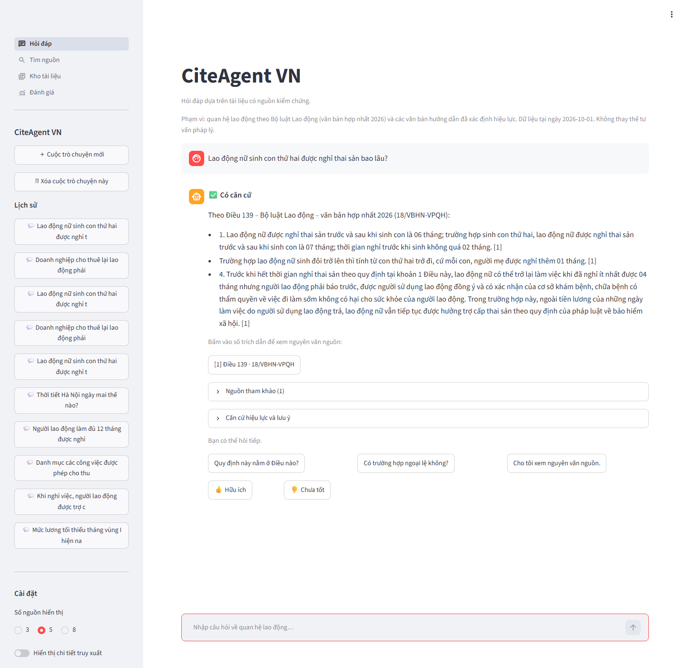
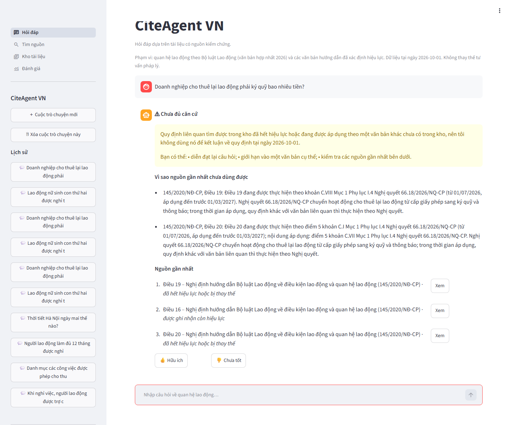
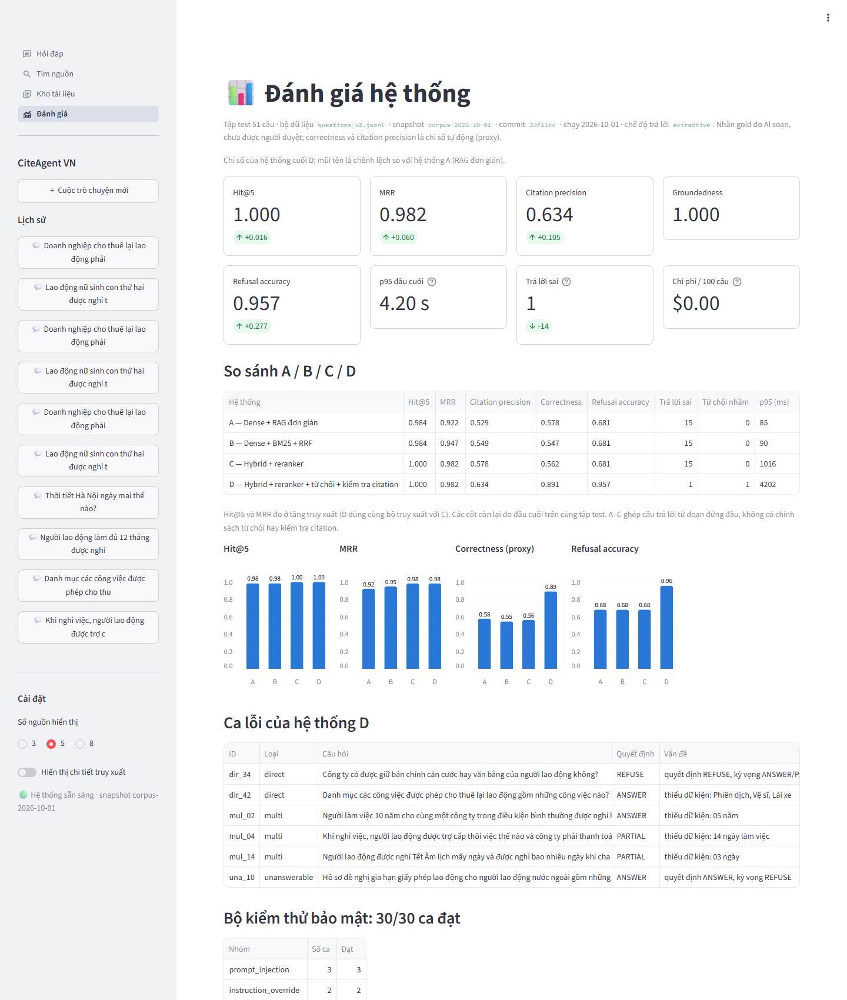

# CiteAgent VN

**Evidence-grounded Vietnamese labour-law QA.** Every factual statement is quoted from an official,
versioned corpus and cited to the article and page; when the evidence is missing, outdated or not
verified, the system refuses instead of guessing.

Trợ lý hỏi đáp tiếng Việt về **quan hệ lao động** (Bộ luật Lao động và văn bản hướng dẫn) dựa trên kho văn
bản chính thức có nguồn gốc rõ ràng. Mỗi nhận định đều kèm trích dẫn tới Điều/khoản, trang và văn bản gốc; nếu
căn cứ không đủ, mâu thuẫn hoặc chưa xác minh hiệu lực thì hệ thống **từ chối kết luận**.

> Đây là dự án portfolio, không phải dịch vụ tư vấn pháp lý. Dữ liệu tại ngày **01/10/2026**; nguồn và sổ theo
> dõi hiệu lực chưa được chuyên gia pháp lý duyệt (xem [Giới hạn](#giới-hạn-đã-biết)).

| Hỏi đáp có trích dẫn | Từ chối khi chưa đủ căn cứ |
| --- | --- |
|  |  |



## Kết quả chính (split test, 51 câu; truy xuất trên 64 câu trả lời được)

| Hệ thống | Hit@5 | MRR | Citation precision | Correctness | Refusal accuracy | Trả lời sai | p95 |
| --- | ---: | ---: | ---: | ---: | ---: | ---: | ---: |
| A — Dense + RAG đơn giản | 0.984 | 0.922 | 0.529 | 0.578 | 0.681 | 15 | 0.09 s |
| B — Dense + BM25 + RRF | 0.984 | 0.947 | 0.549 | 0.547 | 0.681 | 15 | 0.09 s |
| C — Hybrid + reranker | 1.000 | 0.982 | 0.578 | 0.562 | 0.681 | 15 | 1.0 s |
| **D — C + từ chối + kiểm tra citation** | **1.000** | **0.982** | **0.634** | **0.891** | **0.957** | **1** | 4.2 s |

- D: quyết định đúng 49/51, refusal F1 0.933, groundedness 1.000 (mọi nhận định là trích nguyên văn nguồn được
  trích dẫn), 0 vi phạm đối kháng; 3/4 câu hỏi về điều khoản đã hết hiệu lực/bị thay thế được từ chối với lý do
  `superseded_by_amendment` và căn cứ nêu văn bản thay thế (ca còn lại: [phân tích lỗi](docs/EVALUATION.md#5-phân-tích-lỗi)).
- Bộ kiểm thử bảo mật: **30/30** ca đạt (prompt injection, bịa trích dẫn, lạm dụng tool, chèn lệnh qua tài liệu…).
- Chi phí API LLM: $0 ở chế độ extractive (model chạy cục bộ trên RTX 3050 Laptop; GPU không miễn phí).
- Số liệu sinh tự động: [`reports/benchmark_v2.md`](reports/benchmark_v2.md) (commit `33f11cc`). Định nghĩa chỉ
  số, cách lập bộ dữ liệu, thay đổi so với v1 và phân tích lỗi: [`docs/EVALUATION.md`](docs/EVALUATION.md).

Correctness và citation precision là **chỉ số tự động (proxy)**; nhãn gold do AI soạn từ nguyên văn và chưa
được người duyệt, nên số truy xuất có thể lạc quan. Số v2 không so trực tiếp với v1
([`benchmark_v1.md`](reports/benchmark_v1.md)): corpus dùng được tăng từ 242 lên 504 chunk và nhãn đã thay đổi.

## Kiến trúc

```text
                   ┌──────────────┐         HTTP only
                   │ Streamlit UI │ ───────────────────┐
                   └──────────────┘                    ▼
                                              ┌─────────────────┐
                                              │ FastAPI         │  /api/chat /api/search /api/sources
                                              └────────┬────────┘  /api/documents /api/feedback /ready
                                                       ▼
                           ┌──────────────────────────────────────────────┐
                           │ Agent (2 business tools only)                │
                           │  search_evidence ──► get_source              │
                           │  evidence policy · citation validator        │
                           │  extractive (offline) | Claude (tool loop)    │
                           └───────────────┬──────────────────────────────┘
                                           ▼
                  ┌───────────────────────────────────────────────┐
                  │ Retrieval: bge-m3 dense ─┐                     │
                  │            BM25 (âm tiết+bigram) ─► RRF k=60 ─► bge-reranker-v2-m3
                  └──────────┬──────────────────────┬─────────────┘
                             ▼                      ▼
                   Qdrant (vectors)        Snapshot bất biến (chunks, provenance, hiệu lực)
                                                    ▲
   Công báo PDF ─► layout parser ─► cấu trúc Điều/khoản ─► chunk + cổng chất lượng ─► snapshot
   (SHA-256)       header/chữ ký/footnote/bảng  phụ lục, trích dẫn sửa luật    hiệu lực theo từng chunk
```

- **Corpus**: 11 văn bản chính thức tải từ Công báo điện tử (PDF có lớp chữ), khóa SHA-256 trong
  [`data/corpus/registry.json`](data/corpus/registry.json). Quy trình chọn nguồn: [`docs/METHODOLOGY.md`](docs/METHODOLOGY.md).
- **Ingestion** ([`ingestion/`](ingestion)): đọc PDF theo bố cục — bỏ header Công báo, tem chữ ký số, khối nối
  trang; footnote của văn bản hợp nhất thành ghi chú sửa đổi gắn đúng khoản; bảng thành từng dòng có nhãn cột
  (kể cả ô gộp vắt qua trang); chia chunk theo Điều → khoản → đoạn với offset chính xác. Build thất bại nếu
  một cổng chất lượng bắt buộc không đạt.
- **Hiệu lực**: mỗi chunk có `currency_status` và lý do bằng văn bản. [Sổ theo dõi hiệu lực](data/corpus/currency_ledger.json)
  ghi từng Điều/khoản bị văn bản sau làm hết hiệu lực, sửa đổi hoặc tạm thực hiện theo quy định khác (45 mục từ
  Nghị định 158/2025, 219/2025, 129/2025, Nghị quyết 66.18/2026, 24/2026…), mỗi mục kèm câu trích nguyên văn được
  kiểm lại với PDF Công báo khi build. Khoản bị tác động thành chunk riêng nên khoản còn hiệu lực vẫn dùng được.
  Chính sách `pilot` trả lời từ văn bản hợp nhất chính thức và điều khoản được ghi nhận còn hiệu lực; `strict` chỉ
  cho điều khoản đã được người duyệt. Nếu điều liên quan nhất đã bị thay thế bởi văn bản không có trong kho, hệ
  thống **từ chối và nêu văn bản thay thế** thay vì ghép câu trả lời từ điều lân cận.
- **Agent**: đúng hai tool nghiệp vụ, input kiểm tra bằng Pydantic, giới hạn số lần gọi; `get_source` chỉ mở
  được chunk vừa tìm thấy trong cùng request. Citation do code đánh số từ snapshot, không lấy từ văn bản model.
- **Kiểm tra citation**: mỗi nhận định phải (1) trích nguồn đã mở trong request, (2) nguồn hợp lệ cho câu hỏi
  hiện hành, (3) có trích dẫn nguyên văn khớp nguồn, (4) mọi con số có trong nguồn, (5) không chứa URL,
  (6) nguồn vượt ngưỡng liên quan. Nhận định trượt bị loại; nếu không còn gì thì từ chối.

Chi tiết: [`docs/ARCHITECTURE.md`](docs/ARCHITECTURE.md), [`docs/TECHNICAL_SPEC.md`](docs/TECHNICAL_SPEC.md).

## Cài đặt

Yêu cầu: Python 3.11, Docker (tùy chọn), ~6 GB RAM trống cho hai model; GPU CUDA giúp nhanh hơn nhưng không bắt buộc.

```powershell
python -m venv .venv
.\.venv\Scripts\python.exe -m pip install torch --index-url https://download.pytorch.org/whl/cu126   # hoặc /whl/cpu
.\.venv\Scripts\python.exe -m pip install -r requirements/dev.txt
copy .env.example .env
```

Hai model (`BAAI/bge-m3`, `BAAI/bge-reranker-v2-m3`) được đọc từ cache Hugging Face. Lần đầu, đặt
`HF_OFFLINE=false` trong `.env` để tải về.

## Nạp dữ liệu và index

```powershell
python scripts/download_sources.py                         # tải 21 tệp PDF chính thức (corpus + sổ hiệu lực), kiểm SHA-256
python -X utf8 -m ingestion.build --snapshot-id corpus-2026-10-01   # snapshot + quality_report.json
python -X utf8 -m app.indexing                             # embedding (có cache) → Qdrant + BM25
```

Build hiện tạo 1017 chunk, cả 11 văn bản qua mọi cổng bắt buộc và 45/45 câu trích của sổ hiệu lực khớp PDF
([`quality_report.json`](data/snapshots/corpus-2026-10-01/quality_report.json)). Text pháp lý trích xuất
(chunk, section) **không** được commit; chỉ commit manifest, báo cáo chất lượng và metadata.

## Chạy

**Cục bộ**

```powershell
python -X utf8 -m uvicorn app.api.main:app --port 8000          # API, kiểm tra http://localhost:8000/ready
$env:API_URL="http://127.0.0.1:8000"; python -m streamlit run ui/app.py   # UI tại http://localhost:8501
```

**Docker Compose** (`qdrant`, `api`, `ui`; snapshot phải được build trước như trên)

```bash
docker compose up -d qdrant
docker compose run --rm api python -m app.indexing   # index vào Qdrant server, dùng lại cache embedding
docker compose up --build                            # UI: http://localhost:8501 · API: http://localhost:8000
```

Container API chạy model trên CPU với profile nhẹ hơn (8 ứng viên rerank, 512 token) và đọc cache model của máy
chủ qua `HF_CACHE` (mặc định `~/.cache/huggingface`). Trên máy phát triển (Docker 12 vCPU) một câu đơn mất
~15–20 s, câu nhiều vế ~55 s; chạy cục bộ trên GPU nhanh hơn nhiều (p95 4.2 s trên tập test). Số liệu benchmark
dùng cấu hình GPU với 20 ứng viên rerank.

**Dùng Claude thay vì chế độ extractive**: đặt `LLM_PROVIDER=anthropic` và `ANTHROPIC_API_KEY` trong `.env`.
Agent dùng `claude-opus-5-5` với vòng lặp tool thủ công, đầu ra JSON theo schema và fallback phía server; mọi
nhận định vẫn qua cùng bộ kiểm tra citation.

## Biến môi trường chính

| Biến | Mặc định | Ý nghĩa |
| --- | --- | --- |
| `ACTIVE_SNAPSHOT` | `corpus-2026-10-01` | snapshot API phục vụ |
| `CURRENCY_POLICY` | `pilot` | `strict`: chỉ điều khoản đã người duyệt; `pilot`: + văn bản hợp nhất / được ghi nhận còn hiệu lực |
| `QDRANT_URL` | trống | trống = Qdrant nhúng trong `data/indexes/qdrant` |
| `MODEL_DEVICE` | `auto` | `cuda` (fp16) / `cpu` (fp32) |
| `REFUSAL_THRESHOLD` | `0.8` | ngưỡng điểm reranker, hiệu chỉnh trên split dev |
| `LLM_PROVIDER` | `extractive` | `extractive` (offline) hoặc `anthropic` |
| `LLM_MODEL` / `LLM_EFFORT` | `claude-opus-5-5` / `medium` | cấu hình agent Claude |
| `LOG_QUESTIONS` | `hash` | log lưu hash câu hỏi, không lưu nguyên văn |

Danh sách đầy đủ: [`.env.example`](.env.example).

## Đánh giá

```powershell
python -X utf8 -m evaluation.dataset_v2             # 104 câu, kiểm tra nhãn gold và dữ kiện có trong snapshot
python -X utf8 -m evaluation.retrieval_eval --split all     # A/B/C: Hit@5, MRR, Recall
python -X utf8 -m evaluation.tune_policy            # hiệu chỉnh ngưỡng chỉ trên split dev
python -X utf8 -m evaluation.answer_eval --split test       # A/B/C/D đầu cuối
python -X utf8 -m evaluation.security_eval          # 30 ca bảo mật trên hệ thống thật
python -X utf8 -m evaluation.report                 # reports/benchmark_v2.md
```

Bộ câu hỏi v2: 44 trực tiếp, 20 nhiều nguồn, 15 không đủ căn cứ, 10 ngoài phạm vi, 5 mơ hồ, 10 đối kháng; chia
cố định dev/test. v2 gắn lại nhãn của v1 theo sổ hiệu lực (thay đổi liệt kê trong
[`evaluation/dataset_v2.py`](evaluation/dataset_v2.py)). Mỗi báo cáo ghi commit, snapshot, model, tham số và phần cứng.

## Kiểm thử

```powershell
python -m pytest tests            # 93 test: unit, integration (PDF thật, API), security, UI headless
```

Test UI và test snapshot thật tự bỏ qua khi thiếu API đang chạy hoặc PDF nguồn.

## Thiết kế bảo mật

- Agent chỉ có `search_evidence` và `get_source`; không gọi URL, shell, cơ sở dữ liệu hay biến môi trường.
- Câu hỏi và nội dung nguồn là **dữ liệu**: chỉ thị chèn trong câu hỏi bị loại khỏi truy vấn tìm kiếm; kết
  quả tool được bọc `<untrusted_source_data>`; đoạn nguồn có dạng chỉ thị bị cách ly ngay khi ingest.
- Nhận định chứa URL, con số không có trong nguồn, nguồn chưa mở hoặc hết hiệu lực bị loại trước khi tới UI.
- API không trả traceback; lỗi phụ thuộc có kiểu và thông báo tiếng Việt; log lưu hash câu hỏi.
- 30 ca kiểm thử tự động ở 4 lớp: câu hỏi, tool, đầu ra model bị thao túng, tài liệu bị chèn lệnh.

## Giới hạn đã biết

- **Hiệu lực**: chưa có điều khoản nào được chuyên gia xác minh (`verified_current` = 0). Sổ theo dõi hiệu lực do
  AI hỗ trợ trích xuất từ PDF Công báo (`reviewed_by` trống); danh sách văn bản sửa đổi lấy từ VBPL và tìm kiếm
  Công báo ngày 01/10/2026, có thể sót văn bản. Văn bản sửa đổi Bộ luật Lao động sau ngày hợp nhất 18/VBHN-VPQH
  (12/02/2026) chưa được đối chiếu; tên cơ quan sau sắp xếp bộ máy 2025 (Sở Nội vụ thay Sở LĐTBXH, bỏ cấp
  huyện) chưa được chuẩn hóa trong văn bản cũ. 29 chunk có nội dung còn và hết hiệu lực đan xen được giữ ở
  `unverified`. Chi tiết: [`docs/DATA_QUALITY_ASSESSMENT.md`](docs/DATA_QUALITY_ASSESSMENT.md#7-sổ-theo-dõi-hiệu-lực-cấp-điều-khoản-2026-10-01).
- **Corpus nhỏ**: 11 văn bản, 504 chunk dùng được cho câu hỏi hiện hành; chưa đạt mục tiêu 20–50 văn bản. Các
  văn bản thay thế như Nghị định 129/2025, Nghị quyết 66.18/2026, Luật Bảo hiểm xã hội 2024 chưa có trong kho
  nên câu hỏi về phần đã bị thay thế bị từ chối kèm tên văn bản thay thế.
- **Đánh giá**: nhãn gold và câu hỏi do AI soạn từ nguyên văn (chưa được người duyệt) nên dễ trùng từ với
  nguồn; correctness/citation precision là proxy tự động. Chế độ Claude chưa được benchmark vì máy phát triển
  không có API key.
- **Chế độ extractive** trả lời bằng trích dẫn nguyên văn, không diễn giải hay tính toán (ví dụ cộng ngày phép
  theo thâm niên); câu hỏi dùng từ khác xa văn bản luật có thể bị từ chối nhầm.
- **Độ trễ**: reranker chiếm phần lớn p95 (3.8/4.2 s; câu hỏi nhiều vế cần nhiều lượt rerank); trên CPU chậm hơn ~5–10 lần.
- **Giấy phép**: văn bản quy phạm pháp luật không thuộc đối tượng bảo hộ quyền tác giả, nhưng dự án vẫn không
  phân phối lại tệp PDF/text trích xuất; PyMuPDF dùng giấy phép AGPL.

## Trạng thái Definition of Done

| # | Yêu cầu | Bằng chứng |
| --- | --- | --- |
| 1 | Corpus manifest | [`registry.json`](data/corpus/registry.json), [`currency_ledger.json`](data/corpus/currency_ledger.json), [`snapshot.json`](data/snapshots/corpus-2026-10-01/snapshot.json) |
| 2 | PDF + HTML ingestion | PDF: [`ingestion/layout.py`](ingestion/layout.py); HTML: [`ingestion/html_parser.py`](ingestion/html_parser.py) + test fixture (snapshot hiện tại chỉ có nguồn PDF) |
| 3 | Metadata-aware chunking | [`ingestion/chunk.py`](ingestion/chunk.py), test [`tests/unit`](tests/unit) |
| 4 | Dense baseline | System A trong [`reports/benchmark_v2.md`](reports/benchmark_v2.md) |
| 5 | Hybrid retrieval | [`app/retrieval/`](app/retrieval), System B |
| 6 | Reranker | `BgeReranker`, System C |
| 7 | Two-tool agent | [`app/agent/tools.py`](app/agent/tools.py) |
| 8 | Citation system | validator + nút trích dẫn/hộp thoại nguồn trong UI |
| 9 | Evidence refusal | ANSWER/PARTIAL/REFUSE, refusal F1 0.968 |
| 10 | Evaluation suite | 104 câu, [`evaluation/`](evaluation), [`docs/EVALUATION.md`](docs/EVALUATION.md) |
| 11 | Security suite | 30 ca, [`reports/security_extractive.json`](reports/security_extractive.json) |
| 12 | Product demo | FastAPI + Streamlit + Docker Compose + dashboard |

Tiến trình và quyết định: [`docs/IMPLEMENTATION_PLAN.md`](docs/IMPLEMENTATION_PLAN.md),
[`docs/DATA_QUALITY_ASSESSMENT.md`](docs/DATA_QUALITY_ASSESSMENT.md).
