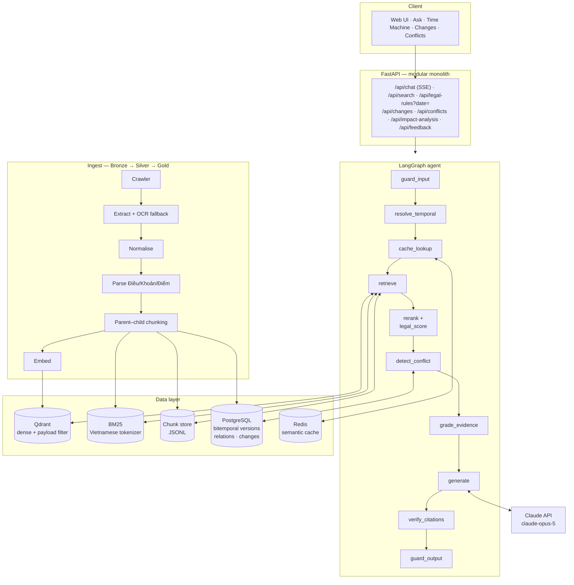

# ViRAG-Gov — Vietnam Tax Legal Intelligence Assistant

> **The system does not look for "the latest law". It determines *which
> provision actually applies* to a specific situation, at a specific point in
> time, in a landscape of amended, replaced and overlapping documents of
> differing legal force.**

A Vietnamese tax-law question-answering system with pin-point citations,
version-aware retrieval and rule-based conflict resolution — built on a
verified corpus of official legal documents.

**Source-verification and pilot-crawl milestone: 2026-08-11.**

---

## Why this is not "just another RAG chatbot"

The failure this project exists to prevent, in one line:

```text
A user asks in 2026 about a 2021 transaction
   → vector search returns the 2026 rule (its language is closer to the question)
   → the model faithfully cites a REAL document that DID NOT APPLY
   → every "does this citation exist?" check passes
   → RAGAS Faithfulness scores 1.0
   → the user files incorrectly
```

This is **temporal misgrounding**, and it is more dangerous than ordinary
hallucination because the cited document, article and figures are all genuine.
A non-specialist has essentially no way to detect it.

Three consequences shape the whole design:

| Legal reality | Design consequence |
|---------------|--------------------|
| A rule is correct only **relative to a date** | `as_of` (the date of the taxable event) is a hard filter evaluated **during index traversal**, and part of every cache key |
| A rule is correct only **relative to the hierarchy** | Ranking blends semantic relevance with legal authority, so an Official Letter can never silently outrank the Law it interprets |
| A rule changes **clause by clause** | Legal status is tracked per Clause, not per document, over immutable bitemporal versions |

---

## Architecture



**Retrieval pipeline:**

```text
query → BM25 (exact: instrument numbers, "Điều 9", rates)
      → dense  (semantic: paraphrase, colloquial questions)
      → reciprocal-rank fusion
      → temporal filter (in force on the event date)
      → cross-encoder rerank
      → composite legal score
        = α·semantic + β·authority + γ·temporal + δ·specificity + ε·citation_quality
      → parent expansion (score the Clause, read the Article)
```

Full detail: [System architecture](docs/virag-gov/04-system-architecture.md) ·
[Design decisions (23 ADRs)](docs/virag-gov/05-design-decisions.md)

---

## Project status

This repository is currently a **research, design and data-acquisition
baseline** — not a production system, and not legal advice.

| Component | Status |
|-----------|--------|
| Data acquisition (`tools/`) | ✅ Working — 9 tools, 9 test modules |
| Raw corpus (Bronze) | ✅ 1,355 PDFs / 4.4 GB, full checksums |
| 10-year inventory | ✅ 13,058 source records |
| Completeness audit | ✅ 600/600 pages, 726/726 PDFs, 0 errors |
| Design dossier | ✅ 14 documents, `docs/virag-gov/` |
| Application code (`virag/`) | ⚠️ Reference scaffold — **never run, never tested** |
| Ingest → index → RAG | ⬜ Not implemented |
| Evaluation & benchmark | ⬜ Not implemented |
| `docker compose up` | ⬜ Not implemented |

**No experimental measurement exists yet.** Every number in the documentation is
either a design target or a descriptive statistic over already-crawled data.
That boundary is enforced strictly.

---

## The corpus

Measured on the repository as of 2026-09-03.

| Metric | Value |
|--------|-------|
| PDFs downloaded | 1,355 (4.4 GB) |
| Readable PDF pages (audited shards) | 33,527 |
| Source records in the 10-year inventory | 13,058 |
| Shards fully audited | 6 of 131 |
| Time window | 2016-08-11 → 2026-08-11 |

**Document type distribution** (698 source pages, run v4):

| Type | Count | Authority tier |
|------|------:|---------------:|
| Circular (Thông tư) | 307 | 7 |
| Decree (Nghị định) | 162 | 5 |
| Consolidated (VBHN) | 141 | per original |
| Resolution (Nghị quyết) | 44 | 2 or 5 |
| Decision (Quyết định) | 30 | 6 or 8 |
| Law (Luật) | 9 | 2 |
| Joint Circular | 3 | 7 |

Two numbers that drive the design:

- **307 Circulars versus 9 Laws** — under pure similarity ranking, Laws would
  almost never win. This is the quantitative case for an authority component in
  the score.
- **22.9% of documents have no effective date** (160 of 698) — the ceiling on
  temporal accuracy is set by data quality, not by the model. The system handles
  this with an `UNKNOWN` status and a graded validity score rather than a binary
  flag.

---

## Evaluation design: VietTaxBench

Five task families, ≥200 questions, gold labels down to the Clause:

| Family | Input → Output |
|--------|----------------|
| TaxQA | Question → Answer |
| TaxRAG | Question → Document / Article / Clause |
| **TaxTime** | Question + Time → Correct version |
| TaxChange | Old law + new law → Changes |
| TaxConflict | Multiple provisions → Applicable rule |

**Six metric layers**, because a single number hides what is broken:

```text
Retrieval    → Recall@K, MRR, nDCG@K
Evidence     → Article Recall@K, Clause Recall@K, Evidence F1
Answer       → Answer Accuracy, Numeric Exact Match
Citation     → Citation Precision / Recall / F1
Temporal     → TVA (Temporal Version Accuracy), VMR (Version Mixing Rate)
Legal Safety → Hallucination Rate, Abstention Accuracy, Authority Accuracy
```

**The headline metric — LAA (Legal Applicability Accuracy):**

```text
LAA = 1  ⟺  Answer Correct
           ∧ Correct Legal Source
           ∧ Correct Article
           ∧ Correct Version
           ∧ Applicable at Relevant Time
```

A correct answer citing the right article of the wrong version scores **0**.
That strictness is the point.

RAGAS runs alongside — never instead. Faithfulness scores 1.0 on a faithfully
cited **repealed** document, which is exactly why TVA and LAA are needed.

Full detail: [VietTaxBench](docs/virag-gov/03-benchmark-viettaxbench.md) ·
[Evaluation plan](docs/virag-gov/09-evaluation-plan.md)

---

## Documentation

Start at **[docs/virag-gov/00-index.md](docs/virag-gov/00-index.md)** — it has a
reading path per role and a 20-minute path.

| # | Document |
|---|----------|
| A | [Research direction](docs/virag-gov/A-research-direction.md) |
| B | [Product direction](docs/virag-gov/B-product-direction.md) |
| 01 | [Problem analysis](docs/virag-gov/01-problem-analysis.md) |
| 02 | [Related work & research gap](docs/virag-gov/02-related-work.md) |
| 03 | [VietTaxBench](docs/virag-gov/03-benchmark-viettaxbench.md) |
| 04 | [System architecture](docs/virag-gov/04-system-architecture.md) |
| 05 | [Design decisions (ADRs)](docs/virag-gov/05-design-decisions.md) |
| 06 | [Data and data pipeline](docs/virag-gov/06-data-pipeline.md) |
| 07 | [Risk analysis](docs/virag-gov/07-risk-analysis.md) |
| 08 | [Implementation plan](docs/virag-gov/08-implementation-plan.md) |
| 09 | [Evaluation & experiment plan](docs/virag-gov/09-evaluation-plan.md) |
| 10 | [Setup & operations guide](docs/virag-gov/10-operations-guide.md) |
| 11 | [Compliance, ethics and limits](docs/virag-gov/11-compliance-and-ethics.md) |

Earlier foundation documents (`docs/de-an-tong-the.md`, `docs/design/00-08`,
`docs/source-register.md`) remain **in Vietnamese**.

---

## Running the data-acquisition tools

This is the part that works today.

```powershell
python -m venv .venv
.\.venv\Scripts\python.exe -m pip install -r requirements-dev.lock
.\.venv\Scripts\python.exe -m pytest -q
.\.venv\Scripts\python.exe -m ruff check tools tests

# Dry run — downloads nothing
.\.venv\Scripts\python.exe tools\legal_crawler.py --dry-run

# Crawl one shard with official PDF attachments
.\.venv\Scripts\python.exe tools\legal_crawler.py `
  --config config\tax-document-all-fulltext-shards-v4\shard-0001.json `
  --output data\crawl\tax-document-all-fulltext-shard-0001-YYYY-MM-DD `
  --download-official-pdfs
```

> **Known defect:** `pyproject.toml` has a stray `y` at the end of the
> `select = [...]` line, which prevents `ruff` from reading the config. Remove it
> first.

**Crawl integrity rule:** if a shard stops part-way, write the missing portion to
a `*-resume` directory — **never overwrite the partial directory**. The Bronze
layer is evidence.

Full guide: [Setup & operations](docs/virag-gov/10-operations-guide.md)

---

## Key design conclusions

- Start with an assistant for **professionals** on VAT and invoicing — not a
  public chatbot covering every tax.
- Determine the applicable law at the **date of the taxable event**, not the date
  the question is asked.
- Store original documents and every amending instrument as **immutable
  evidence**. A consolidated document is a convenience view, not a legal source.
- Every conclusion must bind to Article, Clause, Point, an official source, a
  validity interval, and an auditable copy.
- Use deterministic code or decision tables for computations, deadlines,
  conditions and document checklists wherever they can be formalised — **do not
  delegate these to the LLM**.
- Treat model output as untrusted until it passes temporal, citation, conflict
  and computation checks.
- Isolate per-client data; never place case facts into shared conversational
  memory or training data.
- **Require expert review** for advice that materially affects a taxpayer's
  obligations, rights, filing elections, dispute strategy or deadlines.

---

## Disclaimer

Content generated by this system is reference information quoted from legal
normative documents obtained from official sources. It is **not legal advice**
and does not replace the opinion of a licensed practitioner. The applicable
provision depends on the date the tax obligation arose and on the specific
circumstances of each case. Consult the original documents and a qualified
professional before making decisions.

See [Compliance, ethics and limits](docs/virag-gov/11-compliance-and-ethics.md)
for the full list of known limitations.
