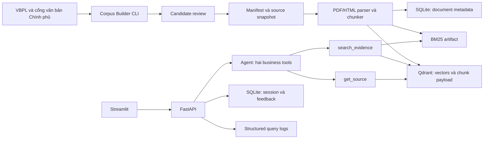
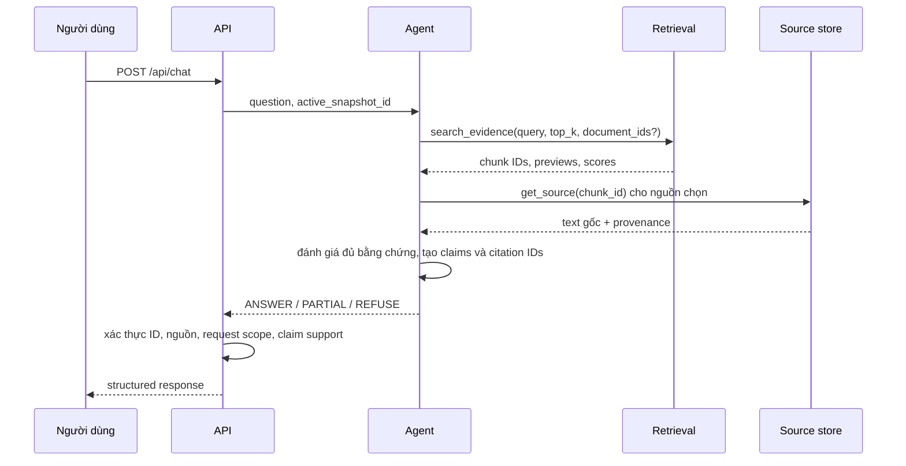

# CiteAgent VN — thiết kế kiến trúc

Trạng thái: **đã triển khai MVP** · cập nhật 2026-10-01 (ADR-007 → ADR-011 ở mục 5). Trước đó: [pilot 10 văn bản](PILOT_10_DOCUMENTS.md) · 2026-09-24. Nguồn yêu cầu: [`../details.md`](../details.md), [`../data.md`](../data.md). Các quyết định có thể đổi khi có số đo hoặc kiểm thử; ghi thay đổi vào phần ADR ở cuối tài liệu.

## 1. Mục tiêu và ranh giới

CiteAgent VN trả lời câu hỏi tiếng Việt về **quan hệ lao động theo Bộ luật Lao động và văn bản trực tiếp liên quan** từ một corpus chính thức, có phiên bản. Mọi khẳng định thực tế trong câu trả lời phải truy ngược tới đoạn nguồn. Ba kết quả hợp lệ là `ANSWER`, `PARTIAL`, `REFUSE`. Khi không xác minh được tình trạng áp dụng của điều khoản, hệ thống từ chối kết luận về quy định hiện hành.

Đây là ứng dụng portfolio chạy bằng Docker Compose trên một máy. MVP không có tìm kiếm web lúc hỏi, upload tài liệu, tài khoản, OCR nâng cao hoặc bộ máy xử lý toàn bộ pháp luật Việt Nam. Phạm vi hiện hành được công bố rõ trong UI và README; câu hỏi lịch sử ngoài phạm vi MVP.

## 2. Sơ đồ thành phần

Đường dữ liệu offline (Builder/Ingest) tách khỏi đường truy vấn online. UI chỉ gọi API. Agent chỉ có quyền gọi `search_evidence` và `get_source`; các bước kiểm tra citation, tính mức đủ bằng chứng và ghi log là code ứng dụng, không phải tool cấp cho LLM.

## 3. Luồng dữ liệu

### 3.1. Xây corpus

1. Khởi đầu bằng 3–5 seed văn bản được xác minh thủ công trên nguồn chính thức.
2. Nếu trang quan hệ VBPL truy cập được, duyệt các quan hệ sửa đổi, thay thế, quy định chi tiết, hướng dẫn và hợp nhất; giới hạn BFS depth 2, khử trùng theo mã văn bản và URL chuẩn hóa. Nếu không, tạo bảng quan hệ được reviewer đối chiếu thủ công trên nguồn chính thức và công bố giới hạn coverage; không giả vờ đã crawl graph.
3. Thu **metadata trước**. Áp dụng hard filters, điểm liên quan và hàng đợi review. Chỉ tải nội dung cho văn bản được duyệt.
4. Chụp snapshot bất biến: manifest, nguồn gốc, hash, quyết định review, thời điểm kiểm tra hiệu lực, phiên bản parser/chunker.
5. Parser thử trích text theo trang và phát hiện PDF scan. Với scan, thử nguồn toàn văn HTML chính thức; nếu cần OCR thì lưu text OCR tách với ảnh nguồn và đòi QA trước khi đưa vào current index. Normalizer chỉ sửa định dạng an toàn. Chunker ưu tiên Điều/khoản, giữ offset và page span chính xác theo trang.
6. Kiểm tra số lượng chunk, hash, khả năng truy ngược source và truy vấn mẫu; sau đó mới kích hoạt snapshot cho API.

Không tự suy ra rằng văn bản hợp nhất tạo luật mới. Không đánh đồng trạng thái hiệu lực của cả văn bản với hiệu lực của từng điều khoản. Điều khoản có sửa đổi chưa xác minh phải bị đánh dấu `currency_unverified` và không được dùng cho câu trả lời về hiện hành.

### 3.2. Trả lời một câu hỏi

`search_evidence` gồm dense top 20 + BM25 top 20 → RRF (`k=60`) → cross encoder rerank top 5 theo mặc định. Không coi score của các model là xác suất. Bộ lọc phạm vi và tình trạng hiệu lực chạy trước truy xuất. Agent có thể tìm thêm tối đa một số vòng định cấu hình; tránh vòng lặp không giới hạn. `get_source` lấy nội dung đầy đủ của chunk đã chọn, không chấp nhận URL tự do.

### 3.3. Baseline và các biến thể đo lường

Baseline A là dense top 5 + RAG đơn giản, được giữ thành pipeline độc lập. B = dense + BM25 + RRF. C = B + reranker. D = C + chính sách từ chối + citation validation. Cùng corpus snapshot, tập câu hỏi và model tạo câu trả lời để phép so sánh có ý nghĩa. Agent và UI là lớp sản phẩm; khi so sánh retrieval, cố định phần còn lại.

## 4. Ranh giới và quyền sở hữu dữ liệu

| Thành phần | Sở hữu | Không làm |
| --- | --- | --- |
| Corpus Builder | khám phá ứng viên, provenance, review, snapshot | trả lời user trực tuyến |
| Ingestion | parse, normalize, chunk, index | quyết định pháp lý thay người review |
| Qdrant | dense vectors và payload chunk | session, feedback, source of truth cho manifest |
| BM25 artifact | sparse index theo snapshot | tự thay đổi khi corpus đang phục vụ |
| SQLite | catalog tài liệu, session, feedback | vector retrieval |
| Retrieval service | lọc, dense/BM25/RRF/rerank | sinh câu trả lời |
| Agent service | hai tool, chọn evidence, soạn trả lời có cấu trúc | gọi URL, shell, database trực tiếp |
| Validation service | chặn citation sai và claim không có căn cứ | tạo nguồn mới |
| API | xác thực request, orchestration, error mapping | parser/crawler |
| UI | hiển thị trạng thái và source viewer | truy cập trực tiếp Qdrant |

Manifest và source snapshot là nguồn chuẩn cho provenance. Qdrant và BM25 là các chỉ mục tái tạo được. Mỗi request ghim vào một `corpus_snapshot_id`; đổi snapshot không làm trộn kết quả cũ và mới.

## 5. Các quyết định kiến trúc

### ADR-001 — Corpus Builder thay generic crawler

**Quyết định:** chỉ triển khai adapter cho VBPL ở vòng khám phá; cổng văn bản Chính phủ dùng để đối chiếu và lấy bản chính thức khi phù hợp. Thu metadata, duyệt graph, review, rồi mới tải. Vẫn hỗ trợ parser PDF và HTML độc lập sau bước chọn nguồn.

**Lý do:** corpus nhỏ, tập trung vào quan hệ lao động và dễ audit. Keyword crawl rộng sẽ kéo nhiều văn bản lân cận. **Hệ quả:** quan hệ bị thiếu trên website phải được bổ sung qua review; coverage được đo và công bố.

### ADR-002 — Snapshot bất biến

**Quyết định:** mỗi lần xuất bản corpus tạo ID snapshot, hash manifest và tên collection riêng; BM25 artifact cùng ID. API chỉ đọc snapshot đang active. Có thể rollback bằng cấu hình.

**Lý do:** benchmark và citation phải tái lập. **Hệ quả:** cần script kiểm tra trước khi chuyển snapshot; nguồn ngoài có thể thay đổi sau ngày chụp nên UI hiển thị `downloaded_at` và `verified_at`.

### ADR-003 — Chỉ mục tách theo chức năng

**Quyết định:** Qdrant cho dense retrieval, file BM25 local theo snapshot cho sparse; SQLite cho dữ liệu giao dịch nhỏ. Qdrant payload chứa metadata đủ để lọc và nguồn chunk; manifest lưu bản gốc.

**Lý do:** dễ hiểu, kiểm thử và benchmark từng giai đoạn. **Hệ quả:** ingest phải tạo cả hai chỉ mục như một release; readiness kiểm tra sự khớp snapshot.

### ADR-004 — Agent giới hạn hai tool

**Quyết định:** dùng graph/state machine nhỏ, có thể hiện thực bằng LangGraph ở milestone agent, với đúng hai business tools. Giới hạn lượt gọi, `top_k`, `document_ids`, độ dài câu hỏi và thời gian.

**Lý do:** kiểm soát nguồn và chi phí. **Hệ quả:** agent không giải quyết yêu cầu ngoài corpus bằng web search.

### ADR-005 — Chính sách hiện hành thận trọng

**Quyết định:** văn bản hết hiệu lực toàn bộ không nằm trong current index. Văn bản hết hiệu lực một phần chỉ đóng góp các đoạn đã kiểm tra hiệu lực điều khoản; khi thiếu mapping, từ chối câu hỏi hiện hành liên quan. Văn bản hợp nhất lưu loại riêng và liên kết văn bản gốc/sửa đổi.

**Lý do:** status cấp văn bản không đủ để xác nhận một quy tắc cụ thể còn áp dụng. **Hệ quả:** coverage ban đầu có thể thấp; báo cáo rõ false refusal và lỗ hổng corpus.

### ADR-006 — Nhánh scan/OCR có cổng QA

**Quyết định:** pilot 10 PDF chính thức có 496/496 trang là ảnh toàn trang, nên ingestion phải phát hiện scan theo trang. Trước tiên tìm bản toàn văn HTML chính thức có thể truy cập; nếu dùng OCR, ghi model/hash/DPI và giữ bản PDF để reviewer đối chiếu. Chunk OCR `unreviewed` không được dùng làm citation. Tách phần thân văn bản, phụ lục/biểu mẫu và nội dung luật khác được trích dẫn trước khi gắn `section_path`.

**Lý do:** OCR thử nghiệm đã đọc sai từ, khoảng trắng và một số ký hiệu năm; parser heading đơn giản cũng nhận nhầm dẫn chiếu/phụ lục thành Điều chính. **Hệ quả:** MVP cần thêm công đoạn review và có thể thu hẹp số điều khoản đủ điều kiện trả lời. Số đo và ví dụ ở [`PILOT_10_DOCUMENTS.md`](PILOT_10_DOCUMENTS.md).

### ADR-007 — Công báo có lớp chữ thay OCR; đọc PDF theo bố cục

**Quyết định:** nguồn chính là PDF Công báo điện tử có lớp chữ (11 tệp, khóa SHA-256 trong `data/corpus/registry.json`, nay 12 tệp cho 11 văn bản); nhánh OCR chỉ còn là thí nghiệm pilot. Parser phân loại từng dòng trước khi ghép: header Công báo, tem chữ ký số, dải chuyên mục và khối nối giữa hai số Công báo bị loại; footnote của văn bản hợp nhất (chữ nhỏ, ký hiệu chỉ số) thành ghi chú sửa đổi gắn đúng Điều/khoản; bảng có đường kẻ dọc được viết lại theo dòng có nhãn cột, ô gộp vắt qua trang được nối lại.

**Lý do:** 5/5 đoạn chép tay và 8/8 đoạn lấy ngẫu nhiên khớp nguyên văn với lớp chữ, trong khi OCR có WER ~16% và đọc sai số hiệu. Ghép text trước rồi lọc bằng regex đã làm 49% chunk dính header và 3/4 footnote gắn nhầm Điều. **Hệ quả:** build chạy ~1 phút cho 10 văn bản, tất định (cùng hash chunk qua các lần chạy) và thất bại nếu một cổng chất lượng bắt buộc không đạt.

### ADR-008 — Trạng thái hiệu lực theo từng chunk và hai chính sách trả lời

**Quyết định:** mỗi chunk mang `currency_status` (`verified_current`, `consolidated_current`, `presumed_current`, `pending_amendment`, `superseded_by_consolidation`, `historical`, `unverified`) và `currency_basis` bằng văn bản. Chính sách `strict` chỉ cho phép `verified_current` + text `verified` (cần người duyệt qua `data/review/*.json`); chính sách `pilot` (mặc định demo) thêm văn bản hợp nhất chính thức và văn bản được ghi nhận còn hiệu lực, với text đã qua mọi cổng tự động. Bản gốc 45/2019 được giữ nhưng chỉ để đối chiếu vì bản hợp nhất 18/VBHN-VPQH chứa nội dung hiện hành.

**Lý do:** cổng chặt của kế hoạch ban đầu chặn 100% corpus cho đến khi có chuyên gia duyệt; chế độ `pilot` cho phép demo trung thực vì mọi câu trả lời hiển thị căn cứ hiệu lực và cảnh báo "chưa được chuyên gia duyệt". **Hệ quả:** 242/926 chunk dùng được trong snapshot `corpus-2026-09-30`; văn bản hết hiệu lực một phần chưa có ánh xạ điều khoản chỉ dùng để giải thích lý do từ chối (`currency_unverified`). ADR-012 thay phần ánh xạ này bằng sổ theo dõi hiệu lực và thêm trạng thái `superseded_by_amendment`.

### ADR-009 — Hai chế độ trả lời dùng chung tool, chính sách và bộ kiểm tra

**Quyết định:** chế độ `extractive` (mặc định, offline) trả lời bằng các khoản/điểm nguyên văn do cross-encoder chọn; chế độ `anthropic` dùng agent Claude (`claude-opus-5-5`, vòng lặp tool thủ công, đầu ra JSON theo schema, fallback phía server). Cả hai chỉ có `search_evidence` và `get_source`; số trích dẫn, URL và trang do code gắn từ snapshot; mọi nhận định qua `app/generation/validator.py`.

**Lý do:** dự án phải chạy và đánh giá được khi không có API key, và an toàn nguồn không được phụ thuộc vào việc model tuân thủ prompt. **Hệ quả:** groundedness của chế độ extractive bằng 1 theo cấu trúc; chế độ Claude cần benchmark riêng khi có key.

### ADR-010 — Qdrant nhúng khi phát triển, Qdrant server trong Docker

**Quyết định:** `QDRANT_URL` trống thì dùng Qdrant nhúng trong `data/indexes/qdrant` (test và dev không cần container); Docker Compose dùng Qdrant server. Embedding được cache theo `sha256(embedding_text)` và tên model nên index lại không phải mã hóa lại.

**Lý do:** chạy test/benchmark nhanh, không phụ thuộc Docker; vẫn giữ mục tiêu `docker compose up`. **Hệ quả:** `/ready` kiểm tra hash snapshot trong manifest index khớp snapshot đang phục vụ.

### ADR-011 — Giới hạn chi phí cross-encoder

**Quyết định:** rerank đúng *hybrid top 20* ứng viên đủ điều kiện (+10 ứng viên chưa đủ điều kiện để giải thích từ chối), độ dài 1024 token trên GPU; profile CPU trong Docker dùng 8/4 ứng viên và 512 token.

**Lý do:** reranker chiếm >90% độ trễ; trên CPU (container 12 vCPU) một câu đơn mất ~100 s khi chấm toàn bộ ứng viên. **Hệ quả:** p95 GPU ~5 s; CPU ~15–20 s/câu đơn — được công bố trong README.

### ADR-012 — Sổ theo dõi hiệu lực cấp điều khoản, có dẫn chứng kiểm lại khi build

**Quyết định:** hiệu lực của văn bản hướng dẫn được xác định theo từng Điều/khoản bằng [`data/corpus/currency_ledger.json`](../data/corpus/currency_ledger.json). Mỗi mục ghi: điều/khoản bị tác động, loại thay đổi (`expired`, `amended`, `displaced`, `partially_affected`, `added`), văn bản và điều khoản gây ra thay đổi, ngày áp dụng (và ngày hết áp dụng với quy định tạm thời), văn bản trong kho mang nội dung thay thế (nếu có), và **một câu trích nguyên văn** từ PDF Công báo của văn bản đó. Build tải lại 11 PDF nguồn của sổ, kiểm SHA-256 và tìm từng câu trích; sai một câu là build thất bại. Khoản bị tác động được tách thành chunk riêng (cắt theo khoản cấp cao nhất, bỏ qua số thứ tự nằm trong ngoặc kép trích dẫn), nên khoản còn hiệu lực không bị loại theo. Chunk bị tác động có trạng thái mới `superseded_by_amendment` kèm câu giải thích; văn bản đã được đối chiếu (`coverage`) mà không có mục nào tác động thì là `presumed_current` với căn cứ ghi rõ các văn bản đã đối chiếu và giới hạn của việc tra cứu.

Chính sách trả lời thêm một quy tắc: nếu một điều đã hết hiệu lực/bị thay thế **mà văn bản thay thế không có trong kho** xếp hạng cao hơn mọi bằng chứng hợp lệ (`superseded_margin`, chọn 0.0 trên split dev), hệ thống từ chối với lý do `superseded_by_amendment` và nêu văn bản thay thế, thay vì ghép câu trả lời từ các điều lân cận.

**Lý do:** đánh dấu cả văn bản là "chưa xác minh" loại bỏ phần lớn nội dung còn hiệu lực của 145/2020, 135/2020, 152/2020; ngược lại coi cả văn bản là còn hiệu lực sẽ trả lời bằng các điều đã bị Nghị định 158/2025, 219/2025, 129/2025 hay Nghị quyết 66.18/2026 thay đổi. Reranker cho điểm gần 1,0 cả điều đúng lẫn điều lân cận, nên chỉ một ngưỡng điểm không phân biệt được. **Hệ quả:** 504/1017 chunk dùng được ở chính sách `pilot` (trước 242/926); thêm Nghị định 219/2025/NĐ-CP vào kho. Sổ do AI hỗ trợ trích xuất, `reviewed_by` còn trống; độ phủ phụ thuộc danh sách văn bản sửa đổi của VBPL và tìm kiếm Công báo (xếp theo độ liên quan) — giới hạn này được ghi vào `currency_basis` của từng chunk.

### ADR-013 — Câu hỏi đời thường, nạp chọn lọc điều khoản và snapshot bất biến được kiểm tra

**Quyết định:** (1) truy vấn tìm kiếm được bổ sung thuật ngữ pháp lý tương ứng với từ đời thường
([`app/agent/lexicon.py`](../app/agent/lexicon.py): "tiếng" → "giờ", "công ty/sếp" → "người sử dụng lao động", "đặt cọc"
→ "biện pháp bảo đảm bằng tiền"…); câu hỏi của người dùng giữ nguyên, phần bổ sung chỉ phục vụ tìm kiếm và chọn đoạn.
(2) Nguồn bổ sung (không phải nguồn tốt nhất) chỉ được trích khi một khoản/điểm của nó đạt điểm ≥ `unit_threshold`
(0.2); khối tiêu đề phụ lục không bao giờ được trích. (3) Văn bản có thể khai báo `section_scope` trong registry để
chỉ nạp các Điều thuộc phạm vi (Nghị định 129/2025/NĐ-CP: Điều 71–80); cổng chất lượng vẫn phân tích toàn văn. Mục
sổ hiệu lực có `successor_document_id` khi văn bản thay thế nằm trong kho, nên điều bị thay thế không còn chặn câu
trả lời từ văn bản thay thế. (4) Build từ chối ghi đè một snapshot đã công bố nếu `chunks_sha256` khác.

**Lý do:** bộ held-out viết theo lối nói thông thường cho thấy D từ chối nhầm 9/28 câu trả lời được dù Điều đúng
thường đứng hạng 1 — điểm cross-encoder tuyệt đối thấp với cách nói đời thường, trong khi hạ ngưỡng làm tăng trả lời
sai. Ngưỡng và từ điển được chỉnh trên dev v2 + bộ paraphrase dev; held-out chỉ đo một lần sau khi sửa. Snapshot
`corpus-2026-10-01` từng bị build đè khi thêm văn bản — chốt chặn ngăn lặp lại; bản có 129/2025 là
`corpus-2026-10-01-r2`. **Hệ quả:** độ chính xác quyết định trên paraphrase dev 0.556 → 0.815, dev v2 không đổi; từ
điển là danh sách thủ công cần mở rộng theo phản hồi người dùng.

### ADR-014 — Model nhỏ trên máy làm bộ xác minh, không làm agent; Kaggle cho model lớn hơn

**Quyết định:** với ràng buộc chỉ dùng model chạy trên máy (Ollama) hoặc API rẻ, LLM không điều khiển vòng tool mà
chỉ làm **bộ xác minh vùng xám** cho chế độ extractive: thấy câu hỏi và Điều đã truy xuất, trả về số thứ tự đoạn trả
lời (hoặc "không"). Model được dùng như cổng chặn: đoạn trích vẫn do cross-encoder chọn, nên model không thể đưa
chữ của nó vào câu trả lời. Phủ quyết bật, cứu tắt với `qwen3:4b` (chọn trên dữ liệu phát triển). Agent LLM đầy đủ
(Ollama hai pha, OpenAI) vẫn có trong mã cho model lớn hơn. Gói [`kaggle/`](../kaggle) tái tạo snapshot, index và
chạy tinh chỉnh + đo với model 8B–14B trên GPU Kaggle, không cần API key.

**Lý do:** trên GPU 4 GB, agent `qwen3:4b` mất ~10 phút/câu và không gọi tool đúng; prompt xác minh ~300 token chạy
~2 s. Model 4B ép JSON kèm tool thì bỏ qua tool và bịa `chunk_id` — bộ kiểm tra citation chặn được, nhưng câu trả
lời vô dụng. **Hệ quả:** trên held-out v2, phủ quyết loại 1 câu trả lời sai và thêm 1 câu từ chối nhầm (hòa vốn);
cứu câu từ chối nhầm cần model mạnh hơn hoặc reranker tốt hơn với câu hỏi đời thường.

## 6. Yêu cầu phi chức năng

- **Tin cậy:** không có citation ngoài evidence của request; không tự tạo URL/trang/Điều; source lỗi thì `REFUSE` hoặc lỗi phụ thuộc rõ ràng.
- **Tái lập:** lưu commit, snapshot, cấu hình retrieval, model và phiên bản eval trong mỗi report.
- **Bảo mật:** xem nội dung nguồn là dữ liệu không đáng tin; giới hạn input/tool; không log secrets; chỉ crawler offline truy cập allowlist domain và chặn redirect ra ngoài allowlist.
- **Quan sát:** log có `query_id`, decision, selected IDs, thời gian từng bước, tokens/cost và lỗi; UI bình thường chỉ thấy thông tin hữu ích.
- **Hiệu năng:** mục tiêu khởi đầu retrieval dưới 1 giây và end-to-end p95 dưới 8 giây; đo trước khi khẳng định đạt.
- **Khả dụng:** `/health` kiểm tra process, `/ready` kiểm tra Qdrant, SQLite, active snapshot và BM25 artifact.

## 7. Rủi ro kiến trúc cần kiểm chứng

| Rủi ro | Cách kiểm chứng và xử lý |
| --- | --- |
| Parser làm mất cấu trúc Điều/khoản | golden fixtures PDF/HTML, kiểm tra thủ công các văn bản dài |
| PDF chính thức là scan; OCR sai số/ngày hoặc phụ lục | phát hiện ảnh toàn trang, lưu source image, soát OCR theo điều khoản, chặn chunk chưa review |
| Trang nguồn đổi HTML hoặc chặn request | adapter riêng, test fixture, lỗi có trạng thái; không bỏ qua provenance |
| Tình trạng hiệu lực thiếu ở mức điều khoản | sổ theo dõi hiệu lực có câu trích kiểm lại khi build (ADR-012); phần không tách được → `unverified`; người duyệt ghi `reviewed_by` |
| Văn bản sửa đổi mới ban hành sau lần đối chiếu | ngày đối chiếu ghi trong `coverage` và `currency_basis`; lặp lại tra cứu Công báo trước mỗi snapshot |
| BM25 tokenizer tiếng Việt kém | benchmark lexical failure trước khi thêm word segmentation |
| Reranker chậm trên CPU | đo p95, cấu hình batch/top K, công bố hardware |
| Citation đúng ID nhưng sai ý | kiểm tra claim-support, sample review thủ công, báo cáo citation precision |

## 8. Lịch sử quyết định

| ID | Ngày | Quyết định | Trạng thái |
| --- | --- | --- | --- |
| ADR-001..005 | 2026-09-24 | Các quyết định ban đầu ở mục 5 | Proposed; xác nhận bằng implementation và benchmark |
| ADR-006 | 2026-09-24 | Nhánh scan/OCR và QA sau pilot 10 văn bản | Superseded một phần bởi ADR-007 (OCR chỉ còn là thí nghiệm) |
| ADR-007 | 2026-09-30 | Công báo có lớp chữ, parser theo bố cục, cổng chất lượng chặn build | Accepted, đã triển khai |
| ADR-008 | 2026-09-30 | Hiệu lực theo chunk, chính sách `strict`/`pilot` | Accepted; `pilot` là mặc định demo |
| ADR-009 | 2026-10-01 | Chế độ extractive và Claude dùng chung tool/kiểm tra | Accepted; Claude chưa benchmark (thiếu key) |
| ADR-010 | 2026-10-01 | Qdrant nhúng khi dev, server trong Docker | Accepted |
| ADR-011 | 2026-10-01 | Giới hạn ứng viên rerank, profile CPU | Accepted |
| ADR-012 | 2026-10-01 | Sổ theo dõi hiệu lực cấp điều khoản, từ chối khi điều liên quan nhất đã bị thay thế | Accepted; sổ chưa có người duyệt |
| ADR-013 | 2026-10-01 | Mở rộng truy vấn bằng thuật ngữ pháp lý, kiểm tra nguồn bổ sung theo khoản, `section_scope`, chốt chặn snapshot bất biến | Accepted |
| ADR-014 | 2026-10-02 | Model nhỏ (Ollama) làm bộ xác minh vùng xám; agent LLM đầy đủ và Kaggle cho model lớn hơn | Accepted; cứu vùng xám chờ model mạnh hơn |

Các trang tham khảo kỹ thuật: [Qdrant payload và filtering](https://qdrant.tech/documentation/concepts/payload/), [FastAPI trong Docker](https://fastapi.tiangolo.com/deployment/docker/), [Streamlit chat elements](https://docs.streamlit.io/develop/api-reference/chat), [PyMuPDF text extraction](https://pymupdf.readthedocs.io/en/latest/recipes-text.html).
