# CiteAgent VN — kế hoạch triển khai chi tiết

Trạng thái: kế hoạch lập 2026-09-24 sau [pilot 10 văn bản](PILOT_10_DOCUMENTS.md); trạng thái thực hiện ở mục 0 (2026-10-01). Nguồn yêu cầu: [`../details.md`](../details.md), [`../data.md`](../data.md). Thiết kế: [`ARCHITECTURE.md`](ARCHITECTURE.md), [`TECHNICAL_SPEC.md`](TECHNICAL_SPEC.md), [`METHODOLOGY.md`](METHODOLOGY.md). **Pilot ingestion đã chạy; chưa có ứng dụng/benchmark RAG vận hành**. Mọi tiêu chí bên dưới là việc phải chứng minh bằng test/report tương ứng.

## 0. Trạng thái triển khai (2026-10-01)

Các phase 1–12 đã có mã, test và bằng chứng chạy thật; số liệu ở [`../reports/benchmark_v2.md`](../reports/benchmark_v2.md) (v1 giữ để đối chiếu). Những điểm còn mở được ghi ở cột cuối, không coi là "xong" khi chưa có bằng chứng.

| Task | Trạng thái | Bằng chứng | Còn mở |
| --- | --- | --- | --- |
| INF-001/002 | Xong | `pyproject.toml`, `requirements/`, `docker-compose.yml`, `/health`, `/ready` | Lockfile đầy đủ (hiện pin phiên bản trực tiếp) |
| COR-000/001 | Một phần | VBPL trả 403 → nguồn Công báo; quan hệ văn bản lập thủ công trong registry (`discovery_mode` thủ công) | Crawler quan hệ BFS khi có endpoint truy cập được |
| COR-002/003 | Xong cho 11 văn bản | `data/corpus/registry.json`, snapshot bất biến `corpus-2026-10-01` + `quality_report.json`, `scripts/download_sources.py` | Mở rộng 20–50 văn bản (vd. 129/2025, 66.18/2026, Luật BHXH 2024 để trả lời thay vì từ chối) |
| CUR-001 | Xong (chưa duyệt) | Sổ theo dõi hiệu lực cấp điều khoản `data/corpus/currency_ledger.json` (45 mục, câu trích kiểm lại khi build), ADR-012 | Người duyệt điền `reviewed_by`; lặp lại tra cứu Công báo trước mỗi snapshot |
| ING-001 | Xong | Parser PDF theo bố cục + parser HTML, test fixture | — |
| OCR-001 | Thay thế | Không cần cho corpus hiện tại (ADR-007); mã pilot giữ trong `pilot/` | — |
| ING-002/003 | Xong | `ingestion/chunk.py`, `app/indexing.py`, cổng chất lượng chặn build | Duyệt người (`text_reviews.json`) |
| BASE-001/002 | Xong | System A, `/api/sources`, UI | — |
| EVAL-001/002 | Xong | 104 câu (`data/eval/questions_v2.jsonl`, gắn lại nhãn từ v1 theo sổ hiệu lực), dev/test cố định, `reports/retrieval_all.json` | Người duyệt nhãn gold |
| RET-001/002 | Xong | System B, `/api/search` | — |
| RRK-001 | Xong | System C, rerank hybrid top 20 | — |
| AGT-001 | Xong | Hai tool, agent extractive + agent Claude | Benchmark chế độ Claude khi có API key |
| GND-001/002 | Xong | `app/generation/validator.py`, `app/agent/policy.py`, ngưỡng hiệu chỉnh trên dev | — |
| UI-001/002 | Xong | `ui/`, ảnh trong `assets/screenshots/`, test UI headless | — |
| SEC-001 | Xong | 30/30 ca (`reports/security_extractive.json`) | — |
| BEN-001 | Xong (chế độ extractive) | `reports/benchmark_v2.md` (v1 giữ để so sánh), `docs/EVALUATION.md` | Chạy chế độ Claude |
| DOC-001 | Xong | `README.md`, DoD 12/12 kèm bằng chứng | Video demo |

## 1. Nguyên tắc triển khai

1. Làm theo checkpoint nhỏ, review được; hoàn tất một phase và bằng chứng kiểm thử trước khi mở phase phụ thuộc.
2. Dựng skeleton trước; xây Corpus Builder và ingestion trước RAG; lưu baseline trước tối ưu retrieval; tạo dataset trước khi tune.
3. Mọi citation truy được về source snapshot. Các quy tắc hiện hành thiếu xác minh điều khoản không được đưa vào câu trả lời khẳng định.
4. Giữ dense baseline riêng và cố định corpus/dataset khi so sánh A/B/C/D.
5. Không thêm feature ngoài 12 Definition of Done (DoD) khi chưa đạt 12/12.

## 2. Quyết định thiết kế đã chọn

| Chủ đề | Quyết định MVP | Bằng chứng cần kiểm tra khi triển khai |
| --- | --- | --- |
| Corpus | Seed 3–5 văn bản, BFS depth ≤2 nếu adapter VBPL truy cập được; review, snapshot khoảng 30–50 văn bản | access probe, candidate audit, review trail, coverage |
| Nguồn | VBPL ưu tiên; cổng văn bản Chính phủ là nguồn chính thức fallback; PDF và HTML đều hỗ trợ | fixture nguồn, provenance đầy đủ, không coi redirect homepage là metadata |
| PDF scan | phát hiện scan; tìm HTML chính thức hoặc OCR offline có QA; chỉ text đã review vào QA index | 10/10 PDF pilot là scan; cần test mixed/born-digital và OCR review |
| Hiệu lực | current-only; chỉ chunk `verified_current` được phục vụ; `partially_expired` cần mapping điều khoản | test sửa đổi một phần và refusal |
| Index | Qdrant dense + BM25 artifact theo snapshot; SQLite metadata/session | consistency/readiness test |
| Model | bge-m3 và bge-reranker-v2-m3 là ứng viên; LLM qua adapter | đo chất lượng, RAM, latency, license |
| Agent | LangGraph/state machine nhỏ, đúng hai business tools | tool-call limit, schema/security tests |
| UI | Streamlit gọi FastAPI, citation và source viewer là trọng tâm | UI states và demo bốn ca |
| Evaluation | 100 câu gold evidence, 30 security cases, A/B/C/D | báo cáo thực với version và failure analysis |

## 3. Phụ thuộc và checkpoint

```mermaid
flowchart LR
  I[INF: skeleton] --> C[COR: source probe và corpus builder]
  C --> G[ING: parse/scan/OCR QA/index]
  G --> B[BASE: dense baseline]
  B --> E[EVAL: gold dataset và baseline]
  E --> H[RET: hybrid]
  H --> R[RRK: reranker]
  R --> A[AGT: two-tool agent]
  A --> N[GND: citation/refusal]
  N --> U[UI: product]
  U --> S[SEC: security suite]
  S --> M[BEN: benchmark]
  M --> D[DOC: CV-ready]
```

Corpus và eval có thể được chuẩn bị sớm sau skeleton, nhưng **không tune retrieval trước khi gold set và baseline report tồn tại**. Checkpoint code đầu tiên là `docker compose up`: `/health` trả 200, Streamlit mở được, Qdrant healthy, Pydantic models và pytest chạy. Thư mục hiện tại chưa là Git repository; `INF-001` khởi tạo Git trước khi commit checkpoint này nếu vẫn chưa có repo.

## 4. Danh sách task

Mỗi task dưới đây có ID, mục tiêu, file dự kiến, phụ thuộc, nghiệm thu và phép kiểm tra bắt buộc. Tên file có thể đổi khi code nhưng không được mất ranh giới thành phần hoặc tiêu chí nghiệm thu.

### Phase 1 — Infrastructure và skeleton

#### INF-001 — Khởi tạo repository, cấu hình, môi trường test

- **Mục tiêu:** tạo package Python, config typed, lockfile, lint/test commands, `.env.example`, Git ignore; khởi tạo Git nếu cần.
- **Files:** `pyproject.toml`, lockfile, `.env.example`, `.gitignore`, `README.md`, `app/config.py`, `tests/conftest.py`.
- **Phụ thuộc:** không.
- **Nghiệm thu:** cài dependency tái lập; import `app` thành công; secret không nằm trong Git; lệnh unit test chạy được dù chưa có RAG.
- **Kiểm tra:** `pytest` smoke, config validation với biến môi trường thiếu/sai, kiểm tra file secret bị ignore.

#### INF-002 — Docker Compose, API/UI/Qdrant skeleton và schemas

- **Mục tiêu:** đạt checkpoint đầu tiên trong `details.md`.
- **Files:** `docker-compose.yml`, `Dockerfile`, `ui/Dockerfile`, `app/main.py`, `app/api/health.py`, `app/schemas/{document,chunk,chat,citation,retrieval}.py`, `ui/app.py`, `tests/unit/test_schemas.py`, `tests/integration/test_health.py`.
- **Phụ thuộc:** INF-001.
- **Nghiệm thu:** `docker compose up --build` chạy `api`,`ui`,`qdrant`; `/health=200`; UI mở; Qdrant health pass; `/ready` báo chưa sẵn sàng khi chưa có corpus; domain models import và validate. Commit checkpoint.
- **Kiểm tra:** API TestClient, `docker compose ps`, HTTP smoke, schema invalid cases.

### Phase 2 — Corpus Builder

#### COR-000 — Kiểm tra truy cập nguồn và chiến lược fallback

- **Mục tiêu:** kiểm tra trang chi tiết/attachment của nguồn chính thức trong môi trường chạy; chọn adapter khám phá không phụ thuộc một website. Pilot gặp 403/redirect về trang chủ ở VBPL, nên phải phân biệt trang tài liệu thật với homepage/error.
- **Files:** `corpus/adapters/{vbpl,government_portal}.py`, `corpus/source_probe.py`, `tests/integration/test_source_probe.py`.
- **Phụ thuộc:** INF-002.
- **Nghiệm thu:** ghi status, final URL, title, metadata completeness; redirect ngoài trang tài liệu bị coi là lỗi; fallback chỉ tới nguồn chính thức có provenance; không dùng web search tại lúc user hỏi.
- **Kiểm tra:** fixture 200/403/308, homepage redirect, missing PDF, content-type và URL allowlist.

#### COR-001 — Seed, metadata adapter và relation discovery

- **Mục tiêu:** thu metadata từ seed, duyệt quan hệ pháp lý tối đa depth 2 nếu endpoint truy cập được; nếu không, lập bảng quan hệ được reviewer đối chiếu từ trang/văn bản chính thức. Không tải toàn bộ văn bản tại bước này.
- **Files:** `corpus/{seeds,discover,relations}.py`, `corpus/adapters/vbpl.py`, `data/seeds/seeds.json`, `tests/fixtures/vbpl/*`, `tests/unit/test_corpus_discovery.py`.
- **Phụ thuộc:** COR-000.
- **Nghiệm thu:** URL được canonicalize; relation có type + source URL; BFS có giới hạn depth/rate/redirect nếu chạy; fallback ghi `discovery_mode=manual_fallback` và giới hạn coverage; candidate dedup; lỗi website ghi trạng thái.
- **Kiểm tra:** fixture HTML cho metadata/relations, cycle/dedup, redirect ngoài allowlist, response lỗi.

#### COR-002 — Relevance filter, review queue và hiệu lực

- **Mục tiêu:** hard filters, taxonomy, điểm giải thích được, export queue và ghi quyết định người review; biểu diễn status văn bản/điều khoản riêng.
- **Files:** `corpus/{filter,review}.py`, `data/review/candidates.csv`, `tests/unit/test_corpus_filter.py`, `tests/fixtures/corpus/*`.
- **Phụ thuộc:** COR-001.
- **Nghiệm thu:** mỗi candidate có feature breakdown và decision; loại dự thảo/nguồn sai; `partially_expired` không bị loại tự động; `expired` không vào current corpus; reviewer override lưu lý do.
- **Kiểm tra:** bảng tình huống include/review/exclude, status unknown/partial, override audit.

#### COR-003 — Official source download, manifest và snapshot

- **Mục tiêu:** chỉ tải candidate đã duyệt; đối chiếu nguồn chính thức; tạo immutable manifest và checksums.
- **Files:** `corpus/{snapshot}.py`, `corpus/adapters/government_portal.py`, `data/snapshots/<id>/manifest.jsonl`, `scripts/build_corpus.py`, `tests/integration/test_corpus_snapshot.py`.
- **Phụ thuộc:** COR-002.
- **Nghiệm thu:** mỗi document có URL, publisher, download/verification date, status, license string, SHA-256; raw bytes có hash; duplicate/changed source được phát hiện; snapshot ID không bị ghi đè.
- **Kiểm tra:** manifest schema, byte-hash, snapshot idempotency/immutability, lỗi tải file.

### Phase 3 — Ingestion

#### ING-001 — PDF và HTML parser

- **Mục tiêu:** trích text native kèm page/heading/DOM provenance; phát hiện PDF scan kể cả khi có vài từ footer/ký số.
- **Files:** `ingestion/{pdf_parser,html_parser}.py`, `tests/unit/test_parsers.py`, `tests/fixtures/{pdf,html}/*`.
- **Phụ thuộc:** COR-003.
- **Nghiệm thu:** parser PDF/HTML trả các block có thứ tự; bỏ navigation/script; giữ list/table text; scan ghi `needs_ocr` và không vào native index; không coi text phụ là toàn văn.
- **Kiểm tra:** fixture page nhiều cột/Điều dài, HTML điều khoản, scan/mixed/born-digital PDF, empty page, encoding tiếng Việt.

#### OCR-001 — OCR offline và cổng kiểm duyệt nguồn

- **Mục tiêu:** xử lý PDF scan khi không có HTML toàn văn chính thức phù hợp; lưu OCR theo trang, model hash và trạng thái review.
- **Files:** `ingestion/{ocr,ocr_review}.py`, `app/schemas/chunk.py`, `data/review/ocr_queue.csv`, `tests/unit/test_ocr_gate.py`, `tests/fixtures/ocr/*`.
- **Phụ thuộc:** ING-001, COR-000.
- **Nghiệm thu:** OCR có cache, lưu bản PDF/ảnh trang và text OCR riêng; số ký hiệu/ngày/giá trị nhạy cảm và đoạn gold được đối chiếu ảnh; so khớp số ký hiệu OCR với metadata nguồn, ghi cảnh báo khi lệch và không ghi đè metadata; chunk `unreviewed`/`rejected` không được citation hoặc đưa vào current QA index; failure được ghi rõ. Pilot 10 văn bản là fixture rủi ro, không phải chứng nhận chất lượng OCR.
- **Kiểm tra:** ảnh scan tiếng Việt, mixed PDF, model hash đổi, OCR lỗi, approval/rejection gate, số/ngày OCR sai.

#### ING-002 — Normalization và structure-aware chunking

- **Mục tiêu:** chuẩn hóa bảo thủ, chia theo Điều/khoản có context, giữ text/ảnh nguồn, offset, page span theo từng dòng/từ và ID xác định.
- **Files:** `ingestion/{normalize,chunk}.py`, `app/schemas/chunk.py`, `tests/unit/{test_normalize,test_chunk}.py`.
- **Phụ thuộc:** ING-001, OCR-001.
- **Nghiệm thu:** không tạo chunk rỗng; không mất tiêu đề Điều; Điều vừa kích thước không bị tách; Điều dài chia có page span đúng; phân biệt `main_text/annex/quoted_amendment`; re-run cho cùng IDs; nguồn đổi sinh IDs mới.
- **Kiểm tra:** normal article, long/multi-page article, dòng dẫn chiếu `Điều 112 của...`, phụ lục có `Điều 1`, Điều được trích trong sửa đổi, Unicode, deterministic IDs.

#### ING-003 — Index release và CLI ingestion

- **Mục tiêu:** cache embeddings, upsert Qdrant, tạo BM25 artifact và catalog SQLite cùng snapshot; kiểm tra integrity rồi activate.
- **Files:** `ingestion/{index,manifest}.py`, `app/storage/{qdrant,metadata}.py`, `app/retrieval/{dense,sparse}.py`, `scripts/ingest.py`, `tests/integration/test_ingest_retrieve.py`.
- **Phụ thuộc:** ING-002.
- **Nghiệm thu:** `python -m ingestion.index <manifest>` index idempotent; chỉ chunk `text_quality_status=verified` và `currency_status=verified_current` vào current QA index; filter metadata hoạt động; BM25/Qdrant/catalog cùng snapshot; `/ready=200` sau activate; rollback cấu hình được.
- **Kiểm tra:** ingest→retrieve, OCR unreviewed bị chặn, re-ingest không duplicate, hash/model cache invalidation, mismatch snapshot fail readiness.

### Phase 4 — Baseline

#### BASE-001 — LLM adapter, dense retrieval và naive RAG

- **Mục tiêu:** baseline A độc lập, chỉ dense top 5 → LLM → answer + mapping nguồn; chưa có BM25/reranker/agent.
- **Files:** `app/generation/{llm_client,answer}.py`, `app/retrieval/dense.py`, `app/api/chat.py`, `tests/unit/test_baseline.py`, `tests/integration/test_baseline_chat.py`.
- **Phụ thuộc:** ING-003.
- **Nghiệm thu:** trả lời có citation từ retrieved IDs; request dùng active snapshot; model/tokens/latency log được; provider lỗi trả lỗi typed.
- **Kiểm tra:** mock LLM với source hợp lệ/sai, integration một câu hỏi có nguồn, timeout/provider error.

#### BASE-002 — API nguồn, tài liệu và chat UI tối thiểu

- **Mục tiêu:** có flow demo baseline từ UI đến source viewer đơn giản.
- **Files:** `app/api/{sources,documents}.py`, `ui/pages/chat.py`, `ui/components/source_card.py`, `tests/integration/test_source_api.py`.
- **Phụ thuộc:** BASE-001.
- **Nghiệm thu:** người dùng hỏi và mở nguồn gốc; source ID không tồn tại trả 404; UI không truy cập Qdrant trực tiếp; source viewer của chat cũ dùng snapshot ID đã lưu.
- **Kiểm tra:** API contract, UI smoke với mock API, source URL mapping, nguồn từ snapshot cũ còn xem được.

### Phase 5 — Evaluation foundation

#### EVAL-001 — Gold dataset và annotation protocol

- **Mục tiêu:** tạo ít nhất 100 câu theo phân bố trong `METHODOLOGY.md`, gắn gold evidence và review.
- **Files:** `data/eval/questions_v1.jsonl`, `data/eval/annotation_log.csv`, `eval/dataset.py`, `tests/unit/test_eval_dataset.py`.
- **Phụ thuộc:** BASE-002, COR-003.
- **Nghiệm thu:** tất cả record schema hợp lệ; gold section/source tồn tại trong snapshot; split development/validation/holdout được khóa; câu gần trùng không rò giữa split.
- **Kiểm tra:** dataset validator, counts theo loại, duplicate/near-duplicate audit, gold reference integrity.

#### EVAL-002 — Retrieval evaluator và baseline report

- **Mục tiêu:** chạy baseline A, tính Hit@5/MRR và lưu per-query trace/config.
- **Files:** `eval/{retrieval,report}.py`, `reports/baseline_v1.json`, `reports/baseline_v1.md`, `tests/unit/test_retrieval_metrics.py`.
- **Phụ thuộc:** EVAL-001, BASE-001.
- **Nghiệm thu:** report ghi snapshot, commit, model, params, dataset version, mẫu số; số liệu từ run thật; lỗi từng câu truy được.
- **Kiểm tra:** fixture xếp hạng cho Hit@5/MRR, end-to-end evaluation smoke.

### Phase 6 — Hybrid retrieval

#### RET-001 — BM25 query, filter và RRF

- **Mục tiêu:** sparse retrieval nhất quán tokenizer với ingest; hợp nhất dense/BM25 bằng RRF.
- **Files:** `app/retrieval/{sparse,rrf,hybrid}.py`, `tests/unit/{test_bm25,test_rrf}.py`.
- **Phụ thuộc:** EVAL-002, ING-003.
- **Nghiệm thu:** mỗi nhánh top 20 cùng snapshot/filter; dedup theo chunk ID; rank bắt đầu 1; RRF deterministic; query filter document IDs hoạt động.
- **Kiểm tra:** tie/rank/empty branch, filter leak, Vietnamese keyword fixture.

#### RET-002 — Search API và so sánh A/B

- **Mục tiêu:** đưa hybrid vào `search_evidence` service và benchmark B so với A.
- **Files:** `app/api/search.py`, `app/agent/tools.py`, `eval/retrieval.py`, `reports/hybrid_v1.*`, `tests/integration/test_hybrid_search.py`.
- **Phụ thuộc:** RET-001.
- **Nghiệm thu:** API trả preview/metadata/ranks; report cùng snapshot/dataset; failure cases lexical hoặc false positives được ghi.
- **Kiểm tra:** API filter/limits, retrieval integration, report generation.

### Phase 7 — Reranking

#### RRK-001 — Cross encoder interface và benchmark C

- **Mục tiêu:** rerank top 20 xuống top 5, có adapter thay model và cache/load kiểm soát.
- **Files:** `app/retrieval/reranker.py`, `app/retrieval/hybrid.py`, `eval/retrieval.py`, `reports/reranker_v1.*`, `tests/unit/test_reranker.py`.
- **Phụ thuộc:** RET-002.
- **Nghiệm thu:** top K đúng, score/rank lưu trong trace; fallback/lỗi typed; so sánh C với A/B và đo latency CPU.
- **Kiểm tra:** reranker mock ordering, empty/long candidate, integration và benchmark run.

### Phase 8 — Agent

#### AGT-001 — Two-tool graph và source selection

- **Mục tiêu:** graph giới hạn hai business tools; agent luôn lấy full source trước factual answer.
- **Files:** `app/agent/{graph,state,tools,prompts,policies}.py`, `tests/unit/test_agent_graph.py`, `tests/integration/test_agent_tools.py`.
- **Phụ thuộc:** RRK-001.
- **Nghiệm thu:** chỉ `search_evidence`, `get_source`; giới hạn lượt/timeouts; tool input validate; không trả lời factual in-scope bằng parametric knowledge; out-of-scope đi refusal.
- **Kiểm tra:** call trace, tool cap, bad ID/URL attempt, no-source, multi-search request.

### Phase 9 — Grounding, citation, refusal

#### GND-001 — Citation mapping và validation

- **Mục tiêu:** citation IDs do code tạo, claim-to-source mapping và validator chặn ID/URL/snapshot sai.
- **Files:** `app/generation/citation_validator.py`, `app/schemas/{chat,citation}.py`, `tests/unit/test_citation_validator.py`, `tests/integration/test_chat_citation.py`.
- **Phụ thuộc:** AGT-001.
- **Nghiệm thu:** mọi factual claim có citation thuộc full source đã fetch trong request; URL lấy từ manifest; unsupported citation không đến UI.
- **Kiểm tra:** fabricated ID/URL/page, stale snapshot, unrelated source, claim thiếu citation.

#### GND-002 — Evidence sufficiency và ba trạng thái trả lời

- **Mục tiêu:** policy `ANSWER/PARTIAL/REFUSE`, threshold được hiệu chỉnh trên validation split, lý do rõ ràng.
- **Files:** `app/agent/policies.py`, `app/generation/{answer,refusal}.py`, `eval/{answers,refusal,citations}.py`, `tests/unit/test_refusal_policy.py`.
- **Phụ thuộc:** GND-001, EVAL-001.
- **Nghiệm thu:** câu thiếu/chồng chéo nguồn hoặc `currency_unverified` từ chối; câu chỉ hỗ trợ một phần trả `PARTIAL`; benchmark false answer/false refusal.
- **Kiểm tra:** policy matrix, contradiction, threshold boundary, current-vs-historical fixture, evaluation run.

### Phase 10 — Product UI và observability

#### UI-001 — Chat UX, citation viewer, refusal và session history

- **Mục tiêu:** giao diện tiếng Việt dễ dùng với citation click, source panel, history và feedback.
- **Files:** `ui/pages/chat.py`, `ui/components/{citation,source_card,refusal,feedback}.py`, `app/api/feedback.py`, `app/storage/sessions.py`, `tests/integration/test_sessions_feedback.py`.
- **Phụ thuộc:** GND-002.
- **Nghiệm thu:** answer/partial/refuse/loading/error/no-result có trạng thái riêng; người dùng mở nguồn và URL; new/clear chat; feedback lưu; không hiển thị traceback.
- **Kiểm tra:** API session/feedback, UI smoke với 3 decision fixtures, accessibility label/contrast review.

#### UI-002 — Document browser, search mode, evaluation dashboard

- **Mục tiêu:** hiển thị corpus provenance, search-only và metric thực đã chạy.
- **Files:** `ui/pages/{documents,search,evaluation}.py`, `app/api/documents.py`, `eval/report.py`, `tests/integration/test_documents_api.py`.
- **Phụ thuộc:** UI-001, EVAL-002.
- **Nghiệm thu:** lọc tài liệu; xem source/status/snapshot date; search top evidence; dashboard chỉ đọc report có thật và failure cases.
- **Kiểm tra:** filter/pagination, missing report state, UI smoke.

### Phase 11 — Security

#### SEC-001 — 30 adversarial cases và hardening

- **Mục tiêu:** test prompt injection trực tiếp/gián tiếp, tool misuse, citation fabrication, exfiltration, out-of-domain và nguồn độc hại.
- **Files:** `data/eval/security_v1.jsonl`, `eval/security.py`, `tests/security/*`, `app/agent/prompts.py`, `corpus/adapters/vbpl.py`, `reports/security_v1.*`.
- **Phụ thuộc:** GND-002, UI-001.
- **Nghiệm thu:** ≥30 ca tự động, ≥5 indirect injection; tool chỉ có hai và không gọi URL tùy ý; source là untrusted data; kết quả per-case tái lập.
- **Kiểm tra:** security suite, crawler redirect/allowlist tests, secrets/log scan.

### Phase 12 — Benchmark và portfolio

#### BEN-001 — Benchmark cuối và phân tích thất bại

- **Mục tiêu:** chạy A/B/C/D trên holdout, correctness/groundedness/citation/refusal, p50/p95 và cost/100.
- **Files:** `eval/{answers,citations,refusal,latency,report}.py`, `reports/final_v1.{json,md}`, `reports/failures_v1.md`, `tests/unit/test_report_metrics.py`.
- **Phụ thuộc:** SEC-001, UI-002.
- **Nghiệm thu:** report có mẫu số, config/hardware/cache condition, số đo thật, bảng A/B/C/D và 10–20 failure analyses; không có chỉ số tự điền.
- **Kiểm tra:** metrics fixture, reproducibility rerun, manual sample check citation/correctness.

#### DOC-001 — README, demo và nghiệm thu 12/12

- **Mục tiêu:** đóng gói project cho CV và người review kỹ thuật.
- **Files:** `README.md`, `docs/ARCHITECTURE.md`, `docs/METHODOLOGY.md`, `docs/TECHNICAL_SPEC.md`, `docs/DEMO.md`, `assets/demo/*`, `reports/final_v1.md`.
- **Phụ thuộc:** BEN-001.
- **Nghiệm thu:** README có setup/ingest/run/eval/security/benchmark/limits; `docker compose up` tái tạo demo; bốn ca demo rõ; checklist DoD 12/12 có link bằng chứng; CV bullets chỉ dùng metric đã đo.
- **Kiểm tra:** setup trên môi trường sạch, demo script, link/file check, manual walkthrough.

## 5. Bản đồ 12 Definition of Done

| DoD | Task tạo bằng chứng |
| --- | --- |
| 1. Corpus manifest | COR-003 |
| 2. PDF + HTML ingestion | COR-000, ING-001, OCR-001 |
| 3. Metadata-aware chunking | ING-002 |
| 4. Dense baseline | BASE-001, EVAL-002 |
| 5. Hybrid retrieval | RET-001, RET-002 |
| 6. Reranker | RRK-001 |
| 7. Two-tool agent | AGT-001 |
| 8. Citation system | GND-001, UI-001 |
| 9. Evidence refusal | GND-002 |
| 10. Evaluation suite | EVAL-001, EVAL-002, BEN-001 |
| 11. Security suite | SEC-001 |
| 12. Product demo | INF-002, UI-001, UI-002, DOC-001 |

## 6. Gate trước khi bắt đầu code sau bộ tài liệu này

1. Kiểm tra repo/Git và khởi tạo ở INF-001; không tạo commit rỗng cho tài liệu.
2. Chốt dependency/model revisions bằng POC nhỏ ở task tương ứng; kiểm tra license PyMuPDF và model trước phát hành.
3. Xác minh seed và status từ trang chính thức tại ngày xây snapshot; ví dụ trong tài liệu không thay thế bước review. Dùng COR-000 để xác nhận đường truy cập nguồn trước khi BFS.
4. Chạy và lưu bằng chứng cho checkpoint đầu tiên trước khi mở Corpus Builder.

Ưu tiên kế tiếp: **INF-001 → INF-002**, sau đó **COR-000 → COR-001**. Pilot vừa chạy là thí nghiệm độc lập để sửa kế hoạch ingestion; chưa thay thế checkpoint hạ tầng hay corpus đã review. Không bắt đầu LangGraph, agent hoặc UI styling trước checkpoint hạ tầng.
