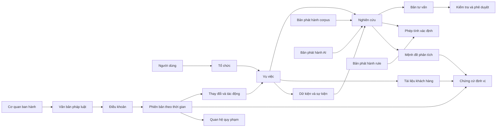

# Thiết kế dữ liệu

**Tài liệu:** `DES-DATA-001`  
**Phiên bản:** 0.1  
**Trạng thái:** bản thiết kế để triển khai MVP  
**Phạm vi:** trợ lý pháp luật thuế Việt Nam, đa tenant, khởi đầu với VAT và hóa đơn  
**Nguồn chuẩn liên quan:** đặc tả sản phẩm, use case `UC-001` đến `UC-018`, kiến trúc AI `AI-001` đến `AI-018`

## 1. Mục tiêu và quyết định nền tảng

Mô hình dữ liệu phải đồng thời bảo đảm bốn loại tính đúng:

1. **Đúng pháp lý:** phân biệt văn bản, phiên bản điều khoản, hiệu lực, quan hệ sửa đổi và cấp thẩm quyền.
2. **Đúng thời điểm:** trả lời được “quy định có hiệu lực tại ngày sự kiện” và “hệ thống biết gì tại một thời điểm trong quá khứ”.
3. **Đúng chứng cứ:** mỗi fact, claim, phép tính và kết luận có thể truy ngược tới snapshot, vị trí và phiên bản xử lý.
4. **Đúng phạm vi truy cập:** tenant, matter, ethical wall và retention được thực thi từ database đến mọi projection.

Quyết định nền tảng:

- PostgreSQL là system of record cho metadata, workflow, temporal state và audit.
- Object store tương thích S3 lưu byte gốc, snapshot và artifact bất biến; khóa object chứa tenant đối với tài liệu riêng.
- OpenSearch/vector index, Redis và graph database là projection có thể dựng lại, không phải nguồn chuẩn.
- Dùng UUIDv7 do server sinh để có tính phân tán và locality; mã văn bản pháp luật là business key riêng, không dùng làm PK.
- Thời gian pháp lý dùng `date`; thời gian hệ thống dùng `timestamptz` UTC. Khoảng thời gian luôn là nửa mở `[from, to)`.
- Số tiền dùng `numeric`, không dùng floating point. Nội dung có hash SHA-256 và provenance.
- Bảng lịch sử quan trọng là append-only. Việc “sửa” tạo content version mới; chỉ assertion có thẩm quyền được phép đóng cận trên `system_period` bằng publish procedure.

### 1.1 Ngoài phạm vi

- Không lưu raw chain-of-thought của mô hình.
- Không dùng vector store làm bộ nhớ nghiệp vụ.
- Không đồng bộ hai chiều PostgreSQL và Neo4j trong MVP.
- Không thiết kế data warehouse phân tích hành vi người dùng trong tài liệu này.
- Không coi bản hợp nhất là nguồn thay thế các văn bản gốc tạo nên lịch sử sửa đổi.

## 2. Ba góc nhìn dữ liệu

### 2.1 Conceptual view



### 2.2 Logical view theo bounded schema

| Schema | Quyền sở hữu dữ liệu | Aggregate root chính | Use case |
|---|---|---|---|
| `iam` | tenant, user, membership, role | `tenant`, `user_account` | `UC-001`, `UC-015` |
| `matter` | case, member, event, fact, issue, assumption | `matter` | `UC-004` đến `UC-011` |
| `content` | upload và tài liệu riêng | `document` | `UC-005`, `UC-006` |
| `legal` | văn bản, điều khoản, phiên bản, cạnh quy phạm, snapshot | `instrument` | `UC-002`, `UC-003`, `UC-013` |
| `research` | run, step, retrieval, claim, evidence, verification | `research_run` | `UC-002`, `UC-007`, `UC-017`, `UC-018` |
| `rules` | rule, parameter, calculation, trace | `rule` | `UC-008` |
| `authoring` | draft, version, review, approval, export | `draft` | `UC-009` đến `UC-011` |
| `changeintel` | diff, impact, subscription, alert | `change_set` | `UC-012`, `UC-014` |
| `release` | corpus/model/prompt/tool/retrieval release | `corpus_release`, `ai_release` | `UC-013` |
| `workflow` | job, task, idempotency, outbox | `job` | mọi command dài |
| `audit` | audit event, access evidence, retention action | `audit_event` | `UC-016` |

Không module nào được join trực tiếp sang bảng private của module khác trong code tùy tiện. Module đọc qua repository/interface; FK liên schema chỉ dùng cho identity ổn định và được ghi trong migration contract.

### 2.3 Physical view

```text
PostgreSQL
  iam, matter, content, legal, research, rules,
  authoring, changeintel, release, workflow, audit
Object store
  tenants/{tenant_id}/documents/{document_id}/{version_id}/original
  legal/{jurisdiction}/{snapshot_id}/original
  artifacts/{tenant_id}/{artifact_id}/{digest}
OpenSearch
  legal-provision-{corpus_release_id}
  matter-document-{tenant_partition}
Optional graph projection
  nodes/edges keyed by stable PostgreSQL IDs + projection_version
Redis
  rate limit, distributed lease, SSE cursor, short-lived exact cache
```

## 3. Quy ước chung

### 3.1 Cột chuẩn

| Cột | Kiểu | Quy tắc |
|---|---|---|
| `id` | `uuid` | UUIDv7, immutable |
| `tenant_id` | `uuid` | bắt buộc với mọi dữ liệu khách hàng; FK `iam.tenant` |
| `created_at`, `updated_at` | `timestamptz` | UTC; `updated_at` không dùng để mô hình hóa lịch sử pháp lý |
| `created_by`, `updated_by` | `uuid` | actor; service actor cũng có principal |
| `row_version` | `bigint` | optimistic concurrency, tăng đúng một |
| `status` | enum/text có check | state machine, không nhận chuỗi tự do |
| `metadata` | `jsonb` | phần mở rộng ít truy vấn; không giấu field nghiệp vụ chính trong JSON |
| `content_sha256` | `bytea` | đúng 32 byte, tính trên byte canonical/original được chỉ rõ |

### 3.2 Business key và ID ổn định

- `instrument.id` tồn tại qua mọi lần sửa đổi; `instrument_version.id` xác định một trạng thái metadata.
- `provision.id` biểu diễn vị trí logic, ví dụ Điều 10 Khoản 2;
  `provision_version.id` biểu diễn một content snapshot, còn `provision_assertion`
  quyết định content đó áp dụng cho branch/khoảng nào.
- Nếu việc sửa luật tái cấu trúc khiến không thể chứng minh cùng identity, tạo `provision.id` mới và cạnh `renumbers_to`/`replaces`.
- Snapshot và document version là immutable. Mọi anchor trỏ tới đúng version, không trỏ “latest”.
- ID projection bằng ID nguồn cộng `corpus_release_id`; index không tự phát sinh legal identity.

### 3.3 Bitemporal và tách candidate khỏi authority

Không đặt candidate đang parse/review vào cùng timeline authoritative. Hai khái niệm được tách:

- `provision_version`: nội dung bất biến lấy từ snapshot; có lifecycle `draft/quarantined/reviewed/published/rejected`, nhưng chưa tự trở thành luật được resolver dùng.
- `provision_assertion`: khẳng định rằng một `provision_version` là bản có thẩm quyền cho một branch trong hai khoảng thời gian.

Hai khoảng chỉ có ý nghĩa authoritative trên assertion:

- `valid_period daterange`: khi quy định có hiệu lực trong thế giới pháp lý.
- `system_period tstzrange`: khi hệ thống đã công bố niềm tin đó, phục vụ audit/correction/rollback.

Resolver tại `event_date = D`, `known_at = T`, branch `B` và corpus release `R` dùng đồng thời:

```sql
WHERE assertion.valid_period @> D
  AND assertion.system_period @> T
  AND assertion.applicability_branch = B
  AND corpus_member.corpus_release_id = R
```

Candidate `reviewed` có thể chồng lấn thoải mái với assertion đang active vì chưa có hàng `provision_assertion`. `valid_period` không được suy ra chỉ từ ngày ban hành; release build phải xét ngày hiệu lực riêng, điều khoản chuyển tiếp, hiệu lực một phần và branch. `system_period` chỉ do publish/rollback procedure quản lý, không nhận từ client.

## 4. Sơ đồ ER logic

Sơ đồ chỉ hiển thị quan hệ chủ chốt; data dictionary ở mục 5 là chuẩn đầy đủ hơn.

```mermaid
erDiagram
  TENANT ||--o{ TENANT_MEMBERSHIP : has
  USER_ACCOUNT ||--o{ TENANT_MEMBERSHIP : joins
  TENANT ||--o{ MATTER : owns
  MATTER ||--o{ MATTER_MEMBER : authorizes
  USER_ACCOUNT ||--o{ MATTER_MEMBER : participates
  MATTER ||--o{ MATTER_EVENT : contains
  MATTER ||--o{ FACT : contains
  FACT ||--o{ FACT_VERSION : versions
  FACT_VERSION ||--o{ FACT_EVIDENCE : supported_by
  MATTER ||--o{ ISSUE : contains
  MATTER ||--o{ DOCUMENT : contains
  DOCUMENT ||--o{ DOCUMENT_VERSION : versions
  DOCUMENT_VERSION ||--o{ SOURCE_ANCHOR : locates

  AUTHORITY ||--o{ INSTRUMENT : issues
  INSTRUMENT ||--o{ INSTRUMENT_VERSION : versions
  INSTRUMENT ||--o{ PROVISION : structures
  PROVISION ||--o{ PROVISION_VERSION : versions
  PROVISION ||--o{ PROVISION_ASSERTION : has_authoritative_timeline
  PROVISION_VERSION ||--o{ PROVISION_ASSERTION : asserted_as
  SOURCE_SNAPSHOT ||--o{ PROVISION_VERSION : proves
  PROVISION_VERSION ||--o{ SOURCE_ANCHOR : locates
  PROVISION_VERSION ||--o{ LEGAL_EDGE : from
  PROVISION ||--o{ LEGAL_EDGE : to

  MATTER ||--o{ RESEARCH_RUN : scopes
  RESEARCH_RUN ||--o{ RESEARCH_STEP : executes
  RESEARCH_RUN ||--o{ RETRIEVAL_HIT : retrieves
  RESEARCH_RUN ||--o{ CLAIM : produces
  CLAIM ||--o{ CLAIM_VERSION : versions
  CLAIM_VERSION ||--o{ CLAIM_EVIDENCE : cites
  SOURCE_ANCHOR ||--o{ CLAIM_EVIDENCE : supports
  CLAIM_VERSION ||--o{ VERIFICATION_RESULT : checks

  RULE ||--o{ RULE_VERSION : versions
  RULE_VERSION ||--o{ CALCULATION_RUN : executes
  CALCULATION_RUN ||--o{ CALCULATION_STEP : traces
  MATTER ||--o{ DRAFT : produces
  DRAFT ||--o{ DRAFT_VERSION : versions
  DRAFT_VERSION ||--o{ REVIEW : reviews
  REVIEW ||--o{ APPROVAL : decides

  CORPUS_RELEASE ||--o{ CORPUS_MEMBER : contains
  AI_RELEASE ||--o{ RESEARCH_RUN : configures
  CHANGE_SET ||--o{ IMPACT : creates
  MATTER ||--o{ IMPACT : affected
  JOB ||--o{ OUTBOX_EVENT : emits
  TENANT ||--o{ AUDIT_EVENT : records
```

## 5. Data dictionary theo miền

Ký hiệu: `PK` khóa chính, `FK` khóa ngoại, `UQ` unique, `NN` not null. Các bảng tenant-scoped luôn có `tenant_id NN` dù bảng dưới không lặp lại trong mọi dòng mô tả.

### 5.1 `iam`: tenant và quyền

#### `iam.tenant`

| Cột | Kiểu/ràng buộc | Ý nghĩa |
|---|---|---|
| `id` | uuid PK | tenant ổn định |
| `slug` | citext UQ NN | định danh URL, không tái sử dụng sau xóa |
| `display_name` | text NN | tên hiển thị |
| `status` | enum NN | `provisioning/active/suspended/closed` |
| `data_region` | text NN | vùng lưu dữ liệu |
| `retention_policy_id` | uuid FK | chính sách đang áp dụng |
| `kms_key_ref` | text | tham chiếu khóa, không lưu secret |
| `settings` | jsonb | feature flags/policy đã validate schema |

#### `iam.user_account`, `iam.tenant_membership`, `iam.role_assignment`

| Bảng | Cột chính | Bất biến |
|---|---|---|
| `user_account` | `id`, `subject UQ`, `email`, `display_name`, `status`, `last_login_at` | `subject` là cặp OIDC issuer + subject; email không là identity |
| `tenant_membership` | `tenant_id FK`, `user_id FK`, `status`, `joined_at`, `ended_at` | UQ active `(tenant_id,user_id)` |
| `role_assignment` | `tenant_id`, `user_id`, `role_code`, `scope_type`, `scope_id`, `valid_period` | role tenant không tự cấp quyền matter bị ethical wall |
| `platform_role_assignment` | `principal_id`, `role_code`, `scope`, `valid_period`, `approved_by`, `reason` | không có `tenant_id`; chỉ control plane cấp quyền curate/publish corpus công cộng, có JIT/step-up/dual control |
| `service_principal` | `id`, `tenant_id?`, `name`, `purpose`, `status`, `credential_ref` | credential ở secret manager |

Corpus pháp luật công cộng thuộc **platform control plane**, không thuộc một tenant.
`tenant_admin` và `tenant curator` không có quyền ghi `legal.*` hoặc phát hành global
corpus. Nội dung riêng như playbook/chú giải của khách hàng nằm trong
`legal.tenant_knowledge_overlay(tenant_id, ...)`, index namespace riêng, RLS/matter
ACL đầy đủ và không được nâng thành nguồn quy phạm công cộng bằng một command tenant.

### 5.2 `matter`: case và dữ kiện

#### `matter.matter`

| Cột | Kiểu/ràng buộc | Ý nghĩa |
|---|---|---|
| `id` | uuid PK | matter ID |
| `tenant_id` | uuid FK NN | ranh giới tenant |
| `code` | text NN | mã nghiệp vụ, UQ trong tenant |
| `title` | text NN | tên vụ việc |
| `tax_domain` | text[] NN | ví dụ `VAT`, `INVOICE` |
| `jurisdiction` | text NN default `VN` | phạm vi pháp luật |
| `event_date_from/to` | date | khoảng sự kiện ban đầu |
| `confidentiality` | enum NN | `internal/restricted/highly_restricted` |
| `status` | enum NN | `draft/active/under_review/closed/archived` |
| `owner_user_id` | uuid FK NN | người chịu trách nhiệm |
| `row_version` | bigint NN | ETag/optimistic lock |

`matter_member(matter_id, tenant_id, principal_type, principal_id, access_level, ethical_wall_reason, granted_by, granted_at, revoked_at)` là ACL chuẩn. `access_level` thuộc `viewer/contributor/reviewer/owner`. Mọi FK từ bảng con dùng khóa ghép `(tenant_id, matter_id)` để ngăn tham chiếu xuyên tenant.

#### Dữ kiện và issue

| Bảng | Cột chính | Quan hệ/ý nghĩa |
|---|---|---|
| `matter_event` | `id`, `matter_id`, `event_type`, `occurred_on`, `ended_on`, `amount`, `currency`, `status` | timeline nghiệp vụ; ngày nguồn cho temporal resolver |
| `fact` | `id`, `matter_id`, `fact_key`, `value_type`, `materiality`, `status` | identity logic của dữ kiện |
| `fact_version` | `id`, `fact_id`, `value_json`, `assertion_type`, `confidence_band`, `system_period`, `created_by` | append-only; `assertion_type=extracted/user_asserted/confirmed/disputed` |
| `fact_evidence` | `fact_version_id`, `source_anchor_id`, `relationship`, `quoted_text_hash` | chứng cứ của đúng phiên bản fact |
| `assumption` | `id`, `matter_id`, `text`, `materiality`, `status`, `resolved_by_fact_id` | giả định phải hiển thị ở output |
| `issue` | `id`, `matter_id`, `parent_issue_id`, `issue_code`, `question`, `priority`, `status` | issue tree; adjacency có giới hạn độ sâu |
| `issue_fact` | `issue_id`, `fact_id`, `relationship` | relevant/supports/contradicts/missing |

Không ghi đè `fact_version`. Xác nhận fact tạo version mới với actor và evidence; AI chỉ có thể tạo `extracted`, không thể tự tạo `confirmed`.

### 5.3 `content`: tài liệu và anchor

| Bảng | Cột chính | Bất biến |
|---|---|---|
| `document` | `id`, `tenant_id`, `matter_id`, `title`, `classification`, `status` | metadata logic, RLS + matter ACL |
| `document_version` | `id`, `document_id`, `version_no`, `object_key`, `media_type`, `byte_size`, `content_sha256`, `scan_status`, `parse_status`, `created_at` | UQ `(document_id,version_no)`; byte bất biến |
| `document_page` | `document_version_id`, `page_no`, `image_object_key`, `text_sha256`, `ocr_quality`, `layout_json` | page_no bắt đầu từ 1 |
| `source_anchor` | `id`, `source_kind`, `document_version_id?`, `snapshot_id?`, `page_no?`, `bbox?`, `char_start?`, `char_end?`, `text_sha256`, `anchor_version` | XOR đúng một nguồn; tọa độ normalized 0..1 |
| `upload_session` | `id`, `tenant_id`, `matter_id`, `status`, `expected_size`, `received_size`, `expires_at`, `idempotency_key` | hoàn tất một lần; quarantine trước khi dùng |

`source_anchor` là kiểu dùng chung cho tài liệu khách hàng và nguồn luật. Nội dung trích dẫn hiển thị phải được đọc từ version bất biến và kiểm tra lại hash, không tin chuỗi quote do mô hình trả về.

### 5.4 `legal`: corpus pháp luật và đồ thị quy phạm

#### Văn bản và điều khoản

| Bảng | Cột chính | Bất biến |
|---|---|---|
| `authority` | `id`, `name`, `authority_type`, `jurisdiction`, `valid_period` | cơ quan ban hành theo thời gian |
| `instrument` | `id`, `jurisdiction`, `document_number`, `instrument_type`, `issuing_authority_id`, `issued_on`, `canonical_key` | UQ canonical identity; không chứa “current text” |
| `instrument_version` | `id`, `instrument_id`, `title`, `publication_status`, `legal_status`, `valid_period`, `system_period`, `source_snapshot_id` | bitemporal metadata |
| `provision` | `id`, `instrument_id`, `parent_id`, `level`, `label`, `stable_path`, `ordinal` | cấu trúc logic; cycle bị cấm |
| `provision_version` | `id`, `provision_id`, `heading`, `text_content`, `text_sha256`, `proposed_valid_period`, `publication_status`, `source_snapshot_id`, `source_anchor_id` | content bất biến; candidate/reviewed được phép cùng tồn tại và chồng khoảng |
| `provision_assertion` | `id`, `provision_id`, `provision_version_id`, `applicability_branch`, `valid_period`, `system_period`, `activated_by_release_id`, `deactivated_by_release_id?`, `assertion_reason` | timeline authoritative bitemporal; chỉ publish/rollback procedure tạo/đóng |
| `tenant_knowledge_overlay` | `id`, `tenant_id`, `matter_id?`, `source_snapshot_id`, `kind`, `status`, `valid_period?` | nội dung riêng, không mang authority class công cộng; RLS và release namespace theo tenant |
| `transition_rule` | `id`, `instrument_id`, `scope_expression`, `from_regime`, `to_regime`, `trigger_date`, `source_provision_version_id`, `review_status` | resolver chỉ chạy rule đã duyệt |

#### Snapshot và provenance

| Bảng | Cột chính | Bất biến |
|---|---|---|
| `source_snapshot` | `id`, `source_url`, `retrieved_at`, `http_status`, `media_type`, `object_key`, `content_sha256`, `signature_info`, `parser_release_id`, `status` | UQ `(source_url,content_sha256)`; không sửa byte/object key |
| `source_observation` | `id`, `source_url`, `observed_at`, `etag`, `last_modified`, `content_sha256`, `snapshot_id?`, `result` | lịch sử polling kể cả không đổi/lỗi |
| `parse_artifact` | `id`, `snapshot_id`, `parser_release_id`, `artifact_type`, `object_key`, `content_sha256`, `quality_metrics` | derived nhưng versioned |
| `curation_decision` | `id`, `subject_type`, `subject_id`, `decision`, `reason_code`, `reviewer_id`, `decided_at` | publish/reject/quarantine audit được |

#### `legal.legal_edge`

| Cột | Kiểu/ràng buộc | Ý nghĩa |
|---|---|---|
| `id` | uuid PK | edge ID |
| `from_provision_version_id` | uuid FK NN | phiên bản nguồn |
| `to_provision_id` | uuid FK NN | identity đích; resolver chọn version theo thời gian |
| `edge_type` | enum NN | `cites/defines/applies_to/exception_to/amends/replaces/repeals/suspends/implements/guides/renumbers_to/conflicts_with` |
| `valid_period` | daterange NN | thời gian edge có hiệu lực |
| `system_period` | tstzrange NN | thời gian hệ thống biết edge |
| `source_anchor_id` | uuid FK NN | bằng chứng cạnh |
| `derivation` | enum NN | `parser_exact/human/llm_proposed` |
| `review_status` | enum NN | chỉ `approved` được dùng trong authoritative traversal |
| `confidence_band` | enum | `high/medium/low`, không phải xác suất giả |

LLM không được tự publish edge. Edge `amends/repeals/suspends` cần dual review và kiểm tra phạm vi. Mỗi traversal lưu edge IDs thực tế trong research trace.

### 5.5 `research`: tác vụ AI, claim và evidence

#### Run và step

| Bảng | Cột chính | Ý nghĩa |
|---|---|---|
| `research_run` | `id`, `tenant_id`, `matter_id?`, `use_case_id`, `question`, `mode`, `event_date`, `known_at`, `status`, `corpus_release_id`, `ai_release_id`, `policy_snapshot`, `budget`, `started_at`, `finished_at` | root của `UC-002`, `UC-007`, `UC-017`, `UC-018`; release bị pin khi start |
| `research_step` | `id`, `run_id`, `sequence_no`, `ai_task_id`, `step_type`, `status`, `input_digest`, `output_artifact_id`, `tool_name`, `attempt_no`, `started_at`, `finished_at`, `error_code` | `ai_task_id` thuộc registry từ `AI-001` đến `AI-018`; không lưu CoT |
| `retrieval_query` | `id`, `run_id`, `query_text`, `filters_json`, `retrieval_release_id`, `query_digest` | truy vấn và hard filter đã áp dụng |
| `retrieval_hit` | `query_id`, `rank`, `provision_version_id?`, `document_version_id?`, `score_components`, `rerank_score`, `selected`, `rejection_reason` | provenance truy hồi, không coi score là độ tin cậy pháp lý |
| `tool_invocation` | `id`, `step_id`, `tool_code`, `input_digest`, `policy_decision`, `started_at`, `finished_at`, `result_digest`, `error_code` | log typed; payload nhạy cảm ở artifact store |

`status` của run: `queued -> planning -> retrieving -> analyzing -> verifying -> awaiting_input|awaiting_review -> completed|abstained|failed|cancelled`. Chỉ state machine service được chuyển trạng thái.

#### Claim/evidence/verification

| Bảng | Cột chính | Bất biến |
|---|---|---|
| `claim` | `id`, `run_id`, `claim_key`, `claim_type`, `materiality` | identity của mệnh đề |
| `claim_version` | `id`, `claim_id`, `version_no`, `text`, `stance`, `status`, `created_by_type`, `model_call_id?`, `system_period` | append-only; AI version không bao giờ mang trạng thái approved |
| `claim_evidence` | `claim_version_id`, `source_anchor_id`, `evidence_role`, `support_status`, `verification_result_id?`, `display_order` | UQ cặp; role `supports/qualifies/contradicts/background` |
| `verification_result` | `id`, `claim_version_id`, `check_type`, `result`, `reason_codes`, `verifier_release`, `checked_at`, `details_artifact_id` | check citation, temporal, authority, entailment, conflict, completeness |
| `answer_snapshot` | `id`, `run_id`, `schema_version`, `content_json`, `content_sha256`, `gate_status`, `created_at` | output domain đã validate; không lưu raw completion |
| `model_call` | `id`, `run_id`, `step_id`, `provider`, `model_release_id`, `prompt_release_id`, `input_tokens`, `output_tokens`, `latency_ms`, `finish_reason`, `input_digest`, `output_digest`, `retention_class` | prompt/output nhạy cảm nằm ở artifact ACL riêng nếu được phép |

Invariants:

- Claim material không được `supported` nếu không có ít nhất một `claim_evidence` đến nguồn authority phù hợp.
- `claim_evidence` phải trỏ anchor của đúng `provision_version` đã dùng, không chỉ instrument.
- Claim có evidence `contradicts` chưa xử lý không thể qua gate.
- Kết luận `completed` phải có verification cho temporal, citation integrity và conflict; nếu thiếu evidence thì `abstained` hoặc `awaiting_input`.

### 5.6 `rules`: rule và phép tính

| Bảng | Cột chính | Bất biến |
|---|---|---|
| `rule` | `id`, `code`, `name`, `tax_domain`, `owner_team`, `status` | identity logic |
| `rule_version` | `id`, `rule_id`, `semantic_version`, `valid_period`, `system_period`, `input_schema`, `output_schema`, `implementation_digest`, `status`, `approved_by` | immutable sau publish; provenance tới provisions |
| `rule_authority` | `rule_version_id`, `provision_version_id`, `relationship` | căn cứ cho rule |
| `rule_parameter` | `id`, `rule_version_id`, `key`, `value_decimal/text/json`, `unit`, `valid_period`, `source_anchor_id` | một kiểu value đúng |
| `calculation_run` | `id`, `tenant_id`, `matter_id`, `rule_version_id`, `idempotency_key`, `event_date`, `input_json`, `input_digest`, `output_json`, `output_digest`, `status`, `created_by` | input/output theo JSON Schema; dùng Decimal |
| `calculation_step` | `id`, `calculation_run_id`, `sequence_no`, `operation_code`, `inputs_json`, `formula_ref`, `result_json`, `rounding_policy`, `authority_ids` | trace tái lập được |

AI (`AI-011`) chỉ đề xuất mapping input và giải thích output. Engine xác định thực thi rule; người dùng xác nhận biến trọng yếu trước khi kết quả được dùng trong memo.

### 5.7 `authoring`: draft, review và phát hành

| Bảng | Cột chính | Ý nghĩa |
|---|---|---|
| `draft` | `id`, `tenant_id`, `matter_id`, `document_type`, `status`, `current_version_id` | aggregate bản tư vấn |
| `draft_version` | `id`, `draft_id`, `version_no`, `schema_version`, `content_json`, `content_sha256`, `source_run_id`, `created_by`, `created_at` | immutable; claim/citation dùng ID có cấu trúc |
| `review` | `id`, `draft_version_id`, `review_type`, `assignee_id`, `status`, `due_at`, `checklist_release_id` | reviewer khác author khi policy yêu cầu |
| `review_comment` | `id`, `review_id`, `target_path`, `body`, `severity`, `status` | target JSON path/claim ID ổn định |
| `approval` | `id`, `review_id`, `decision`, `decided_by`, `decided_at`, `reason`, `approved_digest` | digest khóa đúng draft version |
| `export_artifact` | `id`, `draft_version_id`, `format`, `object_key`, `content_sha256`, `watermark`, `classification`, `expires_at` | chỉ version approved được chia sẻ ngoài tenant |

### 5.8 `release` và change intelligence

| Bảng | Cột chính | Bất biến |
|---|---|---|
| `corpus_release` | `id`, `version`, `status`, `manifest_sha256`, `built_at`, `published_at`, `approved_by`, `parent_release_id` | manifest immutable; research pin release |
| `corpus_member` | `corpus_release_id`, `provision_assertion_id`, `provision_version_id`, `index_document_digest`, `embedding_release_id` | UQ member; pin đúng assertion authoritative và content version |
| `ai_release` | `id`, `version`, `status`, `model_routes`, `prompt_release_id`, `retrieval_release_id`, `tool_policy_release_id`, `eval_report_id`, `published_at` | toàn bộ cấu hình tái lập run |
| `model_release` | `id`, `provider`, `model_name`, `provider_version`, `capabilities`, `data_policy`, `status` | alias “latest” không được lưu trong run |
| `prompt_release` | `id`, `task_id`, `version`, `template_digest`, `schema_digest`, `status` | nội dung nguồn ở Git/artifact bất biến |
| `change_set` | `id`, `instrument_id`, `old_release_id`, `new_release_id`, `change_type`, `status`, `detected_at`, `published_at` | root của `AI-014` |
| `change_item` | `id`, `change_set_id`, `old_provision_version_id?`, `new_provision_version_id?`, `diff_artifact_id`, `materiality`, `review_status` | semantic diff là derived, cần review |
| `impact` | `id`, `change_item_id`, `target_type`, `target_id`, `tenant_id?`, `impact_type`, `severity`, `rationale_claim_id`, `status` | target rule/template/matter/subscription |
| `subscription` | `id`, `tenant_id`, `principal_id`, `scope_json`, `channel`, `status` | scope được validate, không lưu query tùy ý |
| `alert` | `id`, `subscription_id`, `impact_id`, `dedupe_key`, `status`, `delivered_at`, `read_at` | UQ dedupe; `AI-018` không gửi hai lần |

### 5.9 `workflow` và `audit`

| Bảng | Cột chính | Bất biến |
|---|---|---|
| `workflow.job` | `id`, `tenant_id?`, `job_type`, `aggregate_type/id`, `status`, `attempt`, `max_attempts`, `available_at`, `lease_until`, `input_digest`, `result_artifact_id`, `error_code` | retry có backoff; side effect idempotent |
| `workflow.task` | `id`, `tenant_id`, `matter_id?`, `task_type`, `assignee_id`, `status`, `due_at`, `source_type/id` | human work queue |
| `workflow.idempotency_record` | `tenant_id`, `principal_id`, `operation_id`, `idempotency_key`, `request_digest`, `response_status`, `response_body`, `resource_id`, `expires_at` | UQ tuple; key cũ + body khác trả conflict |
| `workflow.outbox_event` | `id`, `aggregate_type/id`, `event_type`, `schema_version`, `tenant_id?`, `payload`, `occurred_at`, `published_at`, `attempt` | insert cùng transaction nghiệp vụ |
| `workflow.inbox_message` | `consumer`, `message_id`, `received_at`, `processed_at`, `result` | UQ chống xử lý lặp |
| `audit.audit_event` | `id`, `tenant_id?`, `occurred_at`, `actor_type/id`, `action`, `resource_type/id`, `matter_id?`, `purpose`, `decision`, `request_id`, `before_digest`, `after_digest`, `metadata_redacted`, `prev_hash`, `event_hash` | append-only, hash-chain theo partition |
| `audit.retention_action` | `id`, `tenant_id`, `resource_type/id`, `policy_id`, `action`, `scheduled_at`, `executed_at`, `proof_digest`, `status` | xóa/ẩn danh có bằng chứng, không xóa audit bắt buộc |

Audit không chứa nội dung hồ sơ, access token, prompt đầy đủ hoặc PII không cần thiết. Nội dung bằng chứng nằm ở store có ACL/retention riêng.

## 6. Bất biến và ràng buộc toàn hệ thống

| ID | Bất biến | Cơ chế thực thi |
|---|---|---|
| `DATA-INV-001` | không có FK xuyên tenant | khóa ghép `(tenant_id,id)`, test migration |
| `DATA-INV-002` | app role không bypass RLS | `NOBYPASSRLS`, `FORCE ROW LEVEL SECURITY`, integration test |
| `DATA-INV-003` | byte snapshot và nội dung `provision_version` là bất biến | trigger chặn đổi payload/delete; lifecycle decision nằm ở curation/audit; object versioning |
| `DATA-INV-004` | assertion của cùng provision/branch không được chồng cả valid time lẫn system time | GiST exclusion trên hai range; candidate không nằm trong assertion |
| `DATA-INV-005` | resolver luôn có `event_date`, `known_at`, `corpus_release_id` | API schema + DB not null trên run |
| `DATA-INV-006` | fact AI không tự thành confirmed | transition constraint + authorization |
| `DATA-INV-007` | claim material phải có evidence đã verify trước completion | deferred/domain transaction check |
| `DATA-INV-008` | calculator tái lập được | pin rule version, input/output digest, trace |
| `DATA-INV-009` | research/draft pin mọi release | FK non-null khi chuyển khỏi draft/queued |
| `DATA-INV-010` | không phát hành corpus chưa dual review các thay đổi material | publish command policy |
| `DATA-INV-011` | idempotency key không được tái dùng với payload khác | UQ + request digest conflict |
| `DATA-INV-012` | event outbox không mất khi commit nghiệp vụ | cùng DB transaction |
| `DATA-INV-013` | không semantic-cache xuyên tenant | key namespace + architectural test |
| `DATA-INV-014` | graph/search result chỉ chứa IDs thuộc release và ACL hiện hành | projection manifest + query filter |
| `DATA-INV-015` | approved artifact khớp đúng digest đã duyệt | approval FK + digest verification |
| `DATA-INV-016` | tenant principal không thể curate/publish global corpus; overlay không được giả authority công cộng | platform role tách biệt, DB grant riêng, policy/negative tests và audit control plane |
| `DATA-INV-016` | publish/rollback không tạo transient gap giữa timeline cũ và mới | đóng assertion cũ, mở assertion mới, đổi active release pointer và outbox trong một transaction |

## 7. PostgreSQL DDL tham chiếu

DDL minh họa các cơ chế khó; migration thực tế phải đặt tên constraint/index ổn định, có downgrade policy và được test trên bản PostgreSQL được chọn.

```sql
CREATE EXTENSION IF NOT EXISTS btree_gist;
CREATE EXTENSION IF NOT EXISTS citext;

CREATE SCHEMA IF NOT EXISTS iam;
CREATE SCHEMA IF NOT EXISTS matter;
CREATE SCHEMA IF NOT EXISTS legal;
CREATE SCHEMA IF NOT EXISTS workflow;

CREATE TABLE iam.tenant (
  id uuid PRIMARY KEY,
  slug citext NOT NULL UNIQUE,
  display_name text NOT NULL,
  status text NOT NULL CHECK (status IN
    ('provisioning', 'active', 'suspended', 'closed')),
  data_region text NOT NULL,
  created_at timestamptz NOT NULL DEFAULT clock_timestamp()
);

CREATE TABLE matter.matter (
  id uuid NOT NULL,
  tenant_id uuid NOT NULL REFERENCES iam.tenant(id),
  code text NOT NULL,
  title text NOT NULL CHECK (length(title) BETWEEN 1 AND 500),
  jurisdiction text NOT NULL DEFAULT 'VN',
  status text NOT NULL CHECK (status IN
    ('draft', 'active', 'under_review', 'closed', 'archived')),
  confidentiality text NOT NULL CHECK (confidentiality IN
    ('internal', 'restricted', 'highly_restricted')),
  owner_user_id uuid NOT NULL,
  row_version bigint NOT NULL DEFAULT 1 CHECK (row_version > 0),
  created_at timestamptz NOT NULL DEFAULT clock_timestamp(),
  updated_at timestamptz NOT NULL DEFAULT clock_timestamp(),
  PRIMARY KEY (id),
  UNIQUE (tenant_id, id),
  UNIQUE (tenant_id, code)
);

CREATE TABLE matter.matter_member (
  tenant_id uuid NOT NULL REFERENCES iam.tenant(id),
  matter_id uuid NOT NULL,
  principal_id uuid NOT NULL,
  access_level text NOT NULL CHECK (access_level IN
    ('viewer', 'contributor', 'reviewer', 'owner')),
  granted_by uuid NOT NULL,
  granted_at timestamptz NOT NULL DEFAULT clock_timestamp(),
  revoked_at timestamptz,
  PRIMARY KEY (tenant_id, matter_id, principal_id),
  FOREIGN KEY (tenant_id, matter_id)
    REFERENCES matter.matter(tenant_id, id),
  CHECK (revoked_at IS NULL OR revoked_at >= granted_at)
);

CREATE INDEX matter_member_principal_idx
  ON matter.matter_member (tenant_id, principal_id, matter_id)
  WHERE revoked_at IS NULL;

CREATE TABLE legal.provision (
  id uuid PRIMARY KEY,
  instrument_id uuid NOT NULL,
  parent_id uuid REFERENCES legal.provision(id),
  level text NOT NULL,
  label text NOT NULL,
  stable_path text NOT NULL,
  ordinal integer NOT NULL CHECK (ordinal >= 0),
  UNIQUE (instrument_id, stable_path),
  CHECK (parent_id IS NULL OR parent_id <> id)
);

CREATE TABLE legal.provision_version (
  id uuid PRIMARY KEY,
  provision_id uuid NOT NULL REFERENCES legal.provision(id),
  text_content text NOT NULL,
  text_sha256 bytea NOT NULL CHECK (octet_length(text_sha256) = 32),
  proposed_valid_period daterange,
  publication_status text NOT NULL CHECK (publication_status IN
    ('draft', 'quarantined', 'reviewed', 'published', 'rejected', 'withdrawn')),
  source_snapshot_id uuid NOT NULL,
  source_anchor_id uuid NOT NULL,
  created_at timestamptz NOT NULL DEFAULT clock_timestamp(),
  CHECK (proposed_valid_period IS NULL OR NOT isempty(proposed_valid_period)),
  CHECK (proposed_valid_period IS NULL OR
    (lower_inc(proposed_valid_period) AND NOT upper_inc(proposed_valid_period)))
);

CREATE TABLE legal.provision_assertion (
  id uuid PRIMARY KEY,
  provision_id uuid NOT NULL REFERENCES legal.provision(id),
  provision_version_id uuid NOT NULL REFERENCES legal.provision_version(id),
  applicability_branch text NOT NULL DEFAULT 'default',
  valid_period daterange NOT NULL,
  system_period tstzrange NOT NULL,
  activated_by_release_id uuid NOT NULL,
  deactivated_by_release_id uuid,
  assertion_reason text NOT NULL,
  CHECK (NOT isempty(valid_period)),
  CHECK (NOT isempty(system_period)),
  CHECK (lower_inc(valid_period) AND NOT upper_inc(valid_period)),
  CHECK (lower_inc(system_period) AND NOT upper_inc(system_period)),
  UNIQUE (id, provision_version_id)
);

ALTER TABLE legal.provision_assertion
  ADD CONSTRAINT provision_assertion_no_bitemporal_overlap
  EXCLUDE USING gist (
    provision_id WITH =,
    applicability_branch WITH =,
    valid_period WITH &&,
    system_period WITH &&
  );

CREATE INDEX provision_assertion_resolve_idx
  ON legal.provision_assertion
  USING gist (provision_id, valid_period, system_period);

CREATE INDEX provision_version_snapshot_idx
  ON legal.provision_version (source_snapshot_id);
```

Candidate được ingest/review trước và có thể chồng `proposed_valid_period`; nó chưa có
`provision_assertion` nên resolver không thấy. Publish/correction chỉ cập nhật lifecycle
metadata, không sửa text/hash/snapshot. Việc đóng assertion cũ, tạo assertion mới,
ghi membership, đổi active pointer và outbox phải cùng một transaction
`SERIALIZABLE` hoặc khóa advisory theo `provision_id`/branch:

```sql
BEGIN;
SELECT pg_advisory_xact_lock(hashtextextended(:provision_id::text, 0));

-- Candidate và release/index đã qua curation, dual approval và regression gate.
UPDATE legal.provision_assertion
SET system_period = tstzrange(lower(system_period), :published_at, '[)'),
    deactivated_by_release_id = :release_id
WHERE provision_id = :provision_id
  AND applicability_branch = :branch
  AND upper_inf(system_period);

INSERT INTO legal.provision_assertion (
  id, provision_id, provision_version_id, applicability_branch,
  valid_period, system_period, activated_by_release_id, assertion_reason
) VALUES (
  :assertion_id, :provision_id, :reviewed_version_id, :branch,
  :approved_valid_period, tstzrange(:published_at, 'infinity', '[)'),
  :release_id, :assertion_reason
);

UPDATE legal.provision_version
SET publication_status = 'published'
WHERE id = :reviewed_version_id
  AND publication_status = 'reviewed';

INSERT INTO release.corpus_member (
  corpus_release_id, provision_assertion_id, provision_version_id,
  index_document_digest, embedding_release_id
) VALUES (
  :release_id, :assertion_id, :reviewed_version_id,
  :index_digest, :embedding_release_id
);

UPDATE release.active_pointer
SET corpus_release_id = :release_id, row_version = row_version + 1
WHERE jurisdiction = :jurisdiction
  AND row_version = :expected_pointer_version;

INSERT INTO workflow.outbox_event (...); -- corpus.published.v1
COMMIT;
```

Không có khoảng trống nhìn thấy giữa bản cũ và mới vì transaction chỉ commit sau khi
mọi assertion/member/pointer hợp lệ. Rollback không mở lại row đã đóng; nó tạo một
correction release và assertion mới trỏ về content cũ, giữ toàn bộ system-time history.

### 7.1 RLS và matter ACL

Connection pool phải dùng transaction-scoped `SET LOCAL`; tuyệt đối không để tenant context tồn tại trên connection trả về pool.

```sql
ALTER TABLE matter.matter ENABLE ROW LEVEL SECURITY;
ALTER TABLE matter.matter FORCE ROW LEVEL SECURITY;

CREATE POLICY matter_tenant_policy ON matter.matter
USING (
  tenant_id = current_setting('app.tenant_id', true)::uuid
  AND EXISTS (
    SELECT 1
    FROM matter.matter_member mm
    WHERE mm.tenant_id = matter.tenant_id
      AND mm.matter_id = matter.id
      AND mm.principal_id = current_setting('app.principal_id', true)::uuid
      AND mm.revoked_at IS NULL
  )
)
WITH CHECK (
  tenant_id = current_setting('app.tenant_id', true)::uuid
);

-- Role runtime phải là NOLOGIN/NOBYPASSRLS và không sở hữu bảng.
ALTER ROLE app_runtime NOBYPASSRLS;
```

Worker hệ thống không dùng cờ `bypass=true` chung. Mỗi worker có role DB tối thiểu, purpose và bảng được phép; tác vụ cross-tenant chạy từng tenant, ghi audit riêng.

### 7.2 Outbox và idempotency

```sql
CREATE TABLE workflow.idempotency_record (
  tenant_id uuid NOT NULL,
  principal_id uuid NOT NULL,
  operation_id text NOT NULL,
  idempotency_key text NOT NULL,
  request_digest bytea NOT NULL CHECK (octet_length(request_digest) = 32),
  response_status integer,
  response_body jsonb,
  resource_id uuid,
  created_at timestamptz NOT NULL DEFAULT clock_timestamp(),
  expires_at timestamptz NOT NULL,
  PRIMARY KEY (tenant_id, principal_id, operation_id, idempotency_key)
);

CREATE TABLE workflow.outbox_event (
  id uuid PRIMARY KEY,
  tenant_id uuid,
  aggregate_type text NOT NULL,
  aggregate_id uuid NOT NULL,
  event_type text NOT NULL,
  schema_version integer NOT NULL CHECK (schema_version > 0),
  payload jsonb NOT NULL,
  occurred_at timestamptz NOT NULL DEFAULT clock_timestamp(),
  published_at timestamptz,
  attempt integer NOT NULL DEFAULT 0
);

CREATE INDEX outbox_unpublished_idx
  ON workflow.outbox_event (occurred_at)
  WHERE published_at IS NULL;
```

## 8. Index, partition và projection

### 8.1 Chỉ mục PostgreSQL

| Query | Index |
|---|---|
| danh sách matter của user | `(tenant_id,status,updated_at DESC)` + partial active; ACL `(tenant_id,principal_id,matter_id)` |
| fact/issue theo matter | `(tenant_id,matter_id,status)` |
| resolve provision theo ngày | GiST `(provision_id,valid_period,system_period)` |
| tìm business key văn bản | B-tree `(jurisdiction,instrument_type,document_number)` |
| cạnh 1-2 hop | `(from_provision_version_id,edge_type)` và `(to_provision_id,edge_type)` partial `approved` |
| research progress | `(tenant_id,status,created_at)` và `(run_id,sequence_no)` |
| review queue | `(tenant_id,assignee_id,status,due_at)` |
| alert chưa đọc | `(tenant_id,principal_id,created_at DESC)` partial `read_at IS NULL` |
| outbox | partial `published_at IS NULL` |

Không tạo GIN cho mọi `jsonb`. Chỉ tạo expression index sau khi có query và cardinality thật. HNSW/FTS trong PostgreSQL chỉ dùng prototype; production legal index được version hóa theo corpus release.

### 8.2 Partition

- `audit_event`, `model_call`, `research_step`, `source_observation`, `outbox_event`: range theo tháng trên `occurred_at/created_at`.
- Tenant cực lớn có thể subpartition/hash hoặc database riêng, không đặt một partition cho mỗi tenant nhỏ.
- Bảng legal version ưu tiên index và cold storage trước khi partition; partition theo thời gian pháp lý có thể làm query historical khó hơn.
- Partition mới được tạo trước kỳ; monitor default partition bằng 0 row.

### 8.3 Projection contract

Mỗi document trong search/graph chứa tối thiểu:

```json
{
  "source_id": "uuid",
  "source_version_id": "uuid",
  "corpus_release_id": "uuid",
  "tenant_id": null,
  "matter_id": null,
  "permission_scope": ["public-law"],
  "valid_from": "2025-07-01",
  "valid_to": null,
  "authority_tier": "A1",
  "content_digest": "sha256",
  "projection_version": 4
}
```

Matter index bắt buộc có `tenant_id`, `matter_id`, ACL tokens. Filter quyền chạy trước lexical/vector retrieval. Projection consumer dùng inbox dedupe; reconciliation định kỳ so manifest count/digest với PostgreSQL. Blue-green alias chỉ chuyển sau quality gate.

## 9. Transaction, concurrency và consistency

### 9.1 Transaction boundaries

- Tạo matter + owner ACL + audit + outbox là một transaction.
- Xác nhận fact + version mới + evidence + audit + invalidate dependent run là một transaction.
- Publish corpus + immutable manifest + active-release pointer + outbox là một transaction; index đã build/verify trước đó.
- Approve draft + digest + audit + outbox là một transaction.
- Upload byte vào object store không thể chung transaction DB: dùng state machine `initiated/uploaded/scanned/accepted/failed`, checksum và compensating cleanup.

### 9.2 Optimistic concurrency

Mutable aggregate nhận `If-Match: "<row_version>"`. Update dùng:

```sql
UPDATE matter.matter
SET title = :title,
    row_version = row_version + 1,
    updated_at = clock_timestamp()
WHERE tenant_id = :tenant_id
  AND id = :id
  AND row_version = :expected;
```

Không có row trả về nghĩa là `409 CONCURRENT_MODIFICATION`, không silent last-write-wins. Append-only version lấy `version_no` dưới aggregate lock hoặc unique constraint + retry.

### 9.3 Idempotency

- Bắt buộc cho mọi `POST` command có side effect, upload complete, publish, calculate, approve và export.
- Client gửi `Idempotency-Key` 8-128 ký tự; server scope theo tenant, principal, operationId.
- Cùng key/cùng canonical request trả lại status/body cũ; cùng key/khác digest trả `409 IDEMPOTENCY_KEY_REUSED`.
- TTL tối thiểu 24 giờ; publish/approve giữ record bằng retention của audit.
- Worker tool call có deterministic activity key; retry không gửi hai email/alert hoặc chạy hai phép publish.

## 10. Retention, privacy và xóa

| Lớp | Mặc định đề xuất | Cách xử lý |
|---|---|---|
| source luật công khai | giữ lâu dài theo quyền sử dụng | snapshot bất biến, legal hold |
| tài liệu matter | theo hợp đồng, ví dụ active + 7 năm | archive rồi crypto-delete/object delete |
| draft/review/approval | cùng matter hoặc nghĩa vụ nghề nghiệp | giữ digest/audit tối thiểu theo policy |
| prompt/model artifact có nội dung | ngắn nhất có thể, ví dụ 30-90 ngày | mã hóa, ACL, tắt provider retention |
| telemetry vận hành đã redact | 30-90 ngày hot | aggregate sau đó xóa |
| idempotency thường | 24 giờ-7 ngày | partition/TTL; approval/publish lâu hơn |
| audit | theo nghĩa vụ pháp lý/hợp đồng | immutable, không chứa payload nhạy cảm |
| backup | theo RPO/RTO, ví dụ 35 ngày | encrypted, restore test, expiry tự động |

Retention là dữ liệu versioned theo tenant. Xóa người dùng không xóa các quyết định cần audit; thay actor bằng pseudonymous tombstone khi luật/chính sách cho phép. Legal hold chặn retention job và phải có actor, lý do, thời hạn, audit.

## 11. Migration, backup và phục hồi

### 11.1 Migration

- Alembic là công cụ baseline; migration được review cùng code và data contract.
- Dùng expand/contract: thêm nullable/cột mới, backfill có checkpoint, dual-read/dual-write ngắn hạn, chuyển read, sau đó mới bỏ cột.
- Không rewrite bảng lớn trong giờ cao điểm; đo lock, WAL và replication lag trên bản sao dung lượng thật.
- Enum thay đổi khó rollback nên có thể dùng lookup/check constraint versioned cho state thường xuyên đổi.
- Mọi migration có precondition, forward verification, rollback/roll-forward plan và owner.
- Migration RLS phải có negative tests tenant A/B trước deploy.
- Search/embedding/graph migration tạo projection mới và chuyển alias; không mutate index đang phục vụ.

### 11.2 Backup/DR

- PostgreSQL: PITR với WAL, backup mã hóa, bản sao khác failure domain.
- Object store: versioning, lifecycle và replication theo data region; định kỳ kiểm checksum.
- Search/graph/Redis được dựng lại từ source; snapshot chỉ để rút ngắn RTO.
- Secret/KMS metadata và IaC cũng phải phục hồi được; khóa phải có quy trình break-glass.
- Mục tiêu ban đầu cần xác nhận bằng BIA: gợi ý RPO <= 15 phút, RTO <= 4 giờ cho matter; corpus read-only có thể phục vụ degraded mode.
- Chạy restore drill hàng quý và tenant-level export/restore test; backup chưa restore thử không được coi là backup đạt yêu cầu.

## 12. Truy vấn chuẩn và data contract

### 12.1 Resolve điều khoản

Input bắt buộc: `provision_id`, `event_date`, `known_at`, `applicability_branch`,
`corpus_release_id`. Kết quả 0 hoặc 1 assertion/version sau khi xét transition;
nhiều hơn 1 là lỗi dữ liệu phải quarantine, không tự chọn.

```sql
SELECT pv.*, pa.valid_period, pa.system_period, pa.applicability_branch
FROM legal.provision_assertion pa
JOIN legal.provision_version pv
  ON pv.id = pa.provision_version_id
JOIN release.corpus_member cm
  ON cm.provision_assertion_id = pa.id
 AND cm.provision_version_id = pv.id
WHERE pa.provision_id = :provision_id
  AND cm.corpus_release_id = :corpus_release_id
  AND pa.applicability_branch = :applicability_branch
  AND pa.valid_period @> :event_date::date
  AND pa.system_period @> :known_at::timestamptz
  AND pv.publication_status = 'published';
```

### 12.2 Evidence locator

Anchor contract:

```json
{
  "anchor_id": "uuid",
  "source_kind": "legal_snapshot",
  "source_version_id": "uuid",
  "page": 12,
  "bbox": [0.08, 0.21, 0.91, 0.34],
  "char_range": [1834, 2211],
  "text_sha256": "hex",
  "display_label": "Điều 10 khoản 2"
}
```

API không nhận `display_label` hoặc quote của client làm authority. Server resolve anchor, kiểm tra ACL/release/hash rồi mới trả nội dung.

## 13. Kiểm thử dữ liệu bắt buộc

| Nhóm | Test |
|---|---|
| temporal | boundary ngày bắt đầu/kết thúc, open-ended, retroactive correction, `known_at` cũ/mới, transition rule |
| authority | amendment một phần, repeal, exception, consolidated view không thay source gốc |
| isolation | tenant A không đọc/ghi/search/cache/object của B; owner/bypass RLS; worker scope |
| evidence | page/bbox/offset/hash đúng sau render; tamper object bị phát hiện |
| invariants | overlap range bị chặn; cycle provision/issue; cross-tenant FK; fact AI không confirm |
| concurrency | double submit, stale ETag, two publishers, outbox crash/retry |
| retention | legal hold, TTL, crypto-delete, backup expiry, tombstone actor |
| projection | replay/rebuild, duplicate/out-of-order event, alias rollback, ACL revoke propagation |
| migration | upgrade từ hai version trước, roll-forward, lock budget, RLS negative suite |

Property-based tests sinh khoảng thời gian và phép sửa đổi ngẫu nhiên. Golden dataset tối thiểu có các tình huống trước/ngay/sau ngày hiệu lực và một correction được phát hiện muộn.

## 14. Mapping use case và tác vụ AI vào dữ liệu

| Use case | AI | Aggregate/bảng ghi chính |
|---|---|---|
| `UC-001` đăng nhập/chuyển tenant | - | `iam.*`, `audit_event` |
| `UC-002` hỏi luật theo thời điểm | `AI-001`, `AI-005`, `AI-006`, `AI-007`, `AI-010`, `AI-013` | `research_run`, `retrieval_*`, `claim_*`, `provision_version`, `legal_edge` |
| `UC-003` so sánh phiên bản | `AI-005`, `AI-014` | `provision_version`, `change_item` |
| `UC-004` tạo case | - | `matter`, `matter_member`, `matter_event` |
| `UC-005` tải tài liệu/trích fact | `AI-002`, `AI-008` | `document_version`, `source_anchor`, `fact_version` |
| `UC-006` smart intake/xác nhận fact | `AI-002`, `AI-003`, `AI-004` | `fact*`, `assumption`, `issue*` |
| `UC-007` nghiên cứu case | `AI-001`, `AI-002`, `AI-003`, `AI-004`, `AI-005`, `AI-006`, `AI-007`, `AI-008`, `AI-009`, `AI-010`, `AI-013`, `AI-016` | toàn bộ `research`, evidence ledger |
| `UC-008` calculator VAT | `AI-011` | `rule_version`, `calculation_*` |
| `UC-009` tạo memo | `AI-012`, `AI-013`, `AI-017` | `draft`, `draft_version`, `claim_evidence` |
| `UC-010` submit/review/approve | `AI-010`, `AI-013` | `review`, `approval`, `task` |
| `UC-011` xuất/chia sẻ | - | `export_artifact`, `audit_event` |
| `UC-012` theo dõi thay đổi | `AI-014`, `AI-015`, `AI-018` | `change_set`, `impact`, `subscription`, `alert` |
| `UC-013` curate/publish corpus | `AI-008`, `AI-014` | `source_snapshot`, `curation_decision`, `corpus_release` |
| `UC-014` đánh giá tác động | `AI-014`, `AI-015` | `change_item`, `impact`, `task` |
| `UC-015` quản trị quyền | - | `membership`, `role_assignment`, `matter_member` |
| `UC-016` tra cứu/xuất audit | - | `audit_event`, `export_artifact` |
| `UC-017` pause/resume/cancel | `AI-009` | `research_run`, `research_step`, `job` |
| `UC-018` abstain/escalate | `AI-001`, `AI-003`, `AI-010`, `AI-013` | `answer_snapshot`, `task`, `review` |

## 15. Tiêu chí nghiệm thu thiết kế dữ liệu

- Schema có thể biểu diễn đầy đủ một điều khoản bị sửa một phần, có hiệu lực tương lai và được hệ thống phát hiện muộn.
- Truy vấn cùng event date nhưng khác `known_at` tái hiện đúng câu trả lời tại hai thời điểm hệ thống.
- Một claim click được đến đúng snapshot/page/bbox và hash còn khớp.
- Không query nào trên matter/search/vector chạy thiếu tenant và matter ACL; negative suite đạt 100%.
- Một research run tái lập được từ corpus, AI, prompt, retrieval và rule release đã pin.
- Publish, approve, upload complete và calculate chịu retry mà không tạo side effect trùng.
- Có thể dựng lại search/graph từ manifest và chuyển alias mà không downtime.
- Restore drill đáp ứng RPO/RTO đã phê duyệt và chứng minh dữ liệu tenant không trộn.
