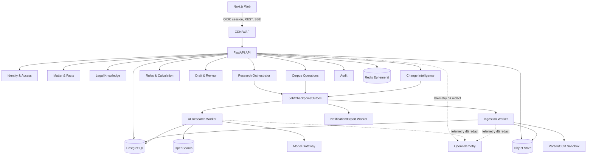
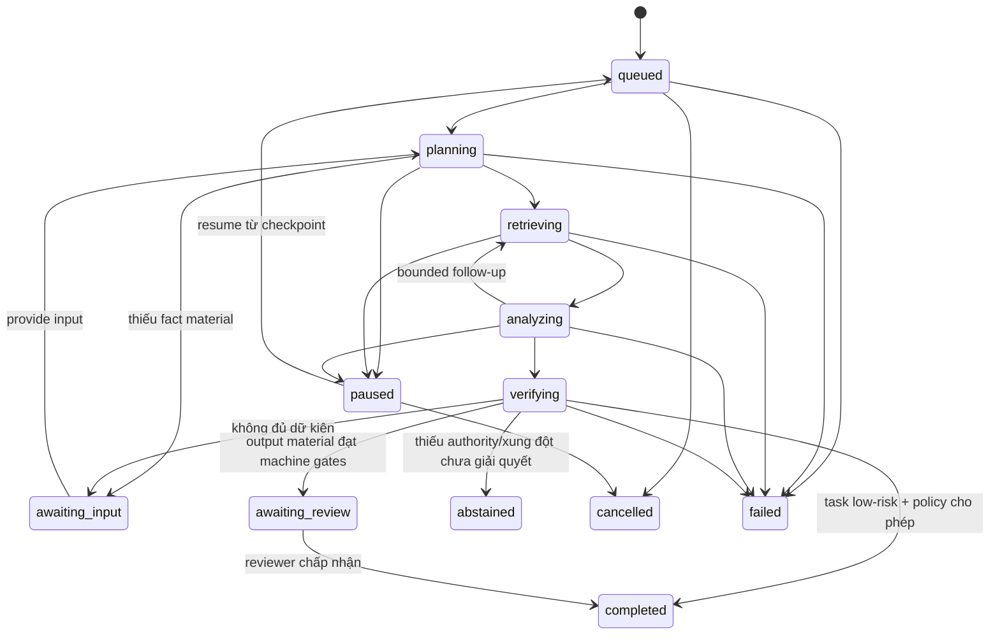
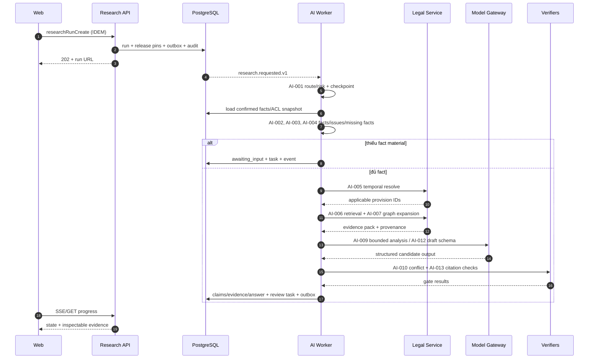
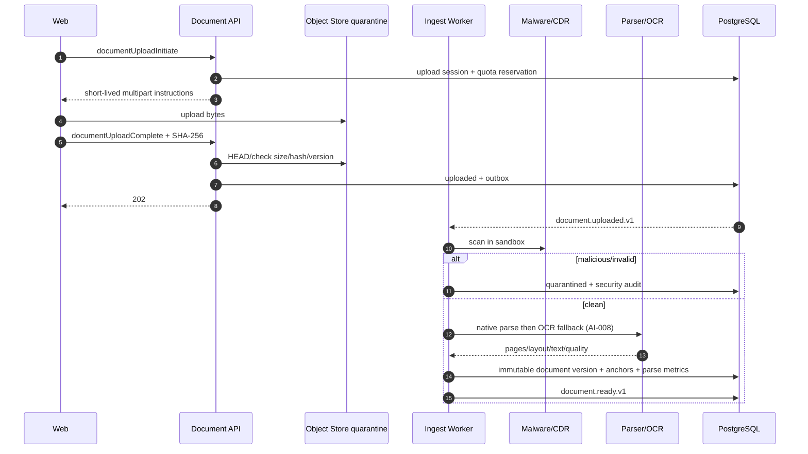

# Thiết kế backend và API

**Tài liệu:** `DES-BE-001`  
**Phiên bản:** 0.1  
**Trạng thái:** bản thiết kế để triển khai MVP  
**Phong cách:** FastAPI modular monolith + worker nền + REST/OpenAPI + SSE  
**Liên kết:** use case từ `UC-001` đến `UC-018`, tác vụ AI từ `AI-001` đến `AI-018`, mô hình dữ liệu `DES-DATA-001`

## 1. Mục tiêu

Backend phải cung cấp một hợp đồng nghiệp vụ ổn định cho web, không để frontend phụ thuộc vào SDK mô hình, search engine hay cấu trúc workflow nội bộ. Hệ thống phải:

- áp dụng tenant và matter ACL trước mọi lần đọc/search/tool call;
- nhận các command ngắn theo REST, chuyển tác vụ dài thành job bền vững và phát tiến độ qua SSE;
- pin corpus, AI, prompt, retrieval và rule release để tái lập kết quả;
- chỉ trả domain schema đã validate, không trả raw model completion;
- buộc mọi claim, phép tính và phê duyệt truy ngược được tới bằng chứng;
- hỗ trợ retry/idempotency, optimistic concurrency và transactional outbox;
- có degraded mode: vẫn tra nguồn/dữ liệu đã xác minh khi model hoặc search phụ trợ lỗi.

### 1.1 Nguyên tắc

1. Bắt đầu bằng modular monolith, không microservice hóa theo danh từ.
2. Module giao tiếp qua application service/port; không truy cập repository của module khác.
3. PostgreSQL/object store là nguồn chuẩn; cache/search/graph là projection.
4. Mọi side effect bên ngoài xảy ra sau commit qua outbox/job và có idempotency key.
5. Authorization là deny-by-default, kiểm tra ở gateway, application service và RLS.
6. AI là một dependency không đáng tin: timeout, budget, schema validation, policy và verifier nằm ngoài model.
7. Operation ID camelCase là định danh ổn định để map UI, use case, audit và generated SDK.

### 1.2 Ngoài phạm vi

- API public cho khách hàng thứ ba trong MVP; `/v1` trước hết phục vụ web/BFF chính thức.
- WebSocket cho chỉnh sửa cộng tác thời gian thực; SSE đủ cho tiến độ một chiều.
- Service mesh, Kubernetes và event broker bắt buộc từ ngày đầu.
- Để browser gọi trực tiếp model provider, object store bằng credential dài hạn hoặc search cluster.

## 2. Kiến trúc tổng thể

### 2.1 Container/component view



### 2.2 Module và trách nhiệm

| Module/package | Aggregate/API sở hữu | Cổng ra được phép | UC/AI chính |
|---|---|---|---|
| `identity_access` | session context, membership, role, policy | OIDC, policy evaluator | `UC-001`, `UC-015` |
| `matters` | matter, ACL, event, fact, issue, assumption | document/research ports | `UC-004`, `UC-005`, `UC-006`, `UC-007` |
| `documents` | upload, document version, anchor, quarantine | object store, scanner, parser | `UC-005`; `AI-002`, `AI-008` |
| `legal_knowledge` | legal search, temporal resolver, graph traversal, source viewer | search projection, legal repository | `UC-002`, `UC-003`; `AI-005`, `AI-006`, `AI-007` |
| `research` | research run, state, claim/evidence ledger, gate | AI/task ports, workflow | `UC-002`, `UC-007`, `UC-017`, `UC-018`; `AI-001` đến `AI-010`, `AI-013`, `AI-016` |
| `ai_gateway` | model routing, structured call, budget, prompt/tool policy | approved providers only | mọi tác vụ sinh/phân loại |
| `rules` | published rules, calculation run/trace | deterministic Python engine | `UC-008`; `AI-011` |
| `authoring` | draft, version, review, approval, export | renderer, notification | `UC-009`, `UC-010`, `UC-011`; `AI-012`, `AI-013`, `AI-017` |
| `change_intel` | diff, impact, subscription, alert | legal/matter/rule read ports | `UC-012`, `UC-014`; `AI-014`, `AI-015`, `AI-018` |
| `corpus_ops` | observe, ingest, curate, release, projection switch | crawler, parser, object/search | `UC-013`; `AI-008`, `AI-014` |
| `workflow` | job, task, checkpoint, idempotency, outbox/inbox | worker queue/broker | tác vụ dài |
| `audit` | audit query/export, retention proof | immutable audit repository | `UC-016` |

### 2.3 Quy tắc phụ thuộc

```text
routers -> application commands/queries -> domain -> ports
                                  ports <- infrastructure adapters
```

- Domain không import FastAPI, SQLAlchemy, LangGraph hay SDK model.
- Router không gọi repository trực tiếp.
- `research` gọi `LegalQueryPort`, `RuleExecutionPort`, `ModelPort`; không query bảng module kia.
- Infrastructure map DB row/provider payload sang domain type ở boundary.
- Sự kiện liên module mang stable ID và schema version, không nhúng toàn bộ document/fact.
- Package architecture được khóa bằng import-linter/architecture tests.

### 2.4 Cấu trúc source đề xuất

```text
apps/
  api/main.py
  worker_ai/main.py
  worker_ingest/main.py
  worker_ops/main.py
src/
  identity_access/{domain,application,infrastructure,api}
  matters/{domain,application,infrastructure,api}
  documents/{domain,application,infrastructure,api}
  legal_knowledge/{domain,application,infrastructure,api}
  research/{domain,application,infrastructure,api}
  ai_gateway/{application,infrastructure}
  rules/{domain,application,infrastructure,api}
  authoring/{domain,application,infrastructure,api}
  change_intel/{domain,application,infrastructure,api}
  corpus_ops/{domain,application,infrastructure,api}
  workflow/{domain,application,infrastructure}
  audit/{domain,application,infrastructure,api}
  shared/{ids,clock,money,errors,telemetry}
contracts/
  openapi.yaml
  events/
migrations/
tests/{unit,integration,contract,e2e,security,architecture}
```

## 3. Luồng request chuẩn

```mermaid
sequenceDiagram
  autonumber
  participant B as Browser/BFF
  participant A as API middleware
  participant S as Application service
  participant P as Policy/RLS
  participant D as PostgreSQL
  participant O as Outbox

  B->>A: request + session + X-Tenant-Id + request ID
  A->>A: validate token, CSRF, size, media type
  A->>P: membership + scope + matter authorization
  P-->>A: allow/deny + policy decision ID
  A->>D: BEGIN; SET LOCAL tenant/principal/purpose
  A->>S: typed command/query
  S->>D: domain read/write
  S->>O: append event/audit in same transaction
  D-->>A: COMMIT
  A-->>B: domain response + ETag/request ID
```

Thứ tự không được đảo: xác thực danh tính trước, chọn tenant đã xác minh membership, kiểm quyền resource, rồi mới truy vấn. Không dùng `tenant_id` trong body làm nguồn authorization.

## 4. Hợp đồng API chung

### 4.1 URL, media type và kiểu dữ liệu

- Base path: `/v1`; operationId ổn định camelCase.
- JSON UTF-8: `application/json`; lỗi: `application/problem+json`.
- ID là UUID canonical lowercase; ngày `YYYY-MM-DD`; timestamp RFC 3339 UTC.
- Tiền: `{ "amount": "1250000.00", "currency": "VND" }`; amount là chuỗi decimal.
- `null` khác field bị bỏ. PATCH dùng JSON Merge Patch có schema riêng, không cho sửa field hệ thống.
- Collection dùng cursor opaque, không offset: `?page[size]=50&page[after]=...`; max 100.
- Sort allowlist, ví dụ `?sort=-updatedAt`; filter typed, không nhận SQL/query DSL tùy ý.
- Response mutable resource có `ETag: "<row_version>"`; update/transition cần `If-Match`.
- Request/response có `X-Request-Id`; server thay ID không hợp lệ và luôn trả ID thực dùng.

Envelope collection:

```json
{
  "data": [{ "id": "019...", "type": "matter" }],
  "page": {
    "nextCursor": "opaque-or-null",
    "hasMore": false
  }
}
```

Không bọc single-resource response trong envelope không cần thiết. Tên field JSON dùng camelCase; DB dùng snake_case.

### 4.2 Authentication và context

- Web dùng OIDC Authorization Code + PKCE. Ưu tiên BFF/session cookie `HttpOnly`, `Secure`, `SameSite=Lax/Strict` phù hợp flow.
- State-changing request dùng CSRF token khi xác thực bằng cookie.
- API/service integration dùng access token ngắn hạn, kiểm `iss`, `aud`, signature, `exp`, `nbf`, `jti` khi cần.
- Tenant data-plane route yêu cầu `X-Tenant-Id`; header chỉ chọn một tenant trong
  membership đã xác thực, thiếu/không thuộc tenant trả `403`, không tự fallback.
- Matter permission được kiểm bằng ACL/ethical wall, không suy ra chỉ từ role tenant.
- Ngoại lệ duy nhất cho tenant header là client portal: BFF đổi invite/one-time secret thành cookie ngắn hạn cho một `shareId`; API tự suy ra tenant từ grant, không tin tenant do client gửi.
- Portal principal chỉ có capability `share:view`, `share:comment` và tùy chọn `share:download` trên đúng approved artifact; revoke/expiry bị kiểm ở mỗi request.
- `/v1/platform/*` là control plane riêng, không nhận tenant header làm nguồn quyền.
  Nó yêu cầu platform principal, session step-up/JIT và
  `platform:corpus-curate`/`platform:corpus-publish`; role tenant không thể được
  đổi thành platform role bằng API tenant.
- Scope tenant tiêu biểu: `matter:read/write`, `research:run`, `review:decide`,
  `audit:export`, `admin:identity`. Scope platform không được gắn vào tenant token.
- Break-glass cần MFA mới, reason, thời hạn, approval theo policy và audit ưu tiên cao.

DB transaction thiết lập:

```sql
SET LOCAL app.tenant_id = :verified_tenant_id;
SET LOCAL app.principal_id = :verified_principal_id;
SET LOCAL app.purpose = :operation_id;
```

Control-plane transaction dùng DB role/connection pool riêng và đặt
`app.platform_principal_id`; nó không dùng `app.tenant_id`. `legal.*` công cộng chỉ
cho runtime tenant đọc bản đã publish. Candidate/publish write chỉ qua application
service control plane và stored procedure/grant hẹp có maker-checker; tenant
knowledge overlay vẫn có `tenant_id`/RLS/index namespace riêng.

### 4.3 Idempotency và concurrency

Header `Idempotency-Key` bắt buộc với command được đánh dấu `IDEM` trong bảng endpoint. Phạm vi key là `(tenant, principal, operationId)`. Cùng key + cùng canonical body trả lại response cũ; khác body trả:

```json
{
  "type": "https://api.example.vn/problems/idempotency-key-reused",
  "title": "Idempotency key đã được dùng cho yêu cầu khác",
  "status": 409,
  "code": "IDEMPOTENCY_KEY_REUSED",
  "requestId": "req_..."
}
```

Update mutable resource bắt buộc `If-Match`; thiếu trả `428 PRECONDITION_REQUIRED`, stale trả `409 CONCURRENT_MODIFICATION` cùng current ETag nhưng không lộ dữ liệu nếu caller mất quyền.

### 4.4 Tác vụ bất đồng bộ

- Command hợp lệ đã enqueue trả `202 Accepted`, `Location` đến resource run/job và `Retry-After` gợi ý.
- `202` nghĩa là đã ghi bền vững, không nghĩa là thành công nghiệp vụ.
- Client dùng GET làm nguồn trạng thái; SSE chỉ tối ưu trải nghiệm.
- Hủy là cooperative: command ghi `cancellation_requested`; worker dừng ở safe point và không commit draft chưa verify.
- Pause giữ checkpoint/release pins; resume kiểm lại quyền, budget, corpus policy và stale dependency.

### 4.5 Problem Details và error catalog

Schema lỗi:

```json
{
  "type": "https://api.example.vn/problems/validation",
  "title": "Dữ liệu không hợp lệ",
  "status": 422,
  "code": "VALIDATION_ERROR",
  "detail": "Một số trường cần được sửa.",
  "instance": "/v1/matters/...",
  "requestId": "req_...",
  "errors": [
    {"path": "eventDate", "code": "REQUIRED", "message": "Cần ngày sự kiện."}
  ]
}
```

| HTTP | Code chính | Khi dùng |
|---|---|---|
| `400` | `MALFORMED_REQUEST`, `INVALID_CURSOR` | JSON/cursor không parse được |
| `401` | `AUTHENTICATION_REQUIRED`, `TOKEN_EXPIRED` | chưa xác thực |
| `403` | `TENANT_ACCESS_DENIED`, `MATTER_ACCESS_DENIED`, `SCOPE_REQUIRED` | đã xác thực nhưng bị chặn |
| `404` | `RESOURCE_NOT_FOUND` | không tồn tại **hoặc** cần che giấu tồn tại xuyên tenant |
| `409` | `CONCURRENT_MODIFICATION`, `INVALID_STATE_TRANSITION`, `IDEMPOTENCY_KEY_REUSED`, `TEMPORAL_CONFLICT` | xung đột trạng thái |
| `413` | `UPLOAD_TOO_LARGE` | vượt quota/kích thước |
| `415` | `UNSUPPORTED_MEDIA_TYPE` | loại file/body không cho phép |
| `422` | `VALIDATION_ERROR`, `MISSING_MATERIAL_FACT`, `UNRESOLVED_EVENT_DATE` | semantic validation |
| `423` | `RESOURCE_LOCKED` | draft/review/corpus đang khóa có chủ đích |
| `429` | `RATE_LIMITED`, `BUDGET_EXCEEDED` | quota/rate/cost budget |
| `503` | `DEPENDENCY_UNAVAILABLE`, `CORPUS_NOT_READY` | lỗi tạm thời, có retry policy |

Không trả provider error, stack trace, SQL, signed URL hết hạn dài hoặc prompt nội bộ.

## 5. Danh mục endpoint và traceability

Ký hiệu `IDEM`: yêu cầu `Idempotency-Key`; `ETAG`: yêu cầu `If-Match`. OpenAPI gắn extensions `x-use-cases`, `x-ai-tasks`, `x-permissions`, `x-idempotent` để sinh ma trận tự động.

### 5.1 Session, tenant, identity và data policy

| Method/path | operationId | UC | Quyền/semantics |
|---|---|---|---|
| `GET /v1/session` | `sessionContextGet` | `UC-001` | user, tenant đang chọn, memberships, policy flags |
| `POST /v1/session:select-tenant` | `tenantContextSelect` | `UC-001` | IDEM; xác minh membership; rotate session/CSRF |
| `GET /v1/tenants/{tenantId}/members` | `tenantMembersList` | `UC-015` | `admin:identity` |
| `POST /v1/tenants/{tenantId}/members` | `tenantMemberInvite` | `UC-015` | IDEM; không tự cấp matter restricted |
| `PATCH /v1/tenants/{tenantId}/members/{userId}` | `tenantMemberUpdate` | `UC-015` | ETAG; role/status allowlist |
| `POST /v1/tenants/{tenantId}/members/{userId}:revoke-sessions` | `tenantMemberSessionsRevoke` | `UC-015` | IDEM; step-up; revoke tenant sessions, cache và active grants |
| `GET /v1/tenants/{tenantId}/roles` | `tenantRolesList` | `UC-015` | role/capability effective view |
| `GET /v1/tenants/{tenantId}/retention-policy` | `tenantRetentionPolicyGet` | `UC-015` | `admin:data-policy`; current policy + effective date |
| `PATCH /v1/tenants/{tenantId}/retention-policy` | `tenantRetentionPolicyUpdate` | `UC-015` | IDEM + ETAG + step-up; impact preview token bắt buộc |
| `GET /v1/tenants/{tenantId}/legal-holds` | `legalHoldsList` | `UC-015` | `admin:legal-hold`; scope được permission-filter |
| `POST /v1/tenants/{tenantId}/legal-holds` | `legalHoldCreate` | `UC-015` | IDEM + step-up; reason, scope, custodian và policy |
| `POST /v1/tenants/{tenantId}/legal-holds/{legalHoldId}:release` | `legalHoldRelease` | `UC-015` | IDEM + ETAG + step-up/dual control; không đồng nghĩa xóa ngay |

### 5.2 Matter, fact và issue

| Method/path | operationId | UC/AI | Quyền/semantics |
|---|---|---|---|
| `POST /v1/matters` | `matterCreate` | `UC-004` | IDEM; tạo owner + initial member ACL cùng transaction |
| `GET /v1/matters` | `mattersList` | `UC-004` | permission-filtered cursor list |
| `GET /v1/matters/{matterId}` | `matterGet` | `UC-004` | `matter:read`; ETag |
| `PATCH /v1/matters/{matterId}` | `matterUpdate` | `UC-004` | ETAG; `matter:write` |
| `POST /v1/matters/{matterId}:close` | `matterClose` | `UC-004` | IDEM + ETAG; policy preconditions |
| `GET /v1/matters/{matterId}/members` | `matterMembersList` | `UC-015` | owner/admin, ethical wall aware |
| `PUT /v1/matters/{matterId}/members/{principalId}` | `matterMemberPut` | `UC-004`, `UC-015` | IDEM + ETAG; phân công/upsert grant/revoke sau khi tạo |
| `GET /v1/matters/{matterId}/intake` | `matterIntakeGet` | `UC-006` | `matter:read`; schema/version và draft hiện hành |
| `PATCH /v1/matters/{matterId}/intake` | `matterIntakeUpdate` | `UC-006` | IDEM + ETAG; autosave typed draft, purpose/consent checks |
| `GET /v1/matters/{matterId}/facts` | `matterFactsList` | `UC-006` | fact current view + evidence status |
| `POST /v1/matters/{matterId}/fact-extractions` | `factExtractionCreate` | `UC-005`, `UC-006`; `AI-002`, `AI-003`, `AI-004` | IDEM; `202` research-like job |
| `POST /v1/matters/{matterId}/facts` | `matterFactCreate` | `UC-006` | IDEM; user asserted/confirmed by permission |
| `PATCH /v1/matters/{matterId}/facts/{factId}` | `matterFactUpdate` | `UC-006` | ETAG; tạo fact version mới |
| `POST /v1/matters/{matterId}/facts/{factId}:confirm` | `matterFactConfirm` | `UC-006` | IDEM + ETAG; human only |
| `POST /v1/matters/{matterId}/facts/{factId}:dispute` | `matterFactDispute` | `UC-006` | IDEM + ETAG; reason required |
| `GET /v1/matters/{matterId}/issues` | `matterIssuesList` | `UC-006`, `UC-007` | issue tree và missing fact links |
| `POST /v1/matters/{matterId}/issues` | `matterIssueCreate` | `UC-006` | IDEM; contributor; parent/depth/materiality validate |
| `PATCH /v1/matters/{matterId}/issues/{issueId}` | `matterIssueUpdate` | `UC-006` | IDEM + ETAG; status/owner/scope update + invalidation |

### 5.3 Upload và tài liệu

| Method/path | operationId | UC/AI | Semantics |
|---|---|---|---|
| `POST /v1/matters/{matterId}/uploads` | `documentUploadInitiate` | `UC-005` | IDEM; metadata, quota; trả signed multipart/tus session |
| `POST /v1/matters/{matterId}/uploads/{uploadId}:complete` | `documentUploadComplete` | `UC-005`, `AI-008` | IDEM; checksum/size; `202` scan/parse |
| `GET /v1/matters/{matterId}/uploads/{uploadId}` | `documentUploadGet` | `UC-005` | trạng thái/quarantine/error an toàn |
| `GET /v1/matters/{matterId}/documents` | `matterDocumentsList` | `UC-005` | ACL trước list |
| `GET /v1/matters/{matterId}/documents/{documentId}` | `matterDocumentGet` | `UC-005` | versions/parse quality |
| `DELETE /v1/matters/{matterId}/documents/{documentId}` | `matterDocumentDelete` | `UC-005` | IDEM + ETAG; retention/legal hold check |
| `GET /v1/source-anchors/{anchorId}/content` | `sourceAnchorContentGet` | `UC-002`, `UC-005`, `UC-007` | resolve quyền, short-lived content/range |

### 5.4 Research và SSE

| Method/path | operationId | UC/AI | Semantics |
|---|---|---|---|
| `POST /v1/research-runs` | `researchRunCreate` | `UC-002`, `UC-007`; `AI-001` đến `AI-010`, `AI-013`, `AI-016` | IDEM; `202`; pin releases/budget |
| `GET /v1/research-runs/{runId}` | `researchRunGet` | `UC-002`, `UC-007`, `UC-017`, `UC-018` | domain snapshot, gates, missing facts |
| `GET /v1/research-runs/{runId}/events` | `researchRunEventsStream` | `UC-007`, `UC-017` | SSE; resume bằng `Last-Event-ID` |
| `POST /v1/research-runs/{runId}:pause` | `researchRunPause` | `UC-017`, `AI-009` | IDEM + ETAG; cooperative |
| `POST /v1/research-runs/{runId}:resume` | `researchRunResume` | `UC-017`, `AI-009` | IDEM + ETAG; revalidate policy/dependencies |
| `POST /v1/research-runs/{runId}:cancel` | `researchRunCancel` | `UC-017` | IDEM + ETAG |
| `POST /v1/research-runs/{runId}:provide-input` | `researchRunInputProvide` | `UC-006`, `UC-018`; `AI-003` | IDEM; confirmed facts/answer to clarification |
| `POST /v1/research-runs/{runId}:escalate` | `researchRunEscalate` | `UC-018` | IDEM; human task + reason |
| `GET /v1/research-runs/{runId}/claims` | `researchRunClaimsList` | `UC-007`, `UC-010` | claims, evidence, verification results |

### 5.5 Legal knowledge

| Method/path | operationId | UC/AI | Semantics |
|---|---|---|---|
| `POST /v1/legal/search` | `legalSearchExecute` | `UC-002`, `UC-007`; `AI-005`, `AI-006`, `AI-007` | typed query; eventDate/knownAt; no arbitrary DSL |
| `GET /v1/legal/instruments/{instrumentId}` | `legalInstrumentGet` | `UC-002`, `UC-003` | metadata/source/status |
| `GET /v1/legal/provisions/{provisionId}/versions` | `legalProvisionVersionsList` | `UC-003`, `AI-005` | timeline, cursor |
| `POST /v1/legal/provisions:compare` | `legalProvisionVersionsCompare` | `UC-003`, `AI-014` | IDEM nếu tạo artifact; exact + semantic diff |
| `GET /v1/legal/provision-versions/{versionId}` | `legalProvisionVersionGet` | `UC-002`, `UC-003` | immutable version + source anchors |
| `GET /v1/legal/provision-versions/{versionId}/relations` | `legalRelationsList` | `UC-002`, `UC-007`; `AI-007` | approved edges, depth max 2 |
| `GET /v1/legal/source-snapshots/{snapshotId}/content` | `legalSourceSnapshotContentGet` | `UC-002`, `UC-003`, `UC-013` | range/page; content disposition policy |

### 5.6 Calculation, draft, review và export

| Method/path | operationId | UC/AI | Semantics |
|---|---|---|---|
| `POST /v1/calculation-runs` | `calculationRunCreate` | `UC-008`, `AI-011` | IDEM; deterministic; sync nhỏ hoặc `202` batch |
| `GET /v1/calculation-runs/{calculationRunId}` | `calculationRunGet` | `UC-008` | input/output/trace/provenance |
| `POST /v1/drafts` | `draftCreate` | `UC-009`; `AI-012`, `AI-017` | IDEM; từ run/matter, `202` nếu AI generate |
| `GET /v1/drafts/{draftId}` | `draftGet` | `UC-009`, `UC-010` | current version + status; ETag |
| `PATCH /v1/drafts/{draftId}` | `draftUpdate` | `UC-009` | ETAG; tạo immutable version |
| `POST /v1/drafts/{draftId}:submit-review` | `draftReviewSubmit` | `UC-010`, `AI-013` | IDEM + ETAG; gates bắt buộc |
| `GET /v1/reviews` | `reviewsList` | `UC-010` | assignee/status queue |
| `GET /v1/reviews/{reviewId}` | `reviewGet` | `UC-010` | frozen draft digest/checklist |
| `PUT /v1/reviews/{reviewId}/assignee` | `reviewAssigneePut` | `UC-010` | IDEM + ETAG; manager/review-admin; reviewer tier/independence |
| `POST /v1/reviews/{reviewId}/comments` | `reviewCommentCreate` | `UC-010` | IDEM; target claim/section/checklist; internal-only mặc định |
| `POST /v1/reviews/{reviewId}/flags/{flagId}:resolve` | `reviewFlagResolve` | `UC-010` | IDEM + ETAG; reviewer + resolution reason/evidence |
| `POST /v1/reviews/{reviewId}:approve` | `reviewApprove` | `UC-010` | IDEM + ETAG; reviewer permission/MFA policy |
| `POST /v1/reviews/{reviewId}:request-changes` | `reviewChangesRequest` | `UC-010` | IDEM + ETAG; reason required |
| `POST /v1/drafts/{draftId}/exports` | `draftExportCreate` | `UC-011` | IDEM; only approved external export; `202` |
| `GET /v1/exports/{exportId}` | `exportGet` | `UC-011`, `UC-016` | status + short-lived download URL |
| `POST /v1/drafts/{draftId}/shares` | `draftShareCreate` | `UC-011` | IDEM; exact approved version, recipient/expiry/download policy |
| `GET /v1/shares/{shareId}` | `sharedArtifactGet` | `UC-011` | grant-bound portal principal; sanitized approved snapshot |
| `POST /v1/shares/{shareId}:revoke` | `draftShareRevoke` | `UC-011` | IDEM + ETAG; owner/share-admin; revoke sessions/new downloads |
| `GET /v1/shares/{shareId}/comments` | `sharedArtifactCommentsList` | `UC-011` | grant-bound recipient hoặc internal owner; public-safe fields |
| `POST /v1/shares/{shareId}/comments` | `sharedArtifactCommentCreate` | `UC-011` | IDEM; section target allowlist; sanitize/rate-limit |

### 5.7 Change intelligence và corpus

| Method/path | operationId | UC/AI | Semantics |
|---|---|---|---|
| `GET /v1/changes` | `legalChangesList` | `UC-012` | filter domain/date/materiality |
| `GET /v1/changes/{changeSetId}` | `legalChangeGet` | `UC-012`, `UC-014`; `AI-014`, `AI-015` | diff, authority, review state |
| `POST /v1/change-impact-runs` | `changeImpactRunCreate` | `UC-014`, `AI-015` | IDEM; `202`; target allowlist |
| `GET /v1/change-impact-runs/{runId}` | `changeImpactRunGet` | `UC-014` | impacts + rationale/evidence |
| `POST /v1/impacts/{impactId}:confirm` | `changeImpactConfirm` | `UC-014` | IDEM + ETAG; curator; reason + stale/task preview token |
| `POST /v1/impacts/{impactId}:dismiss` | `changeImpactDismiss` | `UC-014` | IDEM + ETAG; curator; reason code bắt buộc |
| `POST /v1/subscriptions` | `changeSubscriptionCreate` | `UC-012`, `AI-018` | IDEM; validated scope |
| `PATCH /v1/subscriptions/{subscriptionId}` | `changeSubscriptionUpdate` | `UC-012` | ETAG |
| `GET /v1/alerts` | `alertsList` | `UC-012` | tenant/principal filtered |
| `POST /v1/alerts/{alertId}:mark-read` | `alertMarkRead` | `UC-012` | IDEM |
| `GET /v1/tasks` | `tasksList` | `UC-012` | permission-filtered; owner/status/due/impact filters |
| `GET /v1/tasks/{taskId}` | `taskGet` | `UC-012` | matter/asset ACL; dependency path và permitted metadata |
| `POST /v1/tasks/{taskId}:assign` | `taskAssign` | `UC-012` | IDEM + ETAG; manager/owner; assignee clearance check |
| `POST /v1/tasks/{taskId}:acknowledge` | `taskAcknowledge` | `UC-012` | IDEM + ETAG; assignee; acknowledgement không resolve |
| `POST /v1/tasks/{taskId}:resolve` | `taskResolve` | `UC-012` | IDEM + ETAG; disposition/reason/evidence required |
| `POST /v1/platform/corpus/ingestion-runs` | `corpusIngestionRunCreate` | `UC-013`; `AI-008`, `AI-014` | platform curator; IDEM; allowlisted URL/artifact |
| `GET /v1/platform/corpus/ingestion-runs/{runId}` | `corpusIngestionRunGet` | `UC-013` | platform role; parse/quality/quarantine status |
| `POST /v1/platform/corpus/curation-decisions` | `corpusCurationDecisionCreate` | `UC-013` | platform curator; IDEM; human decision |
| `POST /v1/platform/corpus/releases` | `corpusReleaseCreate` | `UC-013` | platform release builder; IDEM; immutable manifest |
| `POST /v1/platform/corpus/releases/{releaseId}:publish` | `corpusReleasePublish` | `UC-013` | platform publisher; IDEM + ETAG; step-up, JIT, dual approval/gates |
| `POST /v1/platform/corpus/releases/{releaseId}:rollback` | `corpusReleaseRollback` | `UC-013` | platform publisher; IDEM + ETAG; step-up + dual control; `202` atomic pointer rollback |

### 5.8 Audit

| Method/path | operationId | UC | Semantics |
|---|---|---|---|
| `POST /v1/audit-events/search` | `auditEventsSearch` | `UC-016` | typed filters, privileged, no raw query DSL |
| `POST /v1/audit-exports` | `auditExportCreate` | `UC-016` | IDEM; `202`; reason + scope + audit of audit |
| `GET /v1/audit-exports/{exportId}` | `auditExportGet` | `UC-016` | time-limited encrypted artifact |

### 5.9 Quy ước status/auth theo loại operation

Mọi endpoint `/v1` đều yêu cầu principal đã xác thực và tenant context, trừ callback OIDC do lớp web/BFF sở hữu và endpoint `/v1/shares/*` dùng portal principal bị khóa vào đúng share grant. Bảng endpoint phía trên bổ sung permission nghiệp vụ; các status chuẩn là:

| Loại operation | Thành công | Header bắt buộc | Lỗi đặc thù ngoài catalog chung |
|---|---|---|---|
| list/get/search read-only | `200` | auth + `X-Tenant-Id`; cursor khi phân trang | `404` che giấu resource ngoài ACL |
| create đồng bộ | `201` + `Location` | auth, tenant, `Idempotency-Key` khi ghi | `409` business key/idempotency conflict |
| create tác vụ dài | `202` + `Location` + `Retry-After` | auth, tenant, `Idempotency-Key` | `429` quota/budget; `503` queue unavailable |
| patch/transition mutable | `200` hoặc `204` | auth, tenant, `If-Match`; IDEM nếu có side effect | `428` thiếu precondition; `409` stale/invalid state |
| delete theo retention | `202` nếu cleanup dài, nếu không `204` | auth, tenant, `If-Match`, `Idempotency-Key` | `409/423` legal hold/locked dependency |
| SSE | `200 text/event-stream` | auth, tenant, `Last-Event-ID` tùy chọn | `410` cursor hết hạn; `429` quá nhiều connection |

OpenAPI của từng operation phải khai báo explicit success/error responses, `security`, scope, idempotency và ETag; không dựa riêng vào bảng mô tả này.

### 5.10 Control contract cho command bổ sung

Đây là phần bắt buộc của OpenAPI/application handler, không chỉ là yêu cầu logging. `Audit action` được ghi trong cùng transaction với state change; `Outbox event` chỉ phát sau commit và consumer phải dedupe.

| Operation | Auth/policy | Concurrency/idempotency | Audit action | Outbox event |
|---|---|---|---|---|
| `matterCreate` với initial members | `matter:create`; từng member qua clearance/ethical-wall policy | IDEM; một transaction cho matter + ACL | `matter.create`, `matter.member.grant` | `matter.created.v1`, `matter.acl_changed.v1` |
| `matterMemberPut` | matter owner hoặc `matter:manage-access`; không tự vượt ethical wall | IDEM + matter ETag | `matter.member.put` với before/after/reason | `matter.acl_changed.v1` |
| `matterIntakeUpdate` | `matter:write`; purpose/consent policy | IDEM + intake ETag | `matter.intake.update` với changed paths | `matter.intake_updated.v1` |
| `matterIssueCreate`, `matterIssueUpdate` | contributor; owner assignment cần clearance | IDEM; update cần issue ETag | `matter.issue.create/update` | `matter.issue_changed.v1` |
| `reviewAssigneePut` | review manager; tier/independence/matter grant | IDEM + review ETag | `review.assign` | `review.assigned.v1` |
| `reviewCommentCreate` | contributor/reviewer được phép; internal-only mặc định | IDEM | `review.comment.create` với target ID, không log body | `review.commented.v1` |
| `reviewFlagResolve` | reviewer; blocker policy; không phải approval | IDEM + review ETag | `review.flag.resolve` với reason/evidence IDs | `review.flag_resolved.v1` |
| `draftShareCreate` | `share:create`; exact approved version; license/DLP pass | IDEM | `share.create` với recipient/policy pseudonym | `share.created.v1` |
| `draftShareRevoke` | owner/share admin; grant còn tồn tại | IDEM + share ETag | `share.revoke` với reason | `share.revoked.v1` |
| `sharedArtifactCommentCreate` | active portal grant có `share:comment` hoặc internal owner | IDEM + rate limit | `share.comment.create`; body ở content store | `share.commented.v1` |
| `taskAssign`, `taskAcknowledge`, `taskResolve` | asset/matter ACL; manager hoặc assignee tùy action | IDEM + task ETag | `task.assign/acknowledge/resolve` | `task.assigned.v1`, `task.acknowledged.v1`, `task.resolved.v1` |
| `changeImpactConfirm`, `changeImpactDismiss` | curator/knowledge approver; restricted matter content vẫn cần grant | IDEM + impact ETag + preview token | `impact.confirm/dismiss` | `impact.confirmed.v1`, `impact.dismissed.v1` |
| `corpusReleaseRollback` | `platform:corpus-publish`; JIT/step-up + dual control; regression evidence | IDEM + active release ETag | `corpus.rollback.request/complete` | `corpus.rollback_requested.v1`, `corpus.rolled_back.v1` |
| `tenantRetentionPolicyUpdate` | `admin:data-policy`; step-up + impact preview | IDEM + policy ETag | `retention.policy.update` | `tenant.retention_policy_changed.v1` |
| `legalHoldCreate`, `legalHoldRelease` | `admin:legal-hold`; step-up; release có thể cần dual control | IDEM; release cần hold ETag | `legal_hold.create/release` | `legal_hold.created.v1`, `legal_hold.released.v1` |
| `tenantMemberSessionsRevoke` | `admin:identity`; step-up; không revoke global identity ngoài quyền tenant | IDEM | `tenant.sessions.revoke` + affected counts | `tenant.sessions_revoked.v1` |

GET portal artifact/comment và GET legal hold được ghi access audit theo policy nhưng không phát domain event. Một comment không chứa raw body trong event/audit; chỉ ID, target, classification và digest.

## 6. Hợp đồng chi tiết quan trọng

### 6.1 Tạo matter: `matterCreate`

```http
POST /v1/matters
Content-Type: application/json
Idempotency-Key: 01J...
X-Tenant-Id: 019...
```

```json
{
  "code": "VAT-2026-0042",
  "title": "Thuế suất dịch vụ phần mềm tháng 7/2026",
  "clientRef": {"clientId": "019..."},
  "taxDomains": ["VAT", "INVOICE"],
  "jurisdiction": "VN",
  "eventPeriod": {"from": "2026-07-01", "to": "2026-07-31"},
  "confidentiality": "restricted",
  "purpose": "tax_advisory",
  "initialMembers": [
    {"principalId": "019...", "accessLevel": "reviewer"}
  ]
}
```

Response `201 Created`, `Location: /v1/matters/{id}`, `ETag: "1"`:

```json
{
  "id": "019...",
  "code": "VAT-2026-0042",
  "title": "Thuế suất dịch vụ phần mềm tháng 7/2026",
  "status": "intake",
  "owner": {"userId": "019..."},
  "eventPeriod": {"from": "2026-07-01", "to": "2026-07-31"},
  "createdAt": "2026-08-10T02:30:00Z",
  "rowVersion": 1
}
```

Transaction tạo matter, owner ACL, các initial member ACL, audit và `matter.created.v1`/`matter.acl_changed.v1`. Server dùng cùng validator/command handler của `matterMemberPut` cho từng initial member nhưng **không** tự gọi HTTP endpoint; nếu một member không đủ clearance thì toàn bộ create rollback. Nếu code đã tồn tại trả `409 MATTER_CODE_EXISTS` nhưng retry đúng idempotency trả response cũ.

### 6.2 Tạo research run: `researchRunCreate`

```json
{
  "matterId": "019...",
  "question": "Dịch vụ này áp dụng thuế suất nào tại ngày giao dịch?",
  "mode": "deepResearch",
  "eventDate": "2026-07-15",
  "knownAt": "2026-08-10T02:35:00Z",
  "scope": {
    "jurisdictions": ["VN"],
    "taxDomains": ["VAT", "INVOICE"],
    "includeMatterDocuments": true,
    "authorityTiers": ["A1", "A2", "A3"]
  },
  "budget": {"maxSteps": 12, "maxSources": 30, "maxSeconds": 180, "maxCostUnits": 100}
}
```

Response `202`:

```json
{
  "id": "019...",
  "status": "queued",
  "eventDate": "2026-07-15",
  "knownAt": "2026-08-10T02:35:00Z",
  "releases": {
    "corpus": "corpus-2026.08.09.1",
    "ai": "ai-0.8.3",
    "rules": "rules-0.5.1"
  },
  "links": {
    "self": "/v1/research-runs/019...",
    "events": "/v1/research-runs/019.../events"
  }
}
```

Validation:

- `eventDate` bắt buộc cho kết luận áp dụng luật; nếu chưa có, run có thể vào `awaiting_input` nhưng không trả conclusion.
- `knownAt` mặc định request time và được đóng băng; client không được đặt tương lai.
- Matter/date/scope phải phù hợp policy và quyền truy cập.
- Server chọn release active đã qua gate; client thường không chọn model/corpus ID.
- `deepResearch` cần quota cao hơn và không tự động phát hành deliverable.

### 6.3 Research result

`GET /v1/research-runs/{id}` không trả reasoning riêng tư. Nó trả state có thể kiểm toán:

```json
{
  "id": "019...",
  "status": "awaitingReview",
  "progress": {"stage": "verification", "completed": 8, "total": 9},
  "answer": {
    "shortConclusion": "...",
    "applicability": {
      "eventDate": "2026-07-15",
      "knownAt": "2026-08-10T02:35:00Z",
      "jurisdiction": "VN"
    },
    "assumptions": [{"id": "...", "text": "...", "materiality": "high"}],
    "claims": [
      {
        "id": "...",
        "text": "...",
        "status": "supported",
        "evidence": [
          {
            "anchorId": "...",
            "role": "supports",
            "authorityTier": "A1",
            "temporalStatus": "applicable"
          }
        ],
        "checks": {"citation": "pass", "temporal": "pass", "conflict": "pass"}
      }
    ],
    "limitations": ["..."],
    "reviewRequired": true
  },
  "gate": {"status": "humanReviewRequired", "reasonCodes": ["MATERIAL_TAX_ADVICE"]},
  "rowVersion": 7
}
```

Không dùng một trường `confidence: 87%`. Tin cậy được thể hiện bằng trạng thái từng dữ kiện, nguồn, thời gian, verifier, conflict và review gate.

### 6.4 SSE

```http
GET /v1/research-runs/{runId}/events
Accept: text/event-stream
Last-Event-ID: 183
```

```text
id: 184
event: research.progress.v1
data: {"runId":"019...","stage":"retrieval","completed":3,"total":9,"occurredAt":"2026-08-10T02:35:12Z"}

id: 185
event: research.awaiting_input.v1
data: {"runId":"019...","requiredFactIds":["019..."],"reasonCodes":["MISSING_EVENT_DATE"]}
```

Quy tắc SSE:

- heartbeat comment mỗi 15-30 giây; proxy buffering tắt;
- cursor tăng đơn điệu trong run và lưu đủ thời gian để reconnect;
- event chỉ chứa ID/trạng thái/progress đã redact, không chứa document text, prompt hay token;
- access token không đặt trong query string; cookie/BFF hoặc header phù hợp client;
- stream giữ `session_version` và permission fingerprint tại lúc mở, đăng ký vào
  connection registry theo tenant/principal/matter/run;
- trước mỗi payload, gateway kiểm auth lease ngắn và resource permission version;
  `tenant.sessions_revoked.v1`, membership/ACL/ethical-wall change làm registry đóng
  mọi stream liên quan trước khi gửi payload kế tiếp;
- lease tối đa 15 giây nếu invalidation bus lỗi; hết lease mà không revalidate thì
  fail closed. Client active tab nhận kết thúc generic và GET tiếp theo trả `401/403`,
  không nhận tên/resource detail sau revoke;
- cursor đã hết hạn trả `410 STREAM_CURSOR_EXPIRED`; client GET snapshot và nối lại;
- tối đa một vài connection/run/user; tab nền có thể dùng polling backoff;
- terminal event không thay GET cuối cùng.

Contract test bắt buộc mở stream ở tenant A, revoke session/matter membership trong
transaction khác rồi chứng minh không có domain payload mới, connection đóng trong
SLA và reconnect bị từ chối. Test lặp khi invalidation bus chậm để chứng minh lease
fail-closed.

### 6.5 Calculation: `calculationRunCreate`

```json
{
  "matterId": "019...",
  "ruleCode": "VN.VAT.RATE_AND_AMOUNT",
  "eventDate": "2026-07-15",
  "inputs": {
    "taxableAmount": {"amount": "100000000.00", "currency": "VND"},
    "transactionClass": "software_service",
    "customerLocation": "VN"
  },
  "confirmedInputKeys": ["taxableAmount", "transactionClass", "customerLocation"]
}
```

Response chỉ được `completed` khi schema, applicable rule version và input đã qua gate. Trace gồm công thức/rule step, rounding, parameter và provision IDs; không gọi LLM để tính số.

### 6.6 Intake và issue contract

`matterIntakeUpdate` lưu draft có cấu trúc, không nhận một blob form không version:

```json
{
  "schemaVersion": "vat-intake-1.3",
  "answers": [
    {"questionId": "transaction_date", "value": "2026-07-15"},
    {"questionId": "payment_evidence", "status": "unknown"}
  ],
  "purpose": "tax_advisory",
  "consent": {"noticeVersion": "privacy-2.1", "acknowledged": true},
  "clientRevision": 14
}
```

Response `200` có ETag mới, `savedAt`, validation theo field và `materialMissingQuestionIds`. Autosave retry dùng cùng idempotency key; server không tạo hai version/audit event. Giá trị `unknown` là trạng thái rõ, không bị đổi thành `null` hoặc model tự điền.

`matterIssueCreate` nhận `parentIssueId`, `question`, `materiality`, `ownerId?` và evidence/fact links. Issue do người tạo có thể `accepted`; đề xuất từ `AI-004` phải qua endpoint/command nội bộ ở trạng thái `proposed`. `matterIssueUpdate` yêu cầu reason khi thay scope, materiality hoặc đóng issue; mọi dependent run/draft chỉ bị đánh stale theo dependency thực tế.

### 6.7 Review collaboration contract

| Operation | Request tối thiểu | Success | Guard quan trọng |
|---|---|---|---|
| `reviewAssigneePut` | `assigneeId`, `dueAt?`, `reason`, `expectedDraftDigest` | `200` + review ETag | reviewer có matter grant, đúng tier, độc lập với maker theo policy |
| `reviewCommentCreate` | `targetType`, `targetId/path`, `body`, `severity` | `201` | sanitize; body internal không xuất sang client portal/telemetry |
| `reviewFlagResolve` | `resolution`, `reason`, `evidenceIds[]`, `checklistItemId?` | `200` + ETag | không resolve blocker nếu evidence/gate còn fail; không đồng nghĩa approve |

Submit hoặc dependency change trong lúc assignment/comment phải giữ frozen draft digest. Nếu ETag stale trả `409`; comment đã commit được retry bằng idempotency key. `reviewGet` trả comments/flags/checklist mà caller được phép, nên không cần endpoint list trùng.

### 6.8 Share grant và client comment

`draftShareCreate` request:

```json
{
  "draftVersionId": "019...",
  "recipient": {"type": "email", "value": "recipient@example.vn"},
  "expiresAt": "2026-08-24T00:00:00Z",
  "permissions": ["view", "comment"],
  "downloadPolicy": "disabled",
  "includedCitationPolicy": "licensed_metadata_only"
}
```

Server đóng băng exact approved digest, chạy stale/license/DLP policy và trả `201` với `shareId`, `expiresAt`, ETag cùng portal URL/bootstrap secret chỉ hiển thị một lần. Secret lưu dạng hash, không nằm trong log, analytics, event hay email template telemetry.

Portal bootstrap tạo principal/cookie bị khóa vào một share. `sharedArtifactGet` chỉ trả approved content đã lọc internal notes/flags và citation theo license. `sharedArtifactCommentCreate` chỉ nhận target section ID thuộc artifact, sanitize nội dung, giới hạn độ dài/tần suất và trả `201`; `sharedArtifactCommentsList` không trả internal review comments.

`draftShareRevoke` ghi `revokedAt`, reason và tăng ETag trong một transaction, sau đó
phát event vô hiệu portal sessions/cache. Mọi download matter/private/restricted và
client-share đi qua authorization download gateway (hoặc CDN token/cookie có server-side
revocation); gateway kiểm grant/session/version ngay trước khi stream byte. Không phát
presigned object URL trực tiếp cho các lớp này vì không thể đáp ứng revoke tức thời.
Presigned URL chỉ được dùng cho public-law artifact bất biến đã được license cho phép,
với TTL ngắn. Link expired/revoked/không tồn tại đều trả cùng trang/`404` an toàn.

### 6.9 Impact task, rollback và data-policy command

| Operation | Body chính | Success/semantics |
|---|---|---|
| `changeImpactConfirm` | `reason`, `previewToken`, `severity`, `ownerId`, `dueAt` | `200`; transaction tạo confirmed decision, stale markers, task và outbox |
| `changeImpactDismiss` | `reasonCode`, `reason`, `evaluationLabel?` | `200`; giữ proposal/history, không tự dùng làm training data |
| `taskAssign` | `assigneeId`, `dueAt?`, `reason` | `200`; kiểm clearance của asset/matter |
| `taskAcknowledge` | `note?` | `200`; ghi người/thời gian, vẫn chưa resolved |
| `taskResolve` | `disposition`, `reason`, `evidenceIds[]` | `200`; material task có thể cần reviewer/owner policy |
| `corpusReleaseRollback` | `targetReleaseId`, `reason`, `incidentId?`, `confirmationReleaseId` | `202`; tạo rollback job, không mutate/xóa release cũ |
| `tenantRetentionPolicyUpdate` | typed policy + `impactPreviewToken`, `effectiveAt`, `reason` | `200` hoặc `202` nếu cần lifecycle jobs; legal hold luôn thắng |
| `legalHoldCreate` | resource/query scope, `reason`, `custodian`, `reviewAt?` | `201`; scope đóng băng/canonical, không nhận SQL tùy ý |
| `legalHoldRelease` | `reason`, `approvalId?` | `200`; chỉ cho retention scheduler đánh giá lại, không xóa đồng bộ |
| `tenantMemberSessionsRevoke` | `reason`, `scope=tenant`, `includeShareGrants` | `202`; revoke token/session/cache/grant và reconciliation |

`changeImpactRunGet` trả `previewToken` ký, bound vào impact version, proposed downstream changes và caller. Confirm với preview cũ trả `409 IMPACT_PREVIEW_STALE` để tránh đánh stale nhầm asset sau concurrent update.

Rollback chỉ chuyển active release pointer sau khi target manifest/index tồn tại, kiểm integrity và minimum regression gate. Hoàn tất phải phát invalidation/impact correction; rollback thất bại giữ active release hiện tại. Request rollback lần hai với cùng key trả cùng job.

Retention impact preview liệt kê lớp dữ liệu, estimated count, legal holds và session/cache/URL bị ảnh hưởng nhưng không lộ nội dung matter. Session revoke là tenant-scoped; tenant admin không được vô hiệu danh tính toàn cục của user. Các cleanup bất đồng bộ có reconciliation và proof trong audit.

## 7. Workflow và state machine

### 7.1 Research state



`failed` là lỗi kỹ thuật; `abstained` là kết quả nghiệp vụ đúng khi không thể bảo vệ câu trả lời. Không retry `abstained` trừ khi có fact/source/release mới.

### 7.2 Draft/review state

```text
draft -> generating -> editable -> submitted -> in_review
      -> changes_requested -> editable
      -> approved -> exported/archived
```

- Submit khóa digest của version.
- Sửa sau submit tạo version mới và vô hiệu review chưa hoàn tất.
- Reviewer không thể approve version khác digest đang xem.
- External export chỉ từ approved version; internal preview có watermark.

### 7.3 Corpus state

```text
observed -> downloaded -> quarantined -> parsed -> validated
 -> curator_review -> release_candidate -> indexed -> evaluated
 -> approved -> published
```

Mọi lỗi scan/hash/parser quay về quarantine, không đi thẳng publish. Publish là pointer switch nguyên tử sau khi manifest, index, temporal validation và benchmark pass.

Rollback không đổi release `published` thành draft hay xóa lịch sử. Nó tạo `rollback_requested -> validating_target -> switching -> completed|failed`; chỉ bước `switching` đổi active pointer nguyên tử. Release bị rút khỏi active vẫn là immutable historical release.

### 7.4 Task, impact và share state

```text
impact: proposed -> confirmed -> remediating -> resolved
                  \-> dismissed
                  \-> superseded (khi source rollback/thay thế)

task: open -> assigned -> acknowledged -> resolved
           \---------------------------> resolved

share: active -> revoked
              \-> expired
```

- Confirm impact và tạo stale/task là một transaction; dismiss không xóa proposal.
- Acknowledge task không đồng nghĩa đã xử lý impact; resolve bắt buộc disposition và evidence phù hợp.
- Reassign task giữ lịch sử assignee; không ghi đè audit.
- Share chỉ active nếu grant, exact approved artifact, recipient session và expiry đều hợp lệ.
- Comment client không thay đổi approved artifact; nó tạo thread riêng và task nội bộ khi policy yêu cầu.

### 7.5 Review collaboration state

Review có assignment version riêng trong aggregate. Comment không chuyển trạng thái. Flag chuyển `open -> resolved|waived`; `waived` chỉ tồn tại khi policy cho phép, có approver/reason và không áp dụng cho blocker không thể override. Bất kỳ dependency material nào đổi sẽ mở lại flag liên quan hoặc đánh review `stale`, chặn `reviewApprove`.

## 8. Sequence nghiệp vụ quan trọng

### 8.1 Research case có AI nhưng bị kiểm soát



### 8.2 Upload an toàn



### 8.3 Corpus publish và projection

```text
official source observation
 -> immutable snapshot/hash
 -> parse/OCR + structural extraction
 -> temporal/citation/relationship validation
 -> curator and dual review for material change
 -> immutable release manifest
 -> build new search/embedding projection
 -> retrieval + temporal + security evaluation
 -> transactional publish pointer + outbox
 -> blue/green alias switch
 -> impact jobs and dependency-aware cache invalidation
```

## 9. Job, event và outbox

### 9.1 Job contract

Job có `jobType`, aggregate ID, tenant/purpose, input digest, release pins, attempt, `availableAt`, lease và cancellation flag. Worker claim bằng `FOR UPDATE SKIP LOCKED` ở quy mô MVP hoặc broker managed sau đó; không vừa DB queue vừa broker làm hai nguồn chuẩn.

Retry matrix:

| Lỗi | Retry | Chính sách |
|---|---|---|
| timeout/429 provider | có | exponential backoff + jitter, tôn trọng Retry-After |
| parser crash | có giới hạn | retry sandbox khác, sau đó quarantine |
| schema-invalid model output | một repair attempt | vẫn lỗi thì fallback/abstain, không vòng lặp vô hạn |
| authorization/revoked ACL | không | cancel và audit |
| missing fact/source conflict | không kỹ thuật | `awaiting_input`/`abstained` |
| deterministic rule error | không tự retry | fail closed, page engineer/rule owner |
| notification timeout | có | dedupe delivery key |

### 9.2 Event envelope

```json
{
  "eventId": "019...",
  "eventType": "research.requested.v1",
  "schemaVersion": 1,
  "occurredAt": "2026-08-10T02:35:00Z",
  "tenantId": "019...",
  "aggregate": {"type": "researchRun", "id": "019...", "version": 1},
  "correlationId": "req_...",
  "causationId": "cmd_...",
  "payload": {"runId": "019..."}
}
```

Event không chứa full question/document/source text. Consumer đọc dữ liệu theo quyền/service role tối thiểu. Schema event backward-compatible trong cùng version; breaking change tạo `.v2` và dual-publish có thời hạn.

### 9.3 Event catalog tối thiểu

| Event | Producer | Consumer |
|---|---|---|
| `matter.created.v1`, `matter.acl_changed.v1` | matters | audit, projection invalidator |
| `matter.intake_updated.v1`, `matter.issue_changed.v1` | matters | dependency invalidator, dashboard/read model |
| `document.uploaded.v1`, `document.ready.v1`, `document.quarantined.v1` | documents/ingest | fact extraction, UI progress |
| `fact.confirmed.v1`, `fact.disputed.v1` | matters | research invalidation, impact |
| `research.requested.v1`, `research.state_changed.v1` | research | AI worker, SSE projector |
| `research.completed.v1`, `research.abstained.v1` | research | review/tasks, metrics |
| `draft.submitted.v1`, `review.assigned.v1`, `review.commented.v1`, `review.flag_resolved.v1`, `review.decided.v1` | authoring | notification, review queue, export gate |
| `share.created.v1`, `share.revoked.v1`, `share.commented.v1` | authoring | portal-session invalidator, notification/task |
| `task.assigned.v1`, `task.acknowledged.v1`, `task.resolved.v1` | workflow | dashboard, notification, SLA metrics |
| `corpus.published.v1`, `corpus.rollback_requested.v1`, `corpus.rolled_back.v1` | corpus | search alias, cache invalidation, impact/correction |
| `legal.change_approved.v1` | corpus/change | `AI-015` impact workflow |
| `impact.confirmed.v1`, `impact.dismissed.v1` | change | stale/task workflow, `AI-018` alert delivery, evaluation |
| `tenant.retention_policy_changed.v1` | identity/admin | retention scheduler, impact preview reconciliation |
| `legal_hold.created.v1`, `legal_hold.released.v1` | identity/admin | retention scheduler, audit alert |
| `tenant.sessions_revoked.v1` | identity/admin | session/cache/share invalidator, reconciliation |

Outbox dispatcher là at-least-once; mọi consumer dùng inbox/dedupe. Không tuyên bố exactly-once cho hệ phân tán.

## 10. Orchestration tác vụ AI ở backend

Backend không thực hiện chi tiết thuật toán thay tài liệu kiến trúc AI, nhưng áp đặt contract sau:

| AI ID | Backend input/output contract | Failure/gate |
|---|---|---|
| `AI-001` | question + user mode + policy -> intent, risk tier, route | schema enum; route ngoài phạm vi -> abstain/escalate |
| `AI-002` | immutable document anchors -> candidate facts/events | không tự confirm; mỗi fact có anchor |
| `AI-003` | issue + current facts -> missing fact questions | materiality + effect required |
| `AI-004` | facts + domain ontology -> candidate issue tree | duplicate/cycle/allowlist checks |
| `AI-005` | event date + legal identity + release -> applicable versions | deterministic; 0/multiple -> conflict |
| `AI-006` | typed query + hard filters -> ranked evidence | ACL/time/authority before ranking |
| `AI-007` | seed IDs + allowed edges/depth -> expanded evidence | approved edge only; depth/budget |
| `AI-008` | quarantined-clean artifact -> pages/layout/text/quality | low quality -> curator/human review |
| `AI-009` | bounded plan/state/tools -> research steps | max steps/time/sources/cost; read-only tools |
| `AI-010` | claims + counter-search -> conflicts/qualifiers | unresolved material conflict blocks output |
| `AI-011` | confirmed typed values + rule version -> amount/trace | deterministic engine; Decimal/schema |
| `AI-012` | verified evidence/claim-evidence matrix + template -> draft AST | output chỉ là claim dự thảo; `AI-013` phải kiểm chứng claim/citation cuối, không cho claim material thiếu nguồn qua gate |
| `AI-013` | claim + anchor bytes/version -> verification results | citation/hash/time/authority gates |
| `AI-014` | old/new provision versions -> exact/semantic diff | semantic result derived; curator review |
| `AI-015` | approved change + dependency graph -> candidate impacts | human confirm material/customer impact |
| `AI-016` | matter facts/summary scoped by ACL -> context pack | no cross-matter/tenant implicit memory |
| `AI-017` | approved content + locale/audience -> plain language | preserve citations/amounts/qualifiers |
| `AI-018` | confirmed impact + subscription -> alert candidate | dedupe, consent/channel policy |

Mỗi AI step nhận `runId`, `stepId`, `aiTaskId`, release pins, tenant/purpose, input artifact digest và budget. Output ghi artifact có schema version/digest; raw provider payload chỉ giữ khi policy cho phép và không dùng làm domain record.

## 11. Validation

### 11.1 Các lớp validation

1. **Transport:** content type, JSON parse, max body, header, UUID/date format.
2. **Schema:** Pydantic strict mode; cấm unknown field với command; discriminated unions cho value types.
3. **Semantic:** range ngày, currency, event date, tax domain, document relation.
4. **Authorization:** membership, capability, matter ACL, classification, purpose.
5. **State transition:** aggregate state và ETag.
6. **Evidence/release gate:** source, temporal, citation, conflict, release status.

Không dùng Pydantic coercion mơ hồ cho tiền/ngày/boolean. Ví dụ chuỗi `"false"` không trở thành true; số tiền vượt scale bị từ chối thay vì làm tròn âm thầm.

### 11.2 Structured AI output

- Mỗi task có JSON Schema versioned và `additionalProperties: false`.
- Parse bằng decoder/schema; một repair attempt có audit; không dùng regex để “cứu” JSON.
- Enum/ID từ model được kiểm tra lại bằng repository và allowlist.
- URL/tool arguments do model đề xuất phải qua policy; ingestion web chỉ đến domain chính thức allowlisted.
- Text model trả về được coi là untrusted content khi render; escape/sanitize chống stored XSS.

## 12. Cache và invalidation

| Cache | Key tối thiểu | TTL/invalidation |
|---|---|---|
| session/membership | principal + tenant + membership version | phút; revoke phát event xóa ngay |
| legal metadata/source range | snapshot/version + range + digest | dài; immutable |
| legal search exact | normalized query + eventDate + knownAt + corpus/retrieval release | ngắn-vừa; corpus publish đổi namespace |
| matter query | tenant + principal permission fingerprint + matter + row version | rất ngắn; ACL/fact event invalidate |
| research answer | tenant + permission scope + fact digest + dates + all releases | chỉ exact; dependency event invalidate |
| rate limit/SSE cursor | tenant/principal/operation/run | ephemeral |

Không semantic-cache tư vấn case xuyên tenant. Cache hit vẫn kiểm tra current authorization. Không cache signed URL; chỉ cache object metadata. Redis lỗi làm giảm hiệu năng/rate-limit theo policy, không làm mất source of truth.

## 13. Security

### 13.1 Control bắt buộc

- TLS mọi đường truyền; encryption at rest; key scope theo tenant khi yêu cầu.
- OIDC MFA cho reviewer/admin; SAML/SCIM ở giai đoạn enterprise.
- Runtime DB role `NOBYPASSRLS`, không sở hữu bảng; worker role theo module.
- Signed upload/download URL thời hạn ngắn, ràng buộc object key/content length/type khi nền tảng hỗ trợ.
- Malware scan, archive bomb limit, MIME sniffing, filename normalization, CDR theo policy.
- HTML/source viewer sandbox CSP chặt; không render active content từ upload.
- Model provider qua gateway có data classification, region, no-training/no-retention contract và egress allowlist.
- Prompt injection trong tài liệu được coi là dữ liệu; tool policy không làm theo lệnh trong source.
- Secret ở secret manager, rotation; không log token, cookie, presigned URL hoặc raw confidential text.
- Audit các lần xem/tải nguồn restricted, thay quyền, export, publish, approve và break-glass.

### 13.2 Authorization pseudocode

```python
async def handle(command: Command, ctx: RequestContext):
    tenant = await memberships.require_active(ctx.principal, ctx.tenant_id)
    decision = await policy.require(
        principal=ctx.principal,
        tenant=tenant,
        action=command.operation_id,
        resource=command.resource_ref,
        purpose=ctx.purpose,
    )
    async with db.transaction() as tx:
        await tx.set_local_security_context(tenant.id, ctx.principal.id, ctx.purpose)
        result = await service.execute(command, decision, tx)
        await audit.append_from_decision(decision, result, tx)
        return result
```

Không trả khác biệt `403/404` làm lộ sự tồn tại của matter tenant khác. Bulk endpoint kiểm quyền từng resource hoặc chỉ query tập đã permission-filter.

### 13.3 Threat cases phải test

- đổi `X-Tenant-Id`, IDOR UUID, cache collision và stale ACL;
- owner table/RLS bypass, connection pool còn `SET` tenant cũ;
- vector/search/graph filter sau retrieval thay vì trước;
- prompt injection yêu cầu đọc matter khác/gọi URL tùy ý;
- PDF polyglot, macro, zip bomb, malicious font/image, XSS trong tên file/model output;
- SSRF qua corpus URL, redirect/DNS rebinding;
- replay approve/publish/export, idempotency key collision;
- citation anchor/hash tampering và signed URL leakage;
- webhook/event giả, duplicate/out-of-order event;
- cost exhaustion bằng deep research/upload/SSE connection.

## 14. Rate limit, quota và budget

Giá trị ban đầu là cấu hình cần load-test/pilot, không phải cam kết cuối:

| Nhóm | Gợi ý ban đầu | Scope |
|---|---|---|
| read CRUD/search | 120 request/phút | user + tenant |
| command matter/fact | 60/phút | user + tenant |
| quick research | 10/phút, 100/ngày | user; tenant quota riêng |
| deep research | 2 đồng thời/user, 10 đồng thời/tenant | concurrency + daily cost units |
| upload initiate | 20/phút; 100 tệp/matter theo policy | tenant/matter |
| SSE | 5 connection/user, 2/run | user/run |
| admin/publish/approve | 30/phút | principal, không retry mù |
| audit export | 3/giờ | tenant + admin |

Response `429` có `Retry-After`, `RateLimit-Limit`, `RateLimit-Remaining`, `RateLimit-Reset` theo chuẩn được chọn. Budget AI kiểm tra trước từng step và hard-stop. Quota không được dùng để phân biệt 404 tenant resource.

## 15. Upload/ingestion chi tiết

1. `documentUploadInitiate` validate quyền, quota, filename, declared MIME/size và giữ quota reservation.
2. Trả multipart/tus instructions ngắn hạn tới quarantine bucket/prefix; không ghi thẳng trusted zone.
3. `complete` HEAD object, xác minh exact key, version, size, part/checksum; client SHA-256 chỉ là đối chiếu, server tính/xác minh.
4. Scanner chạy trong sandbox không network, giới hạn CPU/RAM/time/decompression ratio.
5. File bị nhiễm/không hỗ trợ ở quarantine, không đưa text sang model; audit và thông báo không tiết lộ signature nội bộ.
6. Ưu tiên native PDF/HTML/DOCX parsing; `AI-008` OCR/layout fallback; lưu quality theo page/table.
7. Anchor tạo trên immutable document version; text/hash/bbox/page được kiểm tra.
8. Trang chất lượng thấp tạo review task; fact extraction chỉ dùng vùng đủ chất lượng hoặc gắn cảnh báo.
9. Sau acceptance, object được copy/promote theo cách idempotent tới trusted versioned key; outbox phát `document.ready.v1`.
10. Session bỏ dở và quarantine được cleanup theo TTL, trừ legal hold/security investigation.

Tên file chỉ là display metadata đã normalize; object key dùng server ID. Không cho đường dẫn, executable, macro-enabled format ở MVP. Giới hạn MIME thực tế phải được chốt theo parser benchmark.

## 16. Observability và audit

### 16.1 Correlation

Một request/job/model/tool chain mang:

- `request_id` cho HTTP;
- `correlation_id` cho cả workflow;
- `causation_id` cho event cha;
- `tenant_id` dạng ID/pseudonym theo policy;
- `run_id`, `step_id`, `ai_task_id`, release IDs;
- không gắn raw question, document title, client name vào metric label.

### 16.2 Signal

| Signal | Ví dụ |
|---|---|
| API metrics | rate, p50/p95/p99, status/error code, payload size bucket |
| DB | pool wait, query latency, locks, RLS denial, replication lag |
| workflow | queue age, attempt, lease expiry, stuck state, cancel latency |
| retrieval | filter count, BM25/dense/rerank latency, top-k, zero-result, release |
| AI | model route, token/cost bucket, latency, schema failure, timeout, fallback |
| quality gates | temporal/citation/conflict pass, abstention, human override |
| upload | scan/parse/OCR latency, quarantine, low-quality pages |
| security | auth failure, denied cross-tenant attempt, break-glass, export volume |

OpenTelemetry trace được redact trước exporter. AI trace/eval backend self-host nhận ID/digest/metric cần thiết; nội dung matter chỉ được lưu trong evidence store có ACL và retention. Sampling không bỏ mất error, approve, publish, security hoặc high-risk workflow.

### 16.3 SLO gợi ý cho beta

| Capability | SLI/SLO ban đầu |
|---|---|
| CRUD matter/fact | 99.9% availability; p95 < 500 ms không tính upload |
| legal search | 99.5%; p95 < 2.5 giây trên corpus mục tiêu |
| quick research | p95 < 10 giây dưới reference load khi dependency khỏe; xác nhận lại bằng pilot |
| deep research | 95% có progress/terminal đúng, không cam kết latency cứng trước pilot |
| progress đầu tiên | durable `202`/GET state hoặc SSE event đầu p95 < 1 giây |
| SSE tiếp theo | event-delivery lag p95 < 2 giây; reconnect không mất terminal state |
| publish corpus | zero partial release; rollback alias < 15 phút |
| tenant isolation | 100% negative security suite; bất kỳ leak nào là release blocker |

Quality pháp lý là release gate riêng, không bị thay bằng uptime/latency SLO.
Các số trên là mục tiêu thiết kế của release profile, chưa phải kết quả đã đo.

## 17. API versioning và compatibility

- `/v1` là major version. Thêm optional response field là compatible; xóa/đổi nghĩa/type là breaking.
- Request command mặc định `additionalProperties: false`; field mới cần client/codegen rollout có kiểm soát.
- Enum có chiến lược unknown cho read model/generated client; command chỉ nhận allowlist hiện hành.
- OpenAPI là artifact versioned; lint, breaking-change diff và generated TypeScript/Python client chạy CI.
- Deprecation trả `Deprecation`, `Sunset`, `Link` và theo dõi consumer; tối thiểu một chu kỳ đã công bố.
- Event dùng suffix `.v1`; DB schema version không lộ ra API.
- AI answer/draft có `schemaVersion`; renderer hỗ trợ N-1 trong thời gian migration.
- Cursor opaque chứa version và được ký; thay thuật toán có thể trả lỗi cursor rõ ràng thay vì đọc sai.

## 18. Kiểm thử

### 18.1 Pyramid theo rủi ro

| Lớp | Phạm vi |
|---|---|
| unit | domain transition, money/date, policy predicates, canonical digest, error mapping |
| property | bitemporal range, idempotency, rule rounding, graph depth/cycle, cursor |
| integration | PostgreSQL thật/RLS, object emulator, outbox/inbox, cache, search adapter |
| contract | OpenAPI request/response/error, generated client, provider/model adapter fixtures |
| workflow | crash/retry/cancel/pause/resume, duplicate/out-of-order event, expired lease |
| security | tenant A/B, matter ACL, SSRF/upload, prompt injection/tool policy, CSRF/IDOR |
| AI evaluation | benchmark Việt Nam, retrieval recall, citation/temporal/conflict, risk-coverage |
| end-to-end | mọi use case từ `UC-001` đến `UC-018`: happy path và failure path trên web/API |
| load/resilience | search/research concurrency, DB pool, SSE fanout, provider 429/outage |

Không mock PostgreSQL cho RLS/temporal/integration. Model unit tests dùng recorded structured fixtures; pre-release chạy evaluation trên model/release thật. Test không gửi dữ liệu khách hàng thật ra provider.

### 18.2 Contract tests bắt buộc mỗi endpoint command

- auth thiếu/sai tenant/sai matter permission;
- schema invalid/unknown field/boundary;
- idempotency retry cùng body và conflict khác body;
- stale/missing `If-Match` khi áp dụng;
- audit/outbox cùng transaction và rollback khi lỗi;
- stable problem code, không lộ internal detail;
- request/correlation ID và telemetry redaction.

### 18.3 Release gates backend

- 100% route có operationId, UC mapping, permission và response schema.
- Không có breaking OpenAPI diff chưa phê duyệt.
- RLS cross-tenant/matter suite đạt 100%; SAST/dependency/container scan không còn critical/high chưa chấp nhận.
- Temporal/citation deterministic gates đạt bộ golden; output material không bypass review.
- Migration rehearsal và restore test đạt RPO/RTO.
- Load test đạt SLO trong capacity envelope; rate/budget thực sự hard-stop.

## 19. Deployment boundaries và vận hành

### 19.1 MVP deployable units

| Unit | Code chung | Scale/quyền |
|---|---|---|
| `web` | Next.js | public ingress; không có DB/model credential |
| `api` | FastAPI modular monolith | scale theo HTTP; DB role runtime RLS |
| `worker-ai` | cùng domain/application packages | model/search access; không public ingress; tenant job scope |
| `worker-ingest` | parser/OCR adapters | object quarantine/trusted; sandbox; official-source egress allowlist |
| `worker-ops` | outbox, notify, export, retention | quyền nhỏ theo job; không model nếu không cần |
| `scheduler` | trigger observation/maintenance | leader lease; không chứa business logic |

PostgreSQL, object store, OpenSearch và Redis ưu tiên managed nếu đáp ứng data region/security. Model gateway là egress duy nhất tới provider. Dùng cùng container image có entrypoint khác được ở MVP, nhưng service account/secret/network policy khác nhau.

### 19.2 Network boundaries

- Chỉ WAF/load balancer vào `web/api`; worker không public.
- API không có egress Internet tùy ý; object/DB/cache/search qua private endpoint khi có thể.
- Ingest fetcher riêng chỉ đến official allowlist, giới hạn redirect, DNS/IP và response size chống SSRF.
- Parser/OCR sandbox không có network và filesystem dùng một lần.
- AI worker chỉ gọi model gateway, search và storage cần thiết; model gateway áp policy/region/budget.
- Admin corpus/audit có route/policy riêng, MFA và có thể IP/device restriction.

### 19.3 Khi nào tách service

Chỉ tách khi có ít nhất một bằng chứng: ownership/team độc lập, scaling khác biệt lớn, isolation/security riêng, deployment cadence gây cản trở hoặc SLO không đạt. Ứng viên đầu tiên là ingestion/OCR và model gateway; matter/review/audit giữ transaction consistency trong monolith lâu hơn.

Không tách chỉ vì module đã có tên. Khi tách phải giữ port contract, outbox/event schema, trace context, RLS-equivalent authorization và không tạo dual write.

### 19.4 Degraded mode

| Dependency lỗi | Hành vi |
|---|---|
| model provider | legal search/source viewer/calculator vẫn dùng; research queued/fallback hoặc abstain |
| OpenSearch | fallback PostgreSQL exact/metadata cho phạm vi nhỏ; báo degraded, không giả kết quả đủ |
| Redis | DB source vẫn đúng; rate policy fail-safe theo endpoint; SSE có thể polling |
| graph projection | hybrid retrieval không graph; ghi flag để quality gate biết |
| OCR service | giữ file quarantine/awaiting processing; không trích fact từ text chưa tin cậy |
| notification | workflow hoàn tất, delivery job retry/dedupe; alert vẫn thấy trong app |

## 20. Mapping operationId tổng hợp

| UC | Operation IDs chính | AI |
|---|---|---|
| `UC-001` | `sessionContextGet`, `tenantContextSelect` | - |
| `UC-002` | `researchRunCreate`, `researchRunGet`, `legalSearchExecute`, `legalInstrumentGet`, `legalProvisionVersionsList`, `legalProvisionVersionGet`, `legalRelationsList`, `legalSourceSnapshotContentGet`, `sourceAnchorContentGet` | `AI-001`, `AI-005`, `AI-006`, `AI-007`, `AI-010`, `AI-013` |
| `UC-003` | `legalProvisionVersionsList`, `legalProvisionVersionsCompare`, `legalProvisionVersionGet` | `AI-005`, `AI-014` |
| `UC-004` | `matterCreate`, `mattersList`, `matterGet`, `matterUpdate`, `matterClose`, `matterMembersList`, `matterMemberPut` | - |
| `UC-005` | `documentUploadInitiate`, `documentUploadComplete`, `documentUploadGet`, `matterDocumentsList`, `matterDocumentGet`, `matterDocumentDelete`, `sourceAnchorContentGet` | `AI-002`, `AI-008` |
| `UC-006` | `matterIntakeGet`, `matterIntakeUpdate`, `factExtractionCreate`, `matterFactsList`, `matterFactCreate`, `matterFactUpdate`, `matterFactConfirm`, `matterFactDispute`, `matterIssuesList`, `matterIssueCreate`, `matterIssueUpdate`, `researchRunInputProvide` | `AI-002`, `AI-003`, `AI-004` |
| `UC-007` | `researchRunCreate`, `researchRunGet`, `researchRunClaimsList`, `researchRunEventsStream` | `AI-001`, `AI-002`, `AI-003`, `AI-004`, `AI-005`, `AI-006`, `AI-007`, `AI-008`, `AI-009`, `AI-010`, `AI-013`, `AI-016` |
| `UC-008` | `calculationRunCreate`, `calculationRunGet` | `AI-011` |
| `UC-009` | `draftCreate`, `draftGet`, `draftUpdate` | `AI-012`, `AI-013`, `AI-017` |
| `UC-010` | `draftReviewSubmit`, `reviewsList`, `reviewGet`, `reviewAssigneePut`, `reviewCommentCreate`, `reviewFlagResolve`, `reviewApprove`, `reviewChangesRequest` | `AI-010`, `AI-013` |
| `UC-011` | `draftExportCreate`, `exportGet`, `draftShareCreate`, `sharedArtifactGet`, `draftShareRevoke`, `sharedArtifactCommentsList`, `sharedArtifactCommentCreate` | - |
| `UC-012` | `legalChangesList`, `legalChangeGet`, `changeSubscriptionCreate`, `changeSubscriptionUpdate`, `alertsList`, `alertMarkRead`, `tasksList`, `taskGet`, `taskAssign`, `taskAcknowledge`, `taskResolve` | `AI-014`, `AI-015`, `AI-018` |
| `UC-013` | `corpusIngestionRunCreate`, `corpusIngestionRunGet`, `corpusCurationDecisionCreate`, `corpusReleaseCreate`, `corpusReleasePublish`, `corpusReleaseRollback` | `AI-008`, `AI-014` |
| `UC-014` | `changeImpactRunCreate`, `changeImpactRunGet`, `changeImpactConfirm`, `changeImpactDismiss` | `AI-014`, `AI-015` |
| `UC-015` | `tenantMembersList`, `tenantMemberInvite`, `tenantMemberUpdate`, `tenantMemberSessionsRevoke`, `tenantRolesList`, `matterMembersList`, `matterMemberPut`, `tenantRetentionPolicyGet`, `tenantRetentionPolicyUpdate`, `legalHoldsList`, `legalHoldCreate`, `legalHoldRelease` | - |
| `UC-016` | `auditEventsSearch`, `auditExportCreate`, `auditExportGet` | - |
| `UC-017` | `researchRunPause`, `researchRunResume`, `researchRunCancel`, `researchRunEventsStream` | `AI-009` |
| `UC-018` | `researchRunInputProvide`, `researchRunEscalate`, `researchRunGet` | `AI-001`, `AI-003`, `AI-010`, `AI-013` |

## 21. Tiêu chí nghiệm thu backend

- Demo dọc thực thi từ tạo matter, upload, fact confirmation, dated research, citation viewer, calculator, review, export đến corpus change/impact.
- Mọi command quan trọng chịu retry không tạo aggregate, export, alert hoặc approval trùng.
- Pause/resume/cancel sống qua process crash; GET luôn trả trạng thái chuẩn, SSE reconnect được.
- Không endpoint, worker, search, graph, cache hoặc object access nào vượt tenant/matter ACL trong security suite.
- Mọi research output pin release, có claim/evidence/verifier và không lộ raw model output/CoT.
- Resolver sai/không rõ thời điểm, thiếu fact material hoặc conflict authority đều fail closed thành hỏi lại/abstain/review.
- Publish corpus là atomic pointer switch; projection lỗi có thể rollback/rebuild.
- OpenAPI, event schema, migration, audit và telemetry đủ để tái hiện một case production mà không ghi dữ liệu nhạy cảm vào log vận hành.
