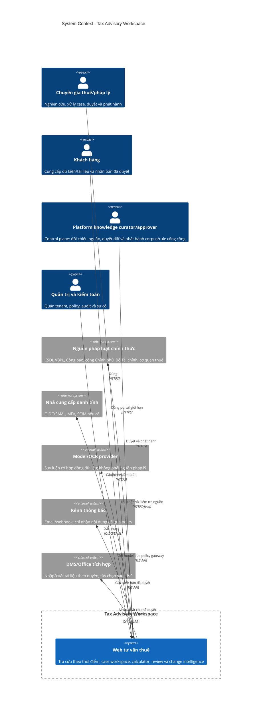
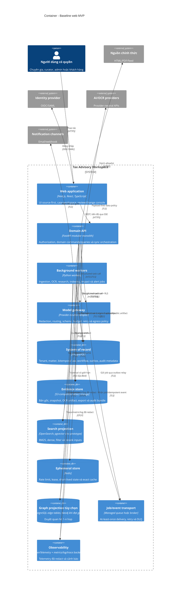
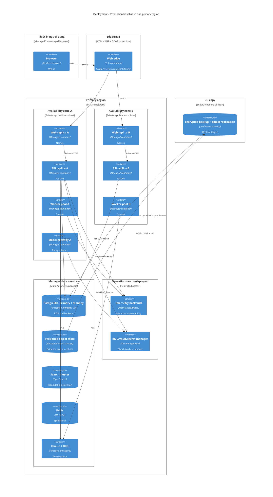

# 06. Kiến trúc hệ thống

**Trạng thái:** bản thiết kế mục tiêu để triển khai web MVP  
**Phạm vi:** trợ lý nghiên cứu và xử lý hồ sơ pháp luật thuế Việt Nam  
**Mốc thiết kế:** 10/08/2026  
**Tài liệu liên quan:** [đề án tổng thể](../de-an-tong-the.md),
[benchmark và kế hoạch web](../benchmark-va-ke-hoach-web.md),
[kiến trúc AI theo tác vụ](07-ai-task-architecture.md)

## 1. Quyết định kiến trúc

Khởi đầu bằng **modular monolith có ranh giới domain**, một nhóm worker nền và các
kho dữ liệu chuyên biệt. Không tách microservice chỉ để mô phỏng sơ đồ doanh
nghiệp. Một module chỉ được tách thành service khi có chủ sở hữu, nhịp phát hành,
mô hình tải hoặc ranh giới bảo mật độc lập được đo bằng dữ liệu vận hành.

Các quyết định không được vi phạm:

1. PostgreSQL và object store phiên bản hóa là nguồn chuẩn; search, vector, graph
   database và cache là projection có thể xây lại.
2. Luật áp dụng được giải bằng dữ liệu hai trục thời gian và mã xác định; LLM
   không tự quyết hiệu lực, thứ bậc văn bản hoặc phép tính thuế.
3. Mỗi request bị giới hạn tenant, matter, purpose và quyền **trước** mọi truy
   vấn SQL/search/vector/graph hoặc gọi model.
4. Nội dung tài liệu và trang web được coi là dữ liệu không tin cậy, không phải
   chỉ dẫn cho agent.
5. Đầu ra AI chỉ được đi qua domain schema đã kiểm tra. API không trả raw model
   output hoặc scratchpad.
6. Corpus, rule, prompt/model và code là bốn release độc lập, có manifest,
   canary và rollback riêng.
7. Công việc dài là durable job có checkpoint, idempotency, cancel/resume và
   trạng thái nhìn thấy được; không giữ một HTTP request mở vô hạn.
8. Mọi tư vấn T2/T3 phải qua người có thẩm quyền duyệt trước khi ra ngoài tổ chức.

## 2. Mục tiêu và giới hạn

### 2.1 Mục tiêu

- phục vụ tra cứu nhanh, nghiên cứu theo case, tính toán có dấu vết và theo dõi
  thay đổi luật trong cùng một web workspace;
- mở đúng căn cứ, đúng phiên bản và đúng đoạn nguồn từ từng claim;
- giữ lịch sử luật và lịch sử hệ thống để tái tạo câu trả lời tại một thời điểm;
- cô lập dữ liệu nhiều tổ chức và ethical wall ở cấp matter;
- tiếp tục được sau lỗi tiến trình hoặc model/provider tạm thời không hoạt động;
- thay thế model, search engine hoặc graph database mà không đổi hợp đồng domain;
- đo được chất lượng từng tầng và chặn phát hành khi một gate trọng yếu thất bại.

### 2.2 Không phải mục tiêu ban đầu

- tự động nộp tờ khai, thanh toán hoặc gửi văn bản tới cơ quan nhà nước;
- agent tự do có quyền ghi hoặc gọi Internet không giới hạn;
- kiến trúc active-active đa vùng ngay trong pilot;
- huấn luyện foundation model hoặc fine-tune kiến thức luật dễ thay đổi;
- graph database là nguồn quyết định quan hệ pháp lý;
- cam kết “không hallucination” dựa trên một benchmark hữu hạn.

## 3. Thuộc tính chất lượng và thứ tự ưu tiên

| Thuộc tính | Requirement | Mục tiêu thiết kế ban đầu | Cách chứng minh |
|---|---|---|---|
| Đúng pháp lý theo thời gian | NFR-002 | 100% trên tập boundary/transition trọng yếu đã duyệt | temporal golden tests và replay snapshot |
| Truy nguyên | NFR-001, NFR-010 | 100% claim trọng yếu có citation mở được hoặc bị chặn | verifier, hash và source-anchor test |
| Cô lập tenant | NFR-005 | không có cross-tenant read/write/search trong suite | RLS, ACL, adversarial và integration test |
| Tái lập | NFR-003, NFR-010 | cùng manifest + input bất biến tạo cùng rule/resolver output | audit bundle và replay runner |
| Availability | NFR-009 | pilot 99,5%; xem xét 99,9% sau BIA và tải thật | SLI theo user journey, không chỉ process uptime |
| Hiệu năng | NFR-007 | trang/source p95 < 2 giây; quick research p95 < 10 giây; progress bền vững đầu tiên < 1 giây | browser + distributed trace |
| Khả năng phục hồi | NFR-008, NFR-013 | job dài resume sau worker crash; projection rebuild được | fault injection và DR drill |
| Bảo mật/riêng tư | NFR-006, NFR-012 | không có critical/high mở khi release | threat model, SAST/DAST, pentest, privacy review |
| Khả năng quan sát | NFR-014 | trace xuyên sync/async nhưng không rò payload | redaction tests và SLO dashboards |
| Khả năng thay đổi | NFR-015 | model/corpus/rule rollback không cần rollback toàn app | release rehearsal |
| Khả năng sử dụng | NFR-011, NFR-016 | workflow phát hành đạt WCAG 2.2 AA và task-success gate | axe, keyboard, screen-reader và test thủ công |

Các con số là **mục tiêu thiết kế**, chưa phải kết quả đã đạt. Tính đúng thời gian,
phép tính, citation và tenant isolation là gate cứng; không được bù bằng điểm trung
bình hoặc câu trả lời trôi chảy.

## 4. C4 cấp 1: System Context



### 4.1 Trách nhiệm của hệ thống

Hệ thống chịu trách nhiệm về corpus đã tiếp nhận, cách chọn phiên bản, truy xuất,
workflow, rule, bằng chứng, phân quyền, log kiểm toán và việc hiển thị giới hạn.
Model provider chỉ thực hiện một tác vụ suy luận hẹp trên payload đã lọc. Nguồn
pháp luật chính thức cung cấp chứng cứ nhưng việc lấy được một URL không đồng
nghĩa nguồn đã được phép phát hành vào corpus.

## 5. C4 cấp 2: Container



### 5.1 Vai trò container

| Container | Chứa | Không được chứa |
|---|---|---|
| Web | view state, optimistic UI có version, source anchors, SSE client | token dài hạn, raw provider key, dữ liệu matter trong `localStorage` |
| Domain API | domain policy, transaction, query, command, short orchestration | crawler dài, OCR nặng, model-specific business logic |
| Worker | idempotent activity, checkpoint, retry, projection builder | quyết định quyền dựa trên payload tự khai |
| Model gateway | task registry, provider adapter, redaction, timeout, budget, schema validation | kiến thức luật chuẩn, quyền tự gọi tool side effect |
| PostgreSQL | nguồn chuẩn quan hệ, bitemporal, workflow, outbox | file nhị phân lớn, vector là nguồn pháp lý |
| Object store | file bất biến, version/hash, audit bundle | ACL duy nhất; quyền phải được kiểm tra ở API lẫn bucket policy |
| Search/graph | projection tối ưu query | stable ID riêng hoặc trạng thái pháp lý không truy về PostgreSQL |
| Redis | cache/lease/rate limit có TTL | matter memory, audit hoặc trạng thái duy nhất của job |

## 6. C4 cấp 3: Component của Domain API

```mermaid
C4Component
  title Components - FastAPI modular monolith

  Container(web, "Web application", "Next.js", "UI")
  Container(worker, "Workers", "Python", "Durable activities")
  ContainerDb(pg, "PostgreSQL", "System of record", "Domain state")
  ContainerDb(search, "Search/graph projections", "OpenSearch/PostgreSQL/Neo4j", "Rebuildable")
  Container(modelGateway, "Model gateway", "Adapter", "Policy-bound AI calls")

  Container_Boundary(api, "Domain API") {
    Component(edge, "API edge", "FastAPI middleware", "AuthN, request ID, quota, validation và idempotency")
    Component(policy, "Tenant & policy", "RBAC/ABAC/RLS context", "Tenant, matter ACL, purpose, data/egress policy")
    Component(matter, "Matter & document", "Domain module", "Case, facts, timeline, documents và membership")
    Component(knowledge, "Legal knowledge", "Domain module", "Instrument, provision, source, corpus release và authority")
    Component(resolver, "Temporal legal resolver", "Deterministic module", "Chọn phiên bản và quan hệ đúng thời điểm")
    Component(retrieval, "Retrieval facade", "Query module", "Hybrid search, graph expansion và evidence packing")
    Component(research, "Research orchestrator", "Typed state graph", "Plan, checkpoint, budgets, interrupt và resume")
    Component(rules, "Rule & calculation", "Typed Python/decision tables", "Decimal calculations và trace")
    Component(composer, "Draft & verification", "Domain + AI adapters", "Claim-evidence output, citation/conflict gates")
    Component(review, "Review & approval", "Workflow module", "Assignment, diff, sign-off và stale state")
    Component(change, "Change intelligence", "Domain module", "Diff, impact, corpus publish và alert approval")
    Component(audit, "Audit & release registry", "Append-only services", "Audit events và code/corpus/rule/model manifests")
    Component(outbox, "Outbox relay contract", "Transactional outbox", "Đưa domain event sang queue")
  }

  Rel(web, edge, "REST/SSE")
  Rel(edge, policy, "Xác lập security context")
  Rel(edge, matter, "Matter commands/queries")
  Rel(edge, knowledge, "Legal queries/admin commands")
  Rel(edge, research, "Start/cancel/resume")
  Rel(edge, review, "Submit/approve/return")
  Rel(policy, pg, "SET LOCAL tenant/purpose; RLS")
  Rel(matter, pg, "Domain transaction")
  Rel(knowledge, pg, "Bitemporal transaction")
  Rel(resolver, knowledge, "Query version/authority")
  Rel(retrieval, resolver, "Hard temporal filter")
  Rel(retrieval, search, "Projection query")
  Rel(research, retrieval, "Tool call")
  Rel(research, rules, "Typed calculation")
  Rel(research, composer, "Evidence bundle")
  Rel(composer, modelGateway, "Structured AI tasks")
  Rel(review, audit, "Signed decision")
  Rel(change, outbox, "Publish events")
  Rel(matter, outbox, "Domain events")
  Rel(outbox, pg, "Same transaction")
  Rel(worker, outbox, "Relay/consume via queue")
```



### 6.1 Quy tắc phụ thuộc module

- `matter` không gọi trực tiếp model provider; chỉ gọi contract AI qua orchestrator.
- `retrieval` phải nhận `SecurityContext` và `TemporalScope` đã validate; không có
  overload bỏ qua hai tham số này.
- `rules` chỉ nhận input có schema, unit, currency, provenance và rule version.
- `composer` không thể tạo citation ID; nó chỉ tham chiếu `EvidenceItem.id` đã cấp.
- `review` ký một immutable output version. Sửa facts, evidence, corpus, rule hoặc
  draft làm bản duyệt cũ thành `stale`.
- `change` không trực tiếp sửa index. Nó phát hành manifest rồi projection worker
  chuyển alias atomically khi đã kiểm tra.
- mọi command thay đổi state ghi `AuditEvent` và `OutboxEvent` trong cùng transaction.

## 7. C4 cấp 4: Deployment



### 7.1 Tiến hóa triển khai

| Giai đoạn | Hình thái | Điều kiện nâng cấp |
|---|---|---|
| Local | Docker Compose, dữ liệu giả | developer workflow tái lập được |
| Prototype | một app instance, PostgreSQL/object store managed | không chứa dữ liệu production |
| Pilot | tối thiểu hai API/web replica, DB multi-AZ, queue/DLQ | trước khi nhận case thật |
| Professional | autoscaling có giới hạn, read replica nếu cần, restore drill | tải và BIA chứng minh |
| Scale | tách ingestion/research/model gateway hoặc Kubernetes | ownership/tải/region/GPU yêu cầu, không theo xu hướng |

## 8. Ranh giới tin cậy

| Ranh giới | Dữ liệu đi qua | Kiểm soát bắt buộc | Không được tin |
|---|---|---|---|
| TB-01 Browser -> Edge | token, form, file metadata | TLS, CSP, CSRF, WAF, size/rate limit, secure cookie | tenant ID, MIME, filename, client validation |
| TB-02 Edge -> API | request đã lọc sơ bộ | JWT validation, nonce/session, request ID, schema, authorization | role/tenant từ body hoặc query |
| TB-03 API -> Data | domain query/command | least privilege, RLS, transaction, parameterized query, encryption | app filter đơn lẻ là đủ |
| TB-04 App -> Object store | file/snapshot | authorization download gateway; signed upload/public artifact ngắn hạn; tenant prefix, checksum, malware state | extension, OCR text, embedded macro |
| TB-05 App -> Search/Graph | query + scope | server-generated tenant/ACL/date filters, result recheck | projection là mới nhất hoặc đầy đủ |
| TB-06 App -> Queue/Worker | job/event | signed envelope, schema/version, idempotency, authorization recheck | payload cũ vẫn còn quyền hợp lệ |
| TB-07 Model gateway -> Provider | prompt/context đã lọc | DLP/redaction, provider/data-region policy, timeout, no-training/retention contract | model output, tool request, citation |
| TB-08 Source -> Ingestion | HTML/PDF/metadata | allowlist, TLS, content hash, AV, sandbox parser, dual-source checks | trang luôn chính thức, nội dung là instruction |
| TB-09 App -> Notification | subject/body/recipient | approval, minimization, link expiry, delivery audit | email là kênh bảo mật cho toàn bộ case |
| TB-10 Operator -> Production | deploy/support action | SSO/MFA, JIT privilege, two-person critical action, session audit | máy trạm/operator mặc nhiên an toàn |

Mọi dữ liệu truy xuất được, kể cả văn bản pháp luật, có thể chứa prompt injection.
Tool registry chỉ cho phép thao tác đã định nghĩa; nội dung nguồn không thể thêm
tool, đổi tenant, tăng budget hoặc vô hiệu gate.

## 9. Đồng bộ và bất đồng bộ

### 9.1 Luồng đồng bộ

Đồng bộ chỉ dùng cho thao tác có p95 dự kiến dưới 10 giây:

```text
Browser -> API edge -> auth/policy -> domain query/command
        -> PostgreSQL transaction hoặc bounded retrieval/rule
        -> domain schema validation -> audit event -> response
```

- CRUD dùng REST với ETag/row version để tránh lost update.
- Command ghi nhận `Idempotency-Key`; server lưu fingerprint và response terminal.
- Quick research có thể trả trong request nếu còn budget; nếu vượt ngưỡng, API
  tạo `ResearchRun` và trả `202 Accepted`.
- SSE chỉ truyền progress/event ID; client lấy state chuẩn lại qua REST sau reconnect.
- SSE giữ auth lease/permission fingerprint ngắn; session/ACL revoke đóng connection
  registry trước payload kế tiếp và fail closed khi invalidation bus không xác nhận.
- API không giữ transaction DB trong lúc chờ model/provider bên ngoài.

### 9.2 Luồng bất đồng bộ

```mermaid
sequenceDiagram
  autonumber
  participant API as Domain API
  participant DB as PostgreSQL
  participant Relay as Outbox relay
  participant Q as Queue/DLQ
  participant W as Worker
  participant P as Projection/Provider

  API->>DB: Transaction(domain state + outbox event)
  DB-->>API: Commit
  API-->>API: Return 202 + job ID
  Relay->>DB: Claim unpublished event
  Relay->>Q: Publish event_id + schema_version
  Q->>W: Deliver at least once
  W->>DB: Check inbox/idempotency + current authorization
  W->>P: Execute bounded activity
  W->>DB: Commit result + checkpoint + next outbox event
  W-->>Q: Ack
  Note over Q,W: Retry exponential; poison event vào DLQ
```

Quy tắc:

- delivery là at-least-once; consumer bắt buộc idempotent;
- event chứa stable ID và version, không chứa toàn bộ tài liệu nhạy cảm;
- worker lấy dữ liệu lại theo security context và version; không tin snapshot quyền
  ở thời điểm enqueue;
- retry chỉ cho lỗi transient; lỗi schema, policy, dữ liệu hoặc gate vào terminal
  state/curator queue;
- `cancel_requested` được kiểm tra giữa mỗi activity; kết quả đến muộn không được
  tự xuất bản;
- DLQ có owner, SLA, replay tool và audit; không replay hàng loạt không giới hạn.

### 9.3 Nhóm domain event tối thiểu

| Event | Producer | Consumer chính |
|---|---|---|
| `matter.created.v1`, `matter.acl_changed.v1` | matter | audit, projection/cache invalidation |
| `document.uploaded.v1` | matter/document | scan, parse, OCR |
| `document.ready.v1`, `document.quarantined.v1` | ingestion | fact extraction hoặc curator QA |
| `fact.confirmed.v1`, `fact.disputed.v1` | matter | research/invalidation |
| `research.requested.v1`, `research.state_changed.v1` | research | research worker, SSE projector |
| `research.completed.v1`, `research.abstained.v1` | research worker | review/task/metrics |
| `draft.submitted.v1`, `review.decided.v1` | authoring/review | review queue, export/portal, audit |
| `corpus.published.v1` | corpus release | search/graph index, cache invalidation, impact |
| `legal.change_approved.v1` | curator/change | impact workflow |
| `impact.confirmed.v1` | change intelligence | task/alert worker |

## 10. Nguồn chuẩn và projection

| Dữ liệu | Nguồn chuẩn | Projection/cache | Cách tái tạo |
|---|---|---|---|
| Tenant, user link, role, matter ACL | PostgreSQL + IdP subject mapping | authorization cache ngắn | đọc lại DB/IdP; cache không cấp thêm quyền |
| Matter, fact, issue, timeline | PostgreSQL append/version records | UI read model/search riêng tenant | outbox + backfill theo version |
| Tệp gốc và source snapshot | object store versioned + metadata/hash trong PostgreSQL | thumbnail, extracted text | parse lại từ object bất biến |
| Instrument/provision/version | PostgreSQL bitemporal | point-in-time view, search, graph | corpus release manifest |
| Legal edge đã duyệt | PostgreSQL versioned edge | Neo4j hoặc materialized paths | outbox/CDC + reconciliation |
| Research state | PostgreSQL checkpoint | Redis lease/progress | resume từ checkpoint |
| Search document/vector | không phải nguồn chuẩn | OpenSearch/pgvector | chunk + embedding manifest |
| Rule/calculator | Git artifact + rule registry/version trong PostgreSQL | compiled rule cache | signed release artifact |
| Draft/review/approval | PostgreSQL versioned + immutable export object | rendered HTML/PDF | render lại từ version và manifest |
| Audit | append-only PostgreSQL/object bundle theo retention | SIEM summary đã redact | không coi dashboard là audit gốc |
| Prompt/model config | Git/release registry | gateway cache | signed manifest |

### 10.1 Chống dual-write và lệch projection

1. Domain transaction chỉ ghi PostgreSQL/outbox; relay mới cập nhật hệ ngoài.
2. Projection record lưu `source_version`, `corpus_release_id`, `schema_version`
   và checksum.
3. Reconciliation job so sánh watermark/count/hash giữa nguồn và projection.
4. Query nhạy cảm kiểm tra projection release khớp request; nếu không, dùng đường
   đọc chuẩn chậm hơn hoặc abstain, không trộn hai release.
5. Publish index bằng alias/snapshot switch atomically; giữ ít nhất một bản trước.
6. Xóa tenant phát event tombstone, xác nhận từng projection và có báo cáo hoàn tất.

## 11. Multi-tenancy và phân quyền

### 11.1 Mô hình

- baseline shared application/shared PostgreSQL schema với `tenant_id` bắt buộc;
- PostgreSQL RLS là lớp cưỡng chế thứ hai sau domain authorization;
- matter ACL/ethical wall giới hạn bên trong tenant;
- object path và key scope theo tenant; private download qua authorization gateway;
  signed URL trực tiếp chỉ cho upload hoặc public-law artifact được phép;
- search document và graph node mang tenant/visibility; filter được server chèn
  trước lexical/vector/graph query;
- dữ liệu luật công cộng dùng namespace chung chỉ đọc; dữ liệu khách hàng không
  được nối vào shared legal graph;
- ghi/quarantine/publish namespace luật công cộng thuộc platform control plane với
  principal/role/DB grant/JIT/dual-control riêng; tenant role không thể nâng quyền;
- knowledge overlay riêng của tenant luôn có `tenant_id`, RLS và index namespace
  riêng, không được gắn authority class công cộng;
- khách enterprise có thể dùng database/key/index riêng khi hợp đồng và threat
  model yêu cầu, qua cùng contract domain.

### 11.2 Security context bắt buộc

```json
{
  "request_id": "uuid",
  "subject_id": "stable-id",
  "tenant_id": "uuid",
  "roles": ["tax_professional"],
  "matter_scope": ["matter-id"],
  "purpose": "case_research",
  "data_policy": "confidential-client",
  "egress_policy": "approved-models-only"
}
```

Context được tạo từ token và server-side membership, không nhận `tenant_id` do
client tự khai. Worker tái xác minh membership tại thời điểm chạy. Support/admin
không có quyền xem nội dung mặc định; break-glass có lý do, thời hạn, phê duyệt và
audit riêng.

Platform control-plane context là schema khác: `{platform_principal_id, platform_roles,
purpose, jit_grant_id, approval_context}` và không có tenant fallback. API route,
session audience, DB connection pool, audit stream và network policy tách khỏi tenant
data plane; negative test chứng minh token tenant bị từ chối trên mọi corpus write.

## 12. Bảo mật và riêng tư

### 12.1 Kiểm soát nền

- TLS ở mọi kết nối; mã hóa storage bằng KMS, rotation và tách key phù hợp tenant;
- workload identity/credential ngắn hạn; secret không nằm trong repo, image hoặc log;
- SSO/MFA, session expiry, device/session revoke; SAML/SCIM khi enterprise yêu cầu;
- secure SDLC: dependency/SBOM, secret scan, SAST, IaC scan, container signing,
  DAST, pentest và patch SLA;
- upload validation theo magic bytes, AV, decompression limits, sandbox parser,
  macro/archive policy và quarantine;
- CSP, output encoding, CSRF, SSRF egress allowlist, parameterized query;
- model/tool egress deny-by-default, DNS/network policy và circuit breaker;
- DLP trước telemetry và model call; không đặt prompt, PII hoặc source text trong
  URL, analytics hay error tracker;
- export có watermark/status, expiry, audit và quyền theo matter;
- retention, legal hold, deletion, access/export request và backup expiry được
  thực thi bằng workflow có bằng chứng.

### 12.2 Phân loại dữ liệu

| Lớp | Ví dụ | Mặc định xử lý |
|---|---|---|
| Public-law | văn bản chính thức đã được phép dùng | shared corpus, vẫn giữ provenance/license |
| Internal | taxonomy, prompt, benchmark không chứa khách hàng | tenant/org hoặc product internal |
| Confidential-client | hợp đồng, hóa đơn, phân tích case | matter ACL, mã hóa, model policy nghiêm, không train |
| Restricted | định danh nhạy cảm, bí mật đặc biệt, credential | tối thiểu hóa/redact; provider call chỉ khi policy cho phép |
| Audit/security | access, approval, incident evidence | quyền riêng, immutable phù hợp, retention khác nội dung case |

### 12.3 Threats đặc thù AI/pháp lý

| Threat | Kiểm soát |
|---|---|
| Prompt injection trong PDF/web | tách instruction/data, allowlisted tools, no side effect, output schema, egress policy |
| Citation poisoning/source giả | allowlist, hash/snapshot, issuer/metadata check, exact anchor verifier |
| Luật sai thời điểm | deterministic resolver, release pinning, boundary tests |
| Cross-tenant retrieval | RLS + pre-filter + post-check + adversarial tests |
| Model nhớ hoặc provider train dữ liệu | hợp đồng no-training/retention, redaction, routing, self-host khi bắt buộc |
| Tool exfiltration/SSRF | read-only registry, fixed parameters, network allowlist, output size limits |
| Corpus update bị đầu độc | quarantine, dual-source checks, curator approval, signed release |
| Reviewer automation bias | source-first UI, adverse authority, explicit unknowns, sampled QA |

## 13. HA, khôi phục và chế độ suy giảm

### 13.1 Mục tiêu DR sơ bộ

Phải được xác nhận bằng Business Impact Analysis trước hợp đồng production.

| Lớp | RPO mục tiêu sơ bộ | RTO mục tiêu sơ bộ | Cơ chế |
|---|---:|---:|---|
| PostgreSQL matter/review/audit metadata | <= 15 phút | <= 4 giờ | Multi-AZ, PITR, encrypted cross-failure-domain backup |
| Source/evidence object | <= 1 giờ | <= 8 giờ | versioning, replication/backup, inventory/hash verification |
| Queue/job state | <= 15 phút | <= 4 giờ | durable queue + DB checkpoint; replay idempotent |
| Search/graph/vector | có thể mất toàn bộ projection | <= 12 giờ theo corpus size | rebuild từ manifest/source of truth |
| Redis | không cam kết RPO | <= 1 giờ | cold cache; job state không phụ thuộc Redis |
| Prompt/model/rule artifact | mỗi release | <= 2 giờ | signed registry + artifact repository |

### 13.2 HA và phục hồi

- tối thiểu hai replica stateless ở hai availability zone cho pilot có case thật;
- PostgreSQL managed failover, connection pool có backoff; không retry transaction
  không idempotent một cách mù;
- queue có DLQ; worker scale theo backlog nhưng có concurrency/budget cap;
- circuit breaker/bulkhead theo model/OCR/notification provider;
- backup mã hóa, kiểm tra restore định kỳ; có cả restore kỹ thuật và kiểm tra hash,
  RLS, manifest sau restore;
- projection rebuild dùng version mới song song, validate rồi đổi alias;
- DR drill tối thiểu mỗi quý sau khi production; lưu bằng chứng thời gian và sai lệch.

### 13.3 Chế độ suy giảm có chủ đích

| Lỗi | Hành vi an toàn |
|---|---|
| Model mạnh không hoạt động | thử provider/model đã duyệt; nếu task chất lượng cao không đạt thì queue/abstain |
| Search lỗi | exact legal reference/PostgreSQL fallback cho tra cứu hẹp; khóa synthesis nếu coverage không đủ |
| Graph projection stale | bỏ graph expansion, nêu giới hạn; resolver vẫn dùng PostgreSQL |
| OCR lỗi | giữ tệp, quarantine trang; yêu cầu bản text hoặc curator review |
| Notification lỗi | alert vẫn ở trạng thái approved/pending; retry idempotent, không mất task |
| Redis mất | mất cache/rate window cục bộ; không mất case/job/audit |
| Corpus candidate lỗi | giữ release đang active; candidate không ảnh hưởng câu trả lời |
| Telemetry backend lỗi | buffer/drop telemetry theo policy; không làm rò payload hoặc chặn transaction chính trừ audit bắt buộc |

## 14. Môi trường và cấu hình

| Môi trường | Dữ liệu | Tích hợp | Quy tắc |
|---|---|---|---|
| Local | fixture/tài liệu công khai nhỏ | emulator/fake provider | không dùng credential hoặc dump production |
| CI | synthetic golden cases | deterministic stub + sandbox | ephemeral, seed cố định, security/contract tests |
| Dev | dữ liệu giả hoặc public | provider sandbox có budget | không nhận client data |
| Staging | dữ liệu tổng hợp/ẩn danh đã duyệt | cấu hình gần production | rehearsal migration, restore, corpus/model/rule canary |
| Production | dữ liệu thật | approved integrations | account/project, key, DB, bucket và telemetry riêng |
| Evaluation enclave | benchmark có quyền sử dụng | model bake-off | truy cập hạn chế, output không tự vào production |

Không clone production sang môi trường thấp. Configuration có schema và version;
secret nằm trong secret manager. Feature flag có owner, expiry và audit, được scope
theo tenant nhưng không được dùng để bỏ qua authorization hoặc legal gate.

## 15. Observability và audit

### 15.1 Ba luồng riêng

1. **Operational telemetry:** metric/log/trace đã redact để vận hành.
2. **AI evaluation evidence:** task input hash, output schema, model/prompt/tool
   version, latency/token/cost và gate result; nội dung chỉ ở kho có ACL.
3. **Legal audit bundle:** facts/evidence/citations, temporal scope, rule trace,
   approvals và release manifests để tái lập case.

Không dùng dashboard observability làm nguồn audit pháp lý.

### 15.2 Trace context

`request_id -> run_id -> step_id -> tool_call_id -> model_call_id` được truyền qua
HTTP, queue và worker. Thuộc tính được phép xuất gồm tenant pseudonym, task ID,
release IDs, latency, token bucket, cache hit, result/gate/error class. Không xuất
prompt, raw source, fact value, email, mã số thuế hoặc tên khách hàng.

### 15.3 SLI và cảnh báo tối thiểu

- success/p50/p95 theo journey: login, open source, quick research, save fact,
  approve, publish corpus;
- queue age, retry, DLQ, stuck checkpoint, cancel latency;
- PostgreSQL saturation/replication lag, object errors, search lag và projection
  release mismatch;
- retrieval empty/low coverage, citation gate fail, abstention/risk routing,
  temporal conflict, calculator failure;
- provider timeout/error/schema violation, token/cost theo task và tenant;
- authorization deny spike, cross-tenant test sentinel, unusual export/download;
- corpus detection-to-review/publish time và impacted asset backlog.

Cảnh báo có severity, owner, runbook và SLO burn-rate; không gửi một cảnh báo cho
mỗi model timeout đơn lẻ.

## 16. Phát hành, migration và rollback

### 16.1 Release manifest thống nhất

Mỗi output lưu tối thiểu:

```json
{
  "code_release": "git-sha/image-digest",
  "schema_version": "db+event+api",
  "corpus_release_id": "immutable-id",
  "index_release_id": "immutable-id",
  "graph_release_id": "immutable-id",
  "rule_release_id": "immutable-id",
  "model_release_id": "routing-manifest-id",
  "prompt_release_id": "prompt-manifest-id",
  "policy_release_id": "policy-manifest-id"
}
```

### 16.2 Pipeline

```text
lint/unit/contract/security
 -> component benchmark + temporal/calculator golden tests
 -> build signed immutable artifacts + SBOM
 -> deploy staging + migration rehearsal + restore/rebuild test
 -> shadow/replay benchmark
 -> production canary theo tenant nội bộ
 -> verify SLI/quality/security gates
 -> progressive rollout hoặc rollback
```

- DB migration dùng expand/migrate/contract; code cũ và mới cùng chạy được trong
  cửa sổ rollout. Migration phá hủy cần backup, rehearsal và phê duyệt riêng.
- API/event schema tương thích ngược trong ít nhất một consumer window; consumer
  bỏ qua field mới nhưng từ chối major version không hiểu.
- Corpus publish tạo snapshot và projection song song, chạy regression rồi đổi
  active pointer atomically.
- Model/prompt release chạy shadow trên replay được phép; T2/T3 canary vẫn cần duyệt.
- Rule release cần dual review và 100% golden/boundary/property tests trong scope.

### 16.3 Rollback

| Thành phần | Rollback |
|---|---|
| Code | chuyển traffic về image digest trước; giữ schema tương thích |
| Corpus | đổi active corpus/index/graph pointer về manifest trước; đánh stale output mới |
| Search/graph | đổi alias/projection release; rebuild nếu hỏng |
| Rule | pin rule release trước và vô hiệu calculation chưa duyệt |
| Model/prompt | đổi routing manifest; không cần deploy application |
| Policy | signed previous policy + break-glass có two-person approval |

Không “rollback” bằng cách xóa bằng chứng. Mọi lần đổi pointer tạo audit event và
impact evaluation. Nếu output sai đã ra ngoài, chạy recall workflow: xác định
matter/recipient, khóa bản, báo reviewer và phát hành correction có dấu vết.

## 17. Kiểm thử kiến trúc và fitness functions

| Fitness function | Tần suất | Gate |
|---|---|---|
| Query không có tenant context bị từ chối ở app và RLS | mỗi CI | 100% |
| Tenant B không thấy SQL/search/vector/graph/object của A | mỗi CI + adversarial định kỳ | 0 leak |
| Temporal resolver boundary/transition | mỗi rule/corpus release | 100% critical set |
| Citation mở đúng snapshot/span/hash | mỗi release | 100% citation ID hoặc chặn output |
| Calculator golden/boundary/property | mỗi rule/code release | 100% trong scope |
| Projection rebuild từ manifest sạch | hàng tuần/staging | hash/count/watermark đạt |
| Worker replay cùng event ID | mỗi CI | không double side effect |
| Kill worker giữa research rồi resume | mỗi release lớn | không mất checkpoint |
| Restore PostgreSQL/object và xác minh audit | theo quý | trong RPO/RTO đã duyệt |
| Prompt injection trong source/file | mỗi model/prompt release | không đổi policy/tool/tenant |
| Rollback code/corpus/rule/model | trước production và theo quý | rehearsal thành công |

## 18. Trade-off đã chấp nhận

| Quyết định | Lợi ích | Chi phí/rủi ro | Tín hiệu xem lại |
|---|---|---|---|
| Modular monolith | transaction và phát triển nhanh, ít vận hành | blast radius/deploy chung | module có tải/owner/SLO độc lập |
| PostgreSQL edge trước Neo4j | một nguồn, giảm dual-write | multi-hop phức tạp có thể chậm | >=20% case cần multi-hop và graph tăng >=3 điểm chất lượng hoặc SQL không đạt SLO |
| Managed services trước Kubernetes | HA/backup nhanh với đội nhỏ | lock-in/chi phí dịch vụ | nhiều service/GPU/region hoặc giới hạn platform rõ |
| API model trước self-host | thay model nhanh, không vận hành GPU | data residency, cost, provider outage | policy cấm egress, model mở đạt benchmark và tải đủ kinh tế |
| SSE trước WebSocket | đơn giản, phù hợp progress một chiều | collaboration realtime hạn chế | co-edit/presence hai chiều trở thành yêu cầu trả phí |
| At-least-once events | hạ tầng phổ biến, phục hồi tốt | consumer phải idempotent | không đổi sang exactly-once marketing; sửa contract/idempotency |
| Human gate T2/T3 | giảm rủi ro tư vấn | tăng thời gian và chi phí | chỉ nới theo loại task sau evidence/risk approval |
| Projection eventual consistency | query nhanh và chuyên biệt | có độ trễ | critical query phải pin release/fallback, không biến projection thành nguồn chuẩn |

## 19. ADR cần lập

| ADR | Quyết định cần ghi | Khi chốt |
|---|---|---|
| ADR-001 | Modular monolith và tiêu chí tách service | trước scaffold backend |
| ADR-002 | PostgreSQL bitemporal schema và exclusion constraints | trước migration đầu |
| ADR-003 | Tenant isolation: RLS, matter ACL, object/search policy | trước lưu dữ liệu thật |
| ADR-004 | Object immutability, hash, retention và legal hold | trước ingestion production |
| ADR-005 | pgvector/FTS so với OpenSearch hybrid | sau retrieval benchmark |
| ADR-006 | Versioned edge trong PostgreSQL so với Neo4j projection | sau multi-hop benchmark |
| ADR-007 | Worker queue so với Temporal cho durable workflow | trước job phút-giờ production |
| ADR-008 | Model gateway, provider routing và data residency | trước model call với dữ liệu case |
| ADR-009 | OCR/layout stack và quarantine thresholds | sau benchmark PDF Việt Nam |
| ADR-010 | Rule-as-code so với DMN/OpenFisca | sau ba calculator thực |
| ADR-011 | Event schema, outbox/inbox và replay policy | trước worker integration |
| ADR-012 | Observability backend, redaction và audit split | trước staging |
| ADR-013 | HA/DR topology và RPO/RTO theo BIA | trước hợp đồng pilot |
| ADR-014 | Release manifest, canary và rollback matrix | trước release đầu |
| ADR-015 | Data retention/provider DPA/egress policy | trước onboarding khách hàng |

Mỗi ADR phải ghi bối cảnh, lựa chọn, bằng chứng benchmark/threat model, hệ quả,
owner, ngày xem lại và điều kiện đảo quyết định. Tên sản phẩm công nghệ không được
thay cho lập luận kiến trúc.

## 20. Checklist sẵn sàng triển khai

- [ ] C4 và data-flow map được security, product, legal và vận hành duyệt.
- [ ] Domain boundaries có contract; không có model SDK trong core legal/rule code.
- [ ] Tenant/RLS/object/search/graph isolation có integration và adversarial tests.
- [ ] Bitemporal resolver và source/projection ownership có migration cụ thể.
- [ ] Outbox/inbox/idempotency/DLQ/replay được chứng minh bằng fault test.
- [ ] Model/OCR/notification egress policy và DPA được phê duyệt.
- [ ] Telemetry redaction test chứng minh không xuất prompt/PII/source text.
- [ ] Backup/restore, projection rebuild và bốn loại rollback được diễn tập.
- [ ] SLO/SLI, dashboard, alert owner và runbook tồn tại trước pilot.
- [ ] Corpus/rule/model/prompt/code release ID đi cùng mọi answer/audit bundle.
