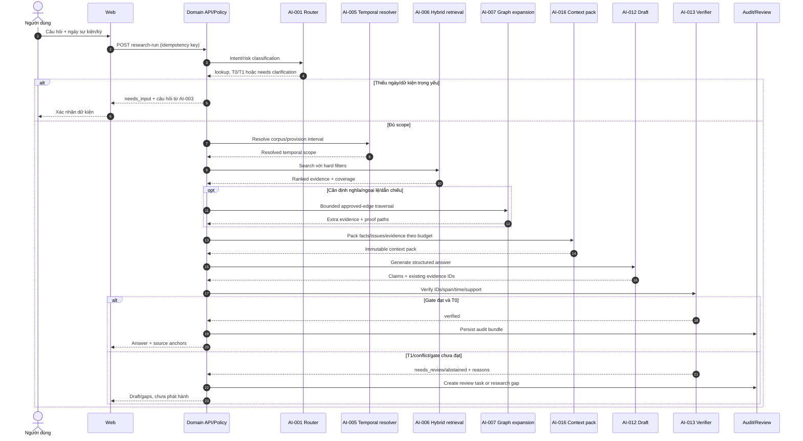

# 07. Kiến trúc AI theo tác vụ

**Trạng thái:** đặc tả triển khai và đánh giá  
**Mốc thiết kế:** 10/08/2026  
**Phạm vi:** 18 tác vụ AI/xác định trong web tư vấn thuế  
**Kiến trúc hệ thống:** [06-system-architecture.md](06-system-architecture.md)

## 1. Mục đích

Tài liệu này biến “AI tư vấn thuế” thành các tác vụ nhỏ, có hợp đồng dữ liệu,
quyền truy cập, giới hạn, fallback và benchmark riêng. Không một model nào được
giao toàn bộ quy trình. Orchestrator chỉ ghép các tác vụ qua typed state và policy
gate; luật, nguồn, rule và phép duyệt vẫn thuộc domain system.

Ba nguyên tắc trung tâm:

1. **Model-provider neutral:** code nghiệp vụ gọi `AI-xxx` qua model gateway và
   capability profile; không nhúng tên/model SDK vào domain module.
2. **Evidence before prose:** model nhận evidence ID đã lọc và trả domain schema;
   không tự tạo source/citation ID, ngày hiệu lực hay kết quả calculator.
3. **Không phơi chain-of-thought:** chỉ lưu/hiển thị kế hoạch ngắn, trạng thái,
   hành động tool, input/output có cấu trúc, nguồn, kiểm tra và lý do nghiệp vụ.
   Không yêu cầu, lưu hoặc hiển thị scratchpad/suy nghĩ nội bộ của model.

## 2. Phân loại thành phần

| Loại | Vai trò | Ví dụ |
|---|---|---|
| Deterministic | quyết định phải tái lập hoàn toàn | AI-005 temporal resolver, AI-011 calculator, hash/span/date validation trong AI-013 |
| Retrieval/ranking | tìm và xếp bằng chứng nhưng không kết luận luật | AI-006, AI-007 |
| Predictive extraction/classification | đề xuất dữ kiện/nhãn có uncertainty | AI-001, AI-002, AI-004, AI-008, AI-014 |
| Generative bounded | tạo kế hoạch/diễn đạt chỉ từ dữ liệu được cấp | AI-009, AI-012, AI-017, phần tóm tắt của AI-015/018 |
| Policy/human control | chặn, chuyển cấp, phê duyệt | risk gate xuyên suốt; reviewer không phải “agent” |

Tên `AI-005` và `AI-011` vẫn nằm trong registry tác vụ để orchestration và telemetry
thống nhất, nhưng implementation cốt lõi là deterministic, không gọi LLM.

## 3. Hợp đồng runtime dùng chung

### 3.1 Request envelope

```json
{
  "task_id": "AI-001",
  "task_schema_version": "1.0",
  "request_id": "uuid",
  "run_id": "uuid",
  "step_id": "uuid",
  "security_context": {
    "subject_id": "stable-id",
    "tenant_id": "uuid",
    "matter_id": "uuid|null",
    "purpose": "case_research",
    "permission_scope_hash": "sha256",
    "data_classification": "public-law|internal|confidential-client|restricted",
    "egress_policy_id": "policy-version"
  },
  "temporal_scope": {
    "jurisdiction": "VN",
    "event_date": "YYYY-MM-DD|null",
    "tax_period": "string|null",
    "procedure_date": "YYYY-MM-DD|null",
    "known_at": "RFC3339",
    "corpus_release_id": "immutable-id"
  },
  "budget": {
    "deadline_ms": 10000,
    "max_steps": 1,
    "max_input_tokens": 8000,
    "max_output_tokens": 2000,
    "max_cost_units": 10
  },
  "input": {}
}
```

`tenant_id`, quyền và data policy được server tạo; client không được ghi đè.
`corpus_release_id` được pin đầu run để không trộn nguồn khi đang phát hành luật.

### 3.2 Result envelope

```json
{
  "task_id": "AI-001",
  "task_schema_version": "1.0",
  "status": "completed|needs_input|needs_review|abstained|failed_retriable|failed_final|cancelled",
  "output": {},
  "warnings": [{"code": "string", "message_key": "string"}],
  "gate_results": [{"gate": "schema", "passed": true, "reason_code": "OK"}],
  "provenance": {
    "input_hash": "sha256",
    "output_hash": "sha256",
    "model_release_id": "id|null",
    "prompt_release_id": "id|null",
    "tool_release_ids": ["id"],
    "rule_release_id": "id|null",
    "index_release_id": "id|null"
  },
  "usage": {"latency_ms": 0, "input_tokens": 0, "output_tokens": 0, "cost_units": 0}
}
```

Không lưu raw hidden reasoning. Với generative task, audit lưu structured output,
evidence IDs và tool observations đã lọc; model-provider response thô chỉ được giữ
tạm để xử lý lỗi nếu privacy/retention policy cho phép.

### 3.3 Kiểu dữ liệu bằng chứng

```json
{
  "evidence_id": "stable-id",
  "source_snapshot_id": "immutable-id",
  "provision_version_id": "id|null",
  "authority_tier": "A1|A2|B|C|D",
  "valid_from": "date|null",
  "valid_to": "date|null",
  "page": 1,
  "bbox": [0, 0, 0, 0],
  "char_start": 0,
  "char_end": 120,
  "quote_hash": "sha256",
  "access_scope": "public-law|tenant|matter"
}
```

Một `Claim` chỉ tham chiếu `evidence_id` đã tồn tại. Quote hiển thị được lấy lại từ
snapshot bằng tọa độ, không tin đoạn text model lặp lại.

### 3.4 Capability profile thay cho tên model

| Profile | Nhu cầu | Dùng cho |
|---|---|---|
| `classifier-small` | structured classification, latency thấp, tiếng Việt tốt | AI-001, AI-004, nhãn trong AI-014 |
| `extractor-text` | constrained schema, span grounding, long input vừa | AI-002 |
| `vision-layout` | page image, table/layout, OCR confidence | AI-008 fallback |
| `embedder-multilingual` | dense representation tiếng Việt/pháp lý | AI-006 |
| `reranker-multilingual` | cross-encoder/late-interaction ranking | AI-006 |
| `reasoner-grounded` | context dài vừa, tool use có cấu trúc | AI-009, AI-010, AI-012, AI-015 |
| `translator-controlled` | bảo toàn số, thuật ngữ, citation | AI-017 |

Mỗi profile có allowlist model, data region, retention, max context, schema success,
benchmark slice và fallback. Bake-off diễn ra trên cùng task contract; thay model
chỉ đổi `model_release_id` sau regression/canary.

## 4. State, tool và policy dùng chung

### 4.1 Typed research state

```json
{
  "run_id": "uuid",
  "mode": "quick|case|change",
  "risk_tier": "T0|T1|T2|T3",
  "facts": [],
  "timeline": [],
  "issues": [],
  "missing_facts": [],
  "temporal_scope": {},
  "evidence": [],
  "conflicts": [],
  "calculations": [],
  "claims": [],
  "gate_results": [],
  "status": "queued|planning|retrieving|analyzing|verifying|awaiting_input|awaiting_review|completed|abstained|failed|cancelled",
  "next_allowed_tasks": []
}
```

State được checkpoint trong PostgreSQL. Transition phải khai báo input/output task,
retry class và stop condition. Một task không được sửa field không thuộc quyền sở
hữu; thay đổi được ghi thành version/diff.

`ResultEnvelope.status` là kết quả **một task** (`needs_input`, `needs_review`,
`failed_retriable`...). Orchestrator ánh xạ nó sang state của **research run**:
`awaiting_input`, `awaiting_review` hoặc `failed`; không dùng lẫn hai enum trong DB/API.

### 4.2 Tool registry

```text
resolve_temporal_scope(...)        -> AI-005
search_legal_authority(...)        -> AI-006
expand_normative_graph(...)        -> AI-007
extract_document_layout(...)       -> AI-008
find_counter_authority(...)        -> AI-010
run_tax_rule(...)                  -> AI-011
verify_claim_citations(...)        -> AI-013
request_user_confirmation(...)
request_human_review(...)
```

Tools mặc định read-only. Parameter được validate, quyền được kiểm tra ở tool
boundary, output có size limit. Không có tool gửi email, sửa corpus, duyệt memo
hoặc nộp hồ sơ trong ReAct loop.

### 4.3 Gate chung

- `authz_gate`: tenant, matter ACL, purpose và egress;
- `input_schema_gate`: type, date, unit, size, malware/quarantine state;
- `temporal_gate`: event/period đã đủ và corpus release được pin;
- `evidence_gate`: nguồn đủ thẩm quyền/coverage và không vượt access scope;
- `citation_gate`: claim-span-version-support;
- `calculation_gate`: typed confirmed inputs và tested rule version;
- `risk_gate`: mode T0-T3, deadline, adverse authority, conflict, action side effect;
- `human_gate`: reviewer/approver có quyền và ký đúng output version.

Nếu một gate cứng thất bại, orchestrator không được “thử prompt khác” để đi vòng.

## 5. Danh mục tác vụ

| ID | Tác vụ | Loại cốt lõi | Chủ sở hữu output |
|---|---|---|---|
| AI-001 | Phân loại ý định và rủi ro | rules + classifier | orchestration/policy |
| AI-002 | Trích dữ kiện và timeline | extraction | matter |
| AI-003 | Phát hiện dữ kiện thiếu | rules + ranking | matter/intake |
| AI-004 | Issue spotting | multi-label + retrieval | research |
| AI-005 | Giải luật theo thời gian | deterministic | legal domain |
| AI-006 | Hybrid retrieval | retrieval/ranking | legal domain |
| AI-007 | Mở rộng normative graph | deterministic bounded traversal | legal domain |
| AI-008 | OCR và hiểu layout | parser/OCR/vision fallback | document/ingestion |
| AI-009 | Deep research/ReAct | bounded state graph | research |
| AI-010 | Tìm căn cứ ngược và xung đột | rules + retrieval/NLI | research/legal |
| AI-011 | Phép tính thuế/thời hạn | deterministic | tax rules |
| AI-012 | Soạn bản nháp có căn cứ | grounded generation | draft |
| AI-013 | Kiểm chứng citation/claim | deterministic + entailment | verification |
| AI-014 | Diff luật | structural diff + classification | change intelligence |
| AI-015 | Phân tích tác động | dependency traversal + summary | change intelligence |
| AI-016 | Bộ nhớ và đóng gói context | structured memory | research/matter |
| AI-017 | Dịch và diễn giải dễ hiểu | controlled generation | presentation |
| AI-018 | Tạo cảnh báo hành động | rules + grounded summary | notification/change |

## 6. Đặc tả từng tác vụ

### AI-001 - Phân loại ý định và rủi ro

| Mục | Đặc tả |
|---|---|
| Mục tiêu | Chọn workflow/tác vụ được phép, nhận diện yêu cầu tư vấn case, tính toán, tài liệu, thay đổi luật, dấu hiệu side effect hoặc rủi ro cao; không kết luận pháp lý. |
| Input schema | `{user_text, ui_mode?, attachment_metadata[], user_role, matter_id?, jurisdiction_hint?, date_hints[], channel}` cùng security context. Không gửi nội dung file nếu metadata đủ. |
| Output schema | `{intent: enum[lookup,case,calculation,document_review,change_research,deep_research,admin,unsupported], risk_tier: enum[T0,T1,T2,T3], data_classification, required_task_ids[], required_gates[], needs_clarification, reason_codes[], prohibited_action?}`. |
| Kỹ thuật/model/tool | Luật policy ưu tiên trước; classifier tiếng Việt có structured output; rules cho từ khóa/route side-effect, gian lận, deadline và quyền; không tool ngoài. |
| State/steps | Normalize tối thiểu -> hard policy -> classifier -> schema/rule consistency -> conservative risk override -> route. |
| Data access | Request hiện tại, role/matter metadata, tenant policy; không search corpus/matter khác. |
| Guardrails | Classifier không thể hạ risk do rule đặt; `unsupported` không tự chuyển thành web search; nội dung file là untrusted. |
| Fallback/abstention/human | Schema/model lỗi: route an toàn tới guided intake hoặc T2 review. Mơ hồ giữa T1/T2 chọn T2 và hỏi mục đích; yêu cầu bị cấm trả policy response. |
| Cache | Chỉ cache trong cùng run theo input hash + policy/model release; không semantic-cache câu hỏi khách hàng xuyên user/tenant. |
| Telemetry | Intent/risk prediction, rule override, clarification, latency, model/schema failure, route sau cùng; text đã redact/hash. |
| Đánh giá | Macro-F1 theo intent; recall cho T2/T3 và prohibited action; false-negative trên critical set phải bằng 0; calibration/risk-coverage; p95. |
| Failure modes | Câu hỏi ngắn che giấu case cụ thể; ngôn ngữ lẫn Anh-Việt; classifier hạ rủi ro; deadline không được nhận diện; attachment làm đổi data class. |

### AI-002 - Trích dữ kiện và timeline

| Mục | Đặc tả |
|---|---|
| Mục tiêu | Biến tài liệu/phát biểu thành **ứng viên** fact/event có kiểu, ngày, nguồn và độ chắc chắn để người dùng xác nhận. |
| Input schema | `{matter_id, document_version_ids[], layout_block_ids[], user_statements[], fact_schema_version, tax_domain, requested_fact_types[]}`; chỉ document ở trạng thái parse được. |
| Output schema | `{fact_candidates:[{id,type,value_raw,value_normalized,unit?,date_kind?,event_date?,tax_period?,evidence_ids[],extraction_confidence,status: proposed,materiality_hint?}], timeline_candidates[], contradictions[], unparsed_regions[]}`. |
| Kỹ thuật/model/tool | Layout-aware span extraction; NER/date normalization; constrained text extractor; table cell mapping. AI-008 cung cấp block/bbox. Rule chuẩn hóa mã số, tiền tệ và loại ngày. |
| State/steps | Chọn page/block -> extract theo schema -> normalize -> liên kết span -> dedupe -> phát hiện khác biệt -> validation -> proposed state. |
| Data access | Chỉ object/layout thuộc matter và schema dùng chung; signed read ngắn hạn; không đưa dữ kiện vào shared corpus. |
| Guardrails | Mỗi fact phải có evidence span hoặc nhãn `user_statement`; phân biệt stated/inferred; không tự nâng thành confirmed; instruction trong tài liệu bị bỏ qua. |
| Fallback/abstention/human | OCR/layout thấp: gọi AI-008 hoặc `needs_review`; critical fact không có span bị loại. User phải xác nhận ngày, số tiền, tư cách, kỳ và dữ kiện có thể đổi kết luận. |
| Cache | Theo tenant + document content hash + page + extractor/schema/prompt release; invalid khi document version/schema đổi. |
| Telemetry | Fact type/count, provenance coverage, low-confidence pages, contradiction count, user accept/edit/reject, latency/cost. |
| Đánh giá | Span-level precision/recall/F1; date-kind và normalization accuracy; 100% provenance cho critical fact; contradiction recall; user correction distance. |
| Failure modes | Nhầm ngày ký/ngày giao dịch/ngày khai; merge hai pháp nhân; số âm/dấu phân cách; bảng nhiều trang; OCR bỏ dấu; suy luận fact không được nói rõ. |

### AI-003 - Phát hiện dữ kiện thiếu và tạo câu hỏi

| Mục | Đặc tả |
|---|---|
| Mục tiêu | Hỏi ít nhất nhưng đủ các dữ kiện có khả năng đổi rule path/kết luận/phép tính, đồng thời giải thích lý do nghiệp vụ. |
| Input schema | `{confirmed_facts[], proposed_facts[], issue_candidates[], rule_input_requirements[], temporal_requirements[], prior_questions[], user_role}`. |
| Output schema | `{questions:[{question_id,fact_type,prompt,answer_schema,why_material,blocking,priority,allowed_values?,sensitivity}], cannot_progress_reasons[], optional_questions[]}`. |
| Kỹ thuật/model/tool | Dependency/rule graph xác định required facts; information-gain/materiality ranking; model chỉ diễn đạt câu hỏi theo vai trò và schema. |
| State/steps | Tạo dependency gaps -> loại fact đã có -> đánh sensitivity -> xếp materiality -> gộp/trình bày tối đa theo batch -> chờ confirm. |
| Data access | Matter state, issue/rule metadata và interview schema; không đọc case tương tự nếu chưa có quyền riêng. |
| Guardrails | Không hỏi PII không cần thiết; không lặp câu đã trả lời trừ khi mâu thuẫn; nêu vì sao hỏi; không biến “không biết” thành giá trị mặc định. |
| Fallback/abstention/human | Không xác định được dependency: hỏi phạm vi/ngày tối thiểu rồi chuyển chuyên gia. Nếu fact blocking không có, output phải `needs_input/cannot_conclude`. |
| Cache | Dependency result theo fact hash + issue/rule/corpus release + permission; wording có thể render lại, không cache answer người dùng. |
| Telemetry | Số câu hỏi/vòng, blocking gaps, completion/skip, sensitivity, accept/change, time-to-sufficient-intake. |
| Đánh giá | Material missing-fact recall; irrelevant-question rate; average rounds; completion; expert rating về tính cần thiết; conclusion-flip coverage. |
| Failure modes | Hỏi checklist dài; bỏ ngoại lệ phụ thuộc một fact hiếm; hỏi lại; rò giả định trong wording; thu thập quá mức dữ liệu nhạy cảm. |

### AI-004 - Issue spotting

| Mục | Đặc tả |
|---|---|
| Mục tiêu | Đề xuất cây vấn đề pháp lý/thuế cần nghiên cứu từ facts và câu hỏi, ưu tiên recall; không trình bày issue như kết luận. |
| Input schema | `{question, confirmed_facts[], proposed_facts[], timeline[], taxpayer_profile, issue_taxonomy_version, corpus_release_id}`. |
| Output schema | `{issues:[{issue_id,taxonomy_code,title,trigger_fact_ids[],missing_fact_types[],scope,priority,confidence,why_candidate,search_seeds[]}], excluded_issue_candidates[], taxonomy_gaps[]}`. |
| Kỹ thuật/model/tool | Multi-label classifier + retrieval-assisted taxonomy matching; rules cho VAT/invoice/deadline; diverse candidate generation rồi constrained normalization. |
| State/steps | Map facts -> rules/taxonomy triggers -> generate candidates -> dedupe/hierarchy -> gap check -> rank -> mark proposed. |
| Data access | Matter facts và taxonomy/legal concept public; chưa cần full document body; permission filter nếu dùng internal playbook. |
| Guardrails | Tách trigger fact được xác nhận/đề xuất; không tự thêm fact; giữ cả adverse/procedural issue; model không tạo taxonomy ID. |
| Fallback/abstention/human | Low coverage/taxonomy gap: issue rộng + `needs_review`; T3/cross-border/new domain bắt buộc chuyên gia chốt research scope. |
| Cache | Fact/question hash + taxonomy/corpus/model release + tenant scope; invalid khi fact confirm/change. |
| Telemetry | Candidate count/depth, taxonomy gap, expert add/remove/reorder, downstream evidence coverage và cost. |
| Đánh giá | Material issue recall là chính; precision, hierarchy F1, expert additions, adverse/procedural issue recall và risk-weighted miss. |
| Failure modes | Chỉ lặp từ khóa; bỏ exception/procedure; issue explosion; thiên về issue thuận lợi; taxonomy cũ sau luật mới. |

### AI-005 - Giải luật theo thời gian (deterministic)

| Mục | Đặc tả |
|---|---|
| Mục tiêu | Chọn đúng `ProvisionVersion`/rule version có thể áp dụng theo jurisdiction, sự kiện/kỳ, thủ tục và thời điểm hệ thống biết; phát hiện khoảng trống/xung đột. |
| Input schema | `{jurisdiction, event_date?, tax_period?, procedure_date?, known_at, taxpayer_profile, candidate_provision_ids[]?, issue_codes[], corpus_release_id}`. |
| Output schema | `{resolved_versions:[{provision_id,version_id,valid_interval,recorded_interval,authority,status,reason_codes[]}], transitions[], unresolved_conflicts[], required_dates[], resolution_status: enum[resolved,needs_input,needs_review]}`. |
| Kỹ thuật/model/tool | PostgreSQL range/exclusion constraints, authority precedence, explicit amendment/transition edges và decision tables. Không gọi LLM. |
| State/steps | Validate date semantics -> pin corpus -> query valid+recorded interval -> apply status/transition/hierarchy -> detect overlap/gap/conflict -> return proof path. |
| Data access | Public legal bitemporal tables/approved edges và taxpayer classification tối thiểu; không cần document raw. |
| Guardrails | Không mặc định `event_date=now`; không dùng consolidated view thay nguồn gốc; mọi result truy về snapshot; overlap bất hợp lệ fail closed. |
| Fallback/abstention/human | Thiếu ngày có tính material: AI-003 hỏi lại. Partial/special transition hoặc authority conflict chưa mã hóa: `needs_review`, không để model chọn. |
| Cache | Exact key gồm jurisdiction + issue/profile hash + mọi date + known_at + corpus release + resolver version; dependency invalidation, không chỉ TTL. |
| Telemetry | Resolution status/reason, overlap/gap/transition, version IDs, query latency, cache hit; không log fact value nhạy cảm. |
| Đánh giá | 100% temporal-version accuracy trên critical boundary/transition set; hierarchy/interval tests; mutation/property tests; reproducible replay. |
| Failure modes | Nhầm event/procedure date; điều khoản có hiệu lực một phần; hồi tố; transition theo nhóm đối tượng; recorded time sai; projection trộn release. |

### AI-006 - Hybrid retrieval

| Mục | Đặc tả |
|---|---|
| Mục tiêu | Trả top evidence có khả năng chứa quy định điều chỉnh, định nghĩa, ngoại lệ và điều chuyển tiếp, sau hard filter quyền/thời gian/thẩm quyền. |
| Input schema | `{query, issue_codes[], exact_legal_refs[], temporal_resolution, authority_allowlist[], source_types[], tenant/matter_scope, top_k, retrieval_config_id}`. |
| Output schema | `{results:[{evidence_id,provision_version_id,lexical_score,dense_score,rerank_score,authority_score,temporal_fit,rank,retrieval_reasons[]}], coverage:{controlling,definition,exception,transition}, query_variants[], index_release_id}`. |
| Kỹ thuật/model/tool | Exact reference lookup; BM25 + multilingual dense song song; RRF; cross-encoder/late-interaction reranker; metadata filters; parent-child context packing. |
| State/steps | Normalize query/ref -> enforce ACL/date/authority filter -> parallel lexical+dense -> fuse -> rerank -> dedupe version -> coverage check -> pack evidence. |
| Data access | Shared public legal index và tenant/matter index riêng theo server-side pre-filter; post-check stable IDs với PostgreSQL khi nhạy cảm. |
| Guardrails | Vector score không vượt hard filter; lower authority được gắn nhãn; exact refs ưu tiên; không query cross-tenant rồi lọc hậu kỳ; pin index release. |
| Fallback/abstention/human | Search lỗi: exact/FTS PostgreSQL cho câu hẹp. Coverage/authority dưới ngưỡng: query rewrite giới hạn một vòng rồi `abstained/needs_review`. |
| Cache | Exact cache theo query normalized + scope/permission hash + dates + corpus/index/retrieval/embed/rerank releases; không semantic-cache xuyên tenant. |
| Telemetry | Result IDs/scores/config, filter counts, coverage, latency từng stage, cache, zero-result và citation downstream; không export source text. |
| Đánh giá | Controlling-provision Recall@20: R1 alpha >=95%, R2 professional beta >=97% sau khi xác nhận baseline; definition/exception/transition recall; nDCG/MRR; hard-negative và filter accuracy; p95/cost. |
| Failure modes | BM25 bỏ diễn đạt tương đương; vector bỏ số/ký hiệu; reranker thích bình luận dễ đọc; filter ngày quá rộng/hẹp; ANN mất recall; index stale. |

### AI-007 - Mở rộng normative graph

| Mục | Đặc tả |
|---|---|
| Mục tiêu | Bổ sung có giới hạn các định nghĩa, dẫn chiếu, ngoại lệ, văn bản hướng dẫn/sửa đổi và dependency cần để hiểu evidence đã tìm. |
| Input schema | `{seed_provision_version_ids[], allowed_edge_types[], temporal_scope, authority_allowlist[], max_depth, max_nodes, direction, graph_release_id}`. |
| Output schema | `{paths:[{node_ids[],edge_ids[],path_type,source_evidence_ids[],valid_intersection,review_states[]}], added_evidence_ids[], truncated, cycle_warnings[], projection_watermark}`. |
| Kỹ thuật/model/tool | Traversal xác định trên approved versioned edges bằng recursive CTE; Neo4j read projection chỉ khi đạt gate. LLM có thể đề xuất edge ở ingestion nhưng edge proposed không nằm trong production traversal mặc định. |
| State/steps | Validate seeds/release -> apply ACL/date/edge allowlist -> breadth-first bounded traversal -> detect cycle -> intersect valid ranges -> rank paths -> fetch evidence. |
| Data access | Shared normative graph; tenant knowledge edge chỉ khi cùng scope. Không nối matter fact vào shared graph hoặc trả node ngoài ACL. |
| Guardrails | Depth/node/time budget; chỉ edge có provenance/review phù hợp; exact source path; projection release phải khớp corpus; không dùng community graph quyết hiệu lực. |
| Fallback/abstention/human | Projection stale/lỗi: traversal PostgreSQL 1-2 hop hoặc bỏ expansion và nêu coverage gap. Quan hệ mơ hồ/proposed chuyển curator/reviewer. |
| Cache | Seed set + edge allowlist + temporal/permission scope + graph/corpus release + traversal config; invalid theo affected edge IDs. |
| Telemetry | Paths/nodes/edge types, truncated/cycles, provenance/review state, latency, downstream evidence use và projection mismatch. |
| Đánh giá | Recall/precision của definition/exception/transition/reference paths; path validity theo ngày; graph contribution ablation; p95 và node budget. |
| Failure modes | Graph explosion/cycle; edge sai chiều; valid interval không giao nhau; proposed edge bị xem là luật; projection cũ; indirect tenant leak. |

### AI-008 - OCR và hiểu layout

| Mục | Đặc tả |
|---|---|
| Mục tiêu | Tạo text/layout/table/formula có tọa độ và confidence từ PDF/ảnh, bảo toàn bản gốc để citation và curator đối chiếu. |
| Input schema | `{document_version_id, object_hash, mime_type, page_range, language_hints:[vi], extraction_policy, parser_release_id}`. |
| Output schema | `{pages:[{page,dimensions,blocks:[{id,type,text,bbox,reading_order,confidence}],tables[],images[]}], native_text_quality, ocr_engine_route, page_confidence[], quarantined_pages[], artifact_ids[]}`. |
| Kỹ thuật/model/tool | Native-text/DOM extraction trước; layout parser; OCR tiếng Việt cho scan; table recognizer; vision-language fallback chỉ với page khó. Engine được chọn qua benchmark, không hard-code provider. |
| State/steps | MIME/signature/AV -> native parse -> quality gate -> OCR/layout fallback -> reading order/table reconstruction -> normalization không phá nguyên văn -> QA/quarantine -> artifact hash. |
| Data access | Một object version qua signed access; worker sandbox và temp encryption; output vào tenant/evidence namespace. |
| Guardrails | Không ghi đè raw artifact; OCR text là derived; không tự “sửa” nguyên văn; giới hạn archive/page/pixel; nội dung là data, không instruction; trang thấp confidence không publish. |
| Fallback/abstention/human | Thử engine profile thứ hai nếu policy/cost cho phép; yêu cầu file text tốt hơn; curator xác nhận page/bảng/formula quan trọng. Không tạo citation từ vùng quarantine. |
| Cache | Content-addressed theo object/page hash + parser/OCR/layout release + language config; có thể dùng lại trong cùng access scope. |
| Telemetry | Route engine, CER proxy/confidence, table/page counts, quarantine, correction, latency/cost/memory; không đẩy raw page ra ops log. |
| Đánh giá | CER/WER tiếng Việt; reading-order accuracy; table cell F1; numeral/date preservation; bbox/anchor accuracy; tỷ lệ page cần sửa và cost/page. |
| Failure modes | OCR mất dấu/lệch số; header/footer lẫn body; bảng nhiều trang; scan xoay/mờ; formula bị diễn giải; malicious PDF; VLM “khôi phục” chữ không có thật. |

### AI-009 - Deep research và ReAct có giới hạn

| Mục | Đặc tả |
|---|---|
| Mục tiêu | Điều phối câu hỏi nhiều vấn đề thành kế hoạch có thể audit, gọi tool read-only, xây claim-evidence matrix và dừng khi đủ bằng chứng/budget hoặc cần người. |
| Input schema | `{research_goal, output_type, confirmed_facts[], timeline[], issues[], temporal_scope, allowed_source_policy, allowed_task_ids:[AI-005,AI-006,AI-007,AI-010,AI-011,AI-013], budget, checkpoint_id?}`. |
| Output schema | `{public_plan:[{step_id,objective,status}], issue_results[], claim_evidence_matrix[], unresolved_questions[], adverse_authorities[], calculation_run_ids[], source_snapshot_ids[], completion_reason, budget_used}`. Không có chain-of-thought. |
| Kỹ thuật/model/tool | Typed state graph/checkpoint; planner + bounded read-only ReAct node; grounded reasoning profile; durable worker cho job dài. Một orchestrator, không agent swarm tự do. |
| State/steps | Scope/risk -> plan schema -> từng issue: AI-005 -> AI-006 -> AI-007 -> AI-010 -> AI-011 khi cần -> coverage/gap -> AI-013 precheck -> complete/interrupt. |
| Data access | Chỉ state/evidence được permission filter và corpus release pin; external web chỉ qua connector allowlist, snapshot/hash và source policy, không browse tự do bằng URL trong document. |
| Guardrails | Max step/source/token/time/cost; tool allowlist; no write/notification; stop on gate fail; prompt injection isolation; structured observations; plan/action/source được audit nhưng không scratchpad. |
| Fallback/abstention/human | Checkpoint/retry activity idempotent; đổi approved model profile khi transient; nếu budget/coverage/date/conflict không đủ, trả research packet `needs_input/needs_review`, không ép kết luận. T3 cần reviewer từ scope. |
| Cache | Cache từng deterministic/retrieval step theo input+release; research run không dùng cached final prose xuyên matter. Resume theo checkpoint, không chạy lại side effect. |
| Telemetry | State transition, task/tool IDs, sources, budget, latency/cost, retry/interrupt/cancel, coverage/gate reason; không hidden reasoning/raw sensitive payload. |
| Đánh giá | Task completion có gate; authority/issue/adverse coverage; unsupported material claim; tool success; steps/cost/time; resume/cancel success; expert research/edit time. |
| Failure modes | Loop/query drift; dừng sớm khi chỉ có căn cứ thuận; dùng source thấp; vượt budget; tool result injection; state mâu thuẫn; model tự tuyên bố đã kiểm chứng. |

### AI-010 - Tìm căn cứ ngược và xung đột

| Mục | Đặc tả |
|---|---|
| Mục tiêu | Chủ động tìm ngoại lệ/căn cứ bất lợi/cách hiểu khác, phân loại xung đột nguồn và xác định phần nào resolver có thể giải, phần nào cần chuyên gia. |
| Input schema | `{candidate_claims[], supporting_evidence_ids[], issues[], temporal_scope, authority_policy, search_budget, corpus_release_id}`. |
| Output schema | `{counter_evidence_ids[], conflicts:[{type: enum[explicit,temporal,hierarchy,scope,interpretation,factual],claim_ids[],evidence_ids[],deterministic_resolution?,status,resolution_reason_codes[]}], unsearched_gaps[], review_required}`. |
| Kỹ thuật/model/tool | Adversarial query generation có schema; AI-006/007 để tìm nguồn; exact rules cho hierarchy/time; multilingual entailment/contradiction model làm tín hiệu, không là trọng tài cuối. |
| State/steps | Đảo proposition/ngoại lệ -> search tiers/date -> graph exception/reference -> pairwise rule checks -> semantic contradiction candidate -> resolve deterministic subset -> flag unresolved. |
| Data access | Evidence public và matter facts cần thiết theo ACL; commentary lower-tier chỉ để phát hiện issue và luôn giữ authority label. |
| Guardrails | Không loại nguồn bất lợi vì điểm similarity thấp; không để NLI/model hạ authority; mọi conflict có hai phía/source; model không âm thầm hòa giải. |
| Fallback/abstention/human | Không đủ search coverage hoặc semantic conflict chưa giải: `needs_review`. Resolver AI-005 xử lý time/hierarchy; chuyên gia xử lý interpretation/novelty. |
| Cache | Claim/evidence hash + authority/date/corpus/retrieval/conflict-model release + permission; invalid khi claim hoặc evidence đổi. |
| Telemetry | Counter queries/result tiers, conflicts theo loại, deterministic/manual resolution, reviewer override, latency/cost. |
| Đánh giá | Adverse-authority/exception recall; conflict precision/recall; false resolution rate; expert-added conflict; risk-weighted miss phải ưu tiên. |
| Failure modes | Confirmation bias; source trái chiều ngoài top-k; nhầm khác thời điểm thành mâu thuẫn; hướng dẫn thấp cấp lấn luật; NLI yếu với phủ định/ngoại lệ dài. |

### AI-011 - Phép tính thuế và thời hạn (deterministic)

| Mục | Đặc tả |
|---|---|
| Mục tiêu | Tính số tiền, tỷ lệ, ngưỡng, thời hạn hoặc decision path có thể tái lập từ input đã xác nhận và rule version đúng thời gian. |
| Input schema | `{rule_id, requested_event_date, inputs:[{name,type,value,unit,currency?,provenance_fact_ids[],confirmed}], rounding_policy?, scenario_id?, rule_release_id}`. |
| Output schema | `{calculation_run_id, rule_id, rule_version, normalized_inputs[], result:{value,type,unit,currency?}, trace:[{step,operation,operands,result,authority_ids[]}], warnings[], missing_inputs[], test_manifest_id}`. |
| Kỹ thuật/model/tool | Typed Python/decision table, `Decimal`, date/calendar library, validated unit/currency/rounding. AI chỉ đề xuất mapping input hoặc diễn giải output; không thực hiện arithmetic quyết định. |
| State/steps | AI-005 chọn rule version -> schema/unit/provenance validate -> require confirmed material inputs -> execute sandboxed deterministic rule -> invariant checks -> persist immutable run. |
| Data access | Confirmed matter facts cần thiết, versioned rule/parameter và authority IDs; không đọc free text khi đang tính. |
| Guardrails | Không dùng float cho tiền; input material phải confirmed; rule có dual review và test; no `eval`/generated code; result không được model sửa; timezone/holiday policy rõ. |
| Fallback/abstention/human | Thiếu/sai input: AI-003 hỏi, không mặc định. Không có rule version/test hoặc outcome ngoài domain: `cannot_calculate/needs_review`; có thể xuất scenario tách biệt, không giả kết quả. |
| Cache | Exact theo normalized typed inputs + event date + rule/parameter/rounding release + tenant scope; kết quả lưu immutable, invalid khi input/rule thay đổi. |
| Telemetry | Rule/version, input completeness/provenance, execution time, warning/error class, scenario count, reviewer/user corrections; giá trị nhạy cảm không vào ops metric. |
| Đánh giá | 100% golden/boundary tests trong scope; property/metamorphic tests, rounding/date exactness, reproducibility và rule-authority coverage; mutation score. |
| Failure modes | Sai rule version; đơn vị/tiền tệ; dấu phân cách; inclusive/exclusive deadline; làm tròn; fact chưa xác nhận; LLM ghi một con số khác trong prose. |

### AI-012 - Soạn bản nháp có căn cứ

| Mục | Đặc tả |
|---|---|
| Mục tiêu | Chuyển facts, evidence, conflict và calculation đã kiểm tra thành answer/memo có cấu trúc; nêu assumptions, missing facts, alternatives và next actions. |
| Input schema | `{answer_contract_version, audience, requested_format, temporal_scope, confirmed_facts[], assumptions[], issues[], evidence_items[], conflict_results[], calculation_run_ids[], style_policy, risk_tier}`. |
| Output schema | `{scope, short_conclusion, claims:[{claim_id,proposition,claim_type,evidence_ids[],calculation_run_ids[],conditional_on_fact_ids[],support_status}], assumptions[], alternatives_and_risks[], missing_information[], next_actions[], review:{required,reason_codes[]}}`. |
| Kỹ thuật/model/tool | Grounded constrained generation với structured output; evidence/context packing; template theo loại deliverable. Model reasoning profile nhưng không tool tự do trong bước soạn. |
| State/steps | Build approved context -> outline theo issue -> draft atomic claims -> attach existing IDs -> render assumptions/conflicts/calculations -> schema validation -> gửi AI-013. |
| Data access | Chỉ confirmed/proposed-labeled facts, evidence đã permission/time filter, deterministic calculation output và approved template; không model memory/web. |
| Guardrails | Không tạo citation/source/fact/result mới; citation required ở claim pháp lý trọng yếu; quote lấy từ source viewer; phân biệt law/guidance/commentary; watermark `Bản nháp AI`. |
| Fallback/abstention/human | Schema fail retry hữu hạn; coverage thấp thì tạo research summary với gaps thay vì conclusion. T1 cần review trước dùng ngoài nhóm; T2/T3 reviewer/approver độc lập. |
| Cache | Không semantic-cache final advice xuyên matter. Có thể tái render đúng immutable input hash + full release manifest trong cùng matter; mọi thay đổi tạo DraftVersion mới. |
| Telemetry | Claim/evidence counts, unsupported/conditional claims, tokens/cost/latency, schema retry, reviewer edits theo loại, approval/stale outcome. |
| Đánh giá | Legal conclusion rubric; factual grounding; citation completeness/precision; unsupported material claim; assumption disclosure; expert edit distance/time; format adherence. |
| Failure modes | Văn phong tự tin che gap; claim ghép nhiều mệnh đề; quote/citation bịa; model sửa số; trộn authority/time; bỏ counterargument; thay `proposed` thành fact. |

### AI-013 - Kiểm chứng citation và claim

| Mục | Đặc tả |
|---|---|
| Mục tiêu | Chứng minh citation tồn tại, đúng snapshot/span/version/time và đánh giá evidence hỗ trợ toàn phần, một phần hay không hỗ trợ từng atomic claim. |
| Input schema | `{claims:[{claim_id,proposition,evidence_ids[],claim_type}], temporal_scope, source_snapshot_manifest, authority_policy, verifier_release_id}`. |
| Output schema | `{claim_results:[{claim_id,verdict: enum[supported,partially_supported,unsupported,wrong_time,wrong_authority,unresolvable],checks:{id_exists,hash_matches,span_matches,version_applies,authority_allowed,semantic_support},unsupported_parts[],reason_codes[]}], citation_precision, citation_coverage, release_blocked}`. |
| Kỹ thuật/model/tool | Deterministic ID/hash/span/quote/date/authority checks trước; sentence/claim decomposition; constrained entailment model chỉ đánh giá semantic support; quote được lấy từ snapshot. |
| State/steps | Resolve IDs -> verify object/hash/coordinates -> AI-005 date/version -> authority rule -> atomic claim split/check -> semantic support -> aggregate theo materiality -> gate. |
| Data access | Immutable evidence snapshot và claim của đúng run/matter; source viewer access recheck; verifier không được search nguồn mới âm thầm. |
| Guardrails | Fail closed nếu citation không mở; partial không được hiển thị như verified; model score không ghi đè deterministic fail; mỗi material claim phải đủ coverage; exact quote không lấy từ generated text. |
| Fallback/abstention/human | Verifier/model lỗi: output chưa được phát hành. Claim unsupported quay lại AI-006/009 hoặc bị bỏ/đánh gap. Semantic borderline/conflicting interpretation chuyển reviewer. |
| Cache | Claim normalized hash + evidence snapshot/span hash + temporal/authority scope + verifier/model release; đổi một từ claim hoặc source tạo key mới. |
| Telemetry | Check result/reason per claim, materiality, partial/unsupported counts, source-open errors, model disagreement, reviewer override; không log source/claim raw ngoài evidence store. |
| Đánh giá | 100% citation ID resolvable hoặc chặn; citation-support precision R1 alpha >=98%, R2 professional beta >=99% sau khi xác nhận baseline; support precision/recall, temporal correctness, material coverage, false-pass rate. |
| Failure modes | Citation thật nhưng không hỗ trợ claim; hỗ trợ nửa mệnh đề; đúng điều sai khoản/version; quote normalization lệch; entailment bỏ phủ định/ngoại lệ; citation laundering qua nguồn B/C. |

### AI-014 - Diff luật

| Mục | Đặc tả |
|---|---|
| Mục tiêu | Căn chỉnh phiên bản văn bản và xác định chính xác đoạn thêm/xóa/sửa/di chuyển, sau đó đề xuất loại thay đổi pháp lý để curator duyệt. |
| Input schema | `{old_artifact_id, new_artifact_id, old_tree_version, new_tree_version, instrument_metadata, parser_release_id, diff_policy_id}`. |
| Output schema | `{alignments:[{old_unit_id?,new_unit_id?,confidence}], structural_ops:[{type:enum[add,delete,modify,move,renumber],old_span?,new_span?}], semantic_candidates:[{category:enum[formal,definition,scope,condition,exception,rate,threshold,formula,deadline,reference,transition,form],changed_span_ids[],summary,confidence}], relation_candidates[], review_priority}`. |
| Kỹ thuật/model/tool | Tree/numbering-aware deterministic diff; text diff; similarity matching cho renumber/move; classifier/grounded model tóm tắt semantic candidate chỉ trên changed spans. |
| State/steps | Validate/hash -> parse tree -> exact/stable-ID alignment -> fuzzy move alignment -> structural diff -> semantic labeling -> legal relation proposal -> curator queue. |
| Data access | Public legal artifacts/trees và prior reviewed mappings; không cần matter/client data. |
| Guardrails | Raw before/after spans luôn hiển thị; generated summary là derivative; không tự publish relation/effect; OCR/parser-only difference tách riêng; effective date không suy từ wording nếu metadata thiếu. |
| Fallback/abstention/human | Alignment thấp, scan khác chất lượng, annex/table/formula hoặc thay đổi lớn: manual alignment/review. High-impact category luôn curator/legal review. |
| Cache | Hai artifact/tree hash + parser/diff/classifier release; immutable, dùng lại giữa runs. |
| Telemetry | Alignment confidence, op/category counts, low-confidence/override, time-to-review, parser/OCR origin và latency/cost. |
| Đánh giá | Alignment accuracy/F1; changed-span recall/precision; move/renumber accuracy; semantic category F1; critical change miss = 0 trên golden set; curator correction effort. |
| Failure modes | Renumber gây diff toàn văn; OCR noise thành sửa luật; bảng/annex mất cell; model phóng đại semantic impact; bỏ transition/effective metadata; consolidated text bị coi là original amendment. |

### AI-015 - Phân tích tác động

| Mục | Đặc tả |
|---|---|
| Mục tiêu | Từ diff/quan hệ đã duyệt, tìm rule, test, template, FAQ, workflow, matter/watch phù hợp có thể bị ảnh hưởng và tạo task có proof path. |
| Input schema | `{approved_change_ids[], changed_provision_version_ids[], effective_scope, corpus_candidate_release_id, graph_release_id, dependency_policy_id}`. |
| Output schema | `{impact_candidates:[{impact_id,target_type,target_id,dependency_path_ids[],impact_kind,severity,effective_date,reason_codes[],suggested_action,owner?,status: proposed}], unaffected_checks[], coverage_summary, alert_eligible:false}`. |
| Kỹ thuật/model/tool | Deterministic dependency/event traversal và materiality rules; AI-007 graph; query matching với matter/watch; grounded model chỉ tóm tắt “vì sao/cần làm gì” từ approved change/path. |
| State/steps | Seed approved change -> traverse explicit dependencies -> date/subject filter -> identify assets/matters/subscriptions -> severity/rule checks -> summarize -> dedupe -> review queue. |
| Data access | Shared dependency graph; khi match matter chỉ xử lý stable ID/minimal attributes trong tenant-scoped job. Curator không tự thấy client content nếu không có quyền. |
| Guardrails | Mỗi impact có path đến changed span; không tự sửa rule/template/matter conclusion; no external alert; tenant isolation trên matching; severity không chỉ do model. |
| Fallback/abstention/human | Graph/projection gap tạo `coverage_incomplete`; owner review. High-impact calculator/template và mọi external client effect cần chuyên gia xác nhận trước publish/alert. |
| Cache | Approved change set + target/dependency watermark + corpus/graph/policy release + tenant scope; invalid theo edge/target version, không TTL đơn thuần. |
| Telemetry | Targets scanned/candidates/confirmed/dismissed, path depth, severity, coverage, stale assets, review latency và false alert downstream. |
| Đánh giá | Impacted-asset/matter recall và precision; critical miss; path validity; reviewer acceptance; detection-to-remediation time; graph ablation. |
| Failure modes | Dependency thiếu nên bỏ sót calculator; fan-out gây alert flood; effective scope áp sai tenant/case; tóm tắt claim vượt diff; curator vô tình thấy tên khách hàng. |

### AI-016 - Bộ nhớ và đóng gói context

| Mục | Đặc tả |
|---|---|
| Mục tiêu | Tạo context tối thiểu nhưng đủ cho task tiếp theo từ structured matter state và evidence, không dùng “chat memory” toàn cục hoặc trộn snapshot. |
| Input schema | `{target_task_id, turn_state, matter_state_version, confirmed_facts[], proposed_facts[], issues[], evidence_candidates[], prior_outputs[], user_preferences?, temporal_scope, token_budget, permission_scope}`. |
| Output schema | `{context_pack_id, sections:{instructions_ref,confirmed_facts,proposed_facts,issues,evidence_ids,conflicts,calculations,unresolved}, omitted_items:[{id,reason}], summaries:[{source_ids[],text,status}], token_estimate, dependency_ids[], expires_at}`. |
| Kỹ thuật/model/tool | Deterministic selection/budget allocation, relevance + materiality ranking, hierarchical evidence-grounded summarization khi cần; state diff thay full chat history. |
| State/steps | Recheck ACL/releases -> select critical structured state -> retrieve exact evidence text by ID -> budget sections -> summarize only overflow -> validate IDs/status/date -> seal pack hash. |
| Data access | Năm lớp tách biệt: turn, matter, user preference, shared legal knowledge, audit. Chỉ layer cần cho task và đúng ACL; legal shared không chứa client fact. |
| Guardrails | Không cross-tenant/global memory; `confirmed` và `proposed` tách rõ; citation-first; không tóm tắt lại số/citation nếu có structured form; law update invalid theo dependency; no hidden profile inference. |
| Fallback/abstention/human | Token budget thiếu: giữ scope/critical facts/controlling evidence, bỏ prose/lịch sử; nếu bỏ item material thì task downstream phải `needs_input/abstain`, không chạy với context thiếu âm thầm. |
| Cache | Exact context pack theo tenant/permission + matter/fact hash + target task + dates + corpus/index/rule/model/prompt release; TTL ngắn và dependency invalidation. Không shared semantic cache case advice. |
| Telemetry | Input/output tokens, items selected/omitted, stale/ACL rejection, summary ratio, cache hit, downstream evidence use; chỉ IDs/pseudonyms. |
| Đánh giá | Critical context recall; stale/unauthorized inclusion phải 0; token reduction; summary factual consistency; downstream quality/cost ablation; long-context position tests. |
| Failure modes | Stale law/fact; summary làm đổi nghĩa; bỏ ngoại lệ ở giữa context; chat injection được mang sang; preference bị coi là fact; cache key thiếu permission/release. |

### AI-017 - Dịch và diễn giải dễ hiểu

| Mục | Đặc tả |
|---|---|
| Mục tiêu | Chuyển nội dung đã kiểm chứng sang ngôn ngữ/độ phức tạp phù hợp người đọc mà không đổi nghĩa, số, điều kiện, trạng thái nguồn hoặc citation. |
| Input schema | `{approved_or_verified_content, source_language, target_language, audience_profile, reading_level, protected_terms[], citation_ids[], numeral/date/unit_spans[], style_policy}`. |
| Output schema | `{segments:[{source_segment_id,target_text,citation_ids[],status}], glossary_used[], preserved_spans_check, ambiguity_warnings[], review_required}`. Bản dịch quotation được ghi rõ không phải nguyên văn nguồn. |
| Kỹ thuật/model/tool | Controlled translation/plain-language model, terminology glossary, constrained placeholders cho citation/số/ngày; rule-based preservation và semantic equivalence checker/back-check. |
| State/steps | Freeze protected spans -> translate/paraphrase từng segment -> restore spans -> terminology/number/citation checks -> equivalence check -> audience render. |
| Data access | Chỉ content version đã verified/approved và glossary được phép; không tìm thêm luật hoặc dùng model memory để “bổ sung”. |
| Guardrails | Không đơn giản hóa mất điều kiện/ngoại lệ; nguyên văn tiếng Việt vẫn mở được; không dịch số hiệu văn bản tùy tiện; giữ `cannot_conclude/conditional/draft` status. |
| Fallback/abstention/human | Check bảo toàn thất bại: giữ bản gốc và báo lỗi. Nội dung T2/T3 gửi khách, thuật ngữ mơ hồ hoặc ngôn ngữ chưa benchmark cần reviewer/bilingual expert. |
| Cache | Public-law content có thể cache theo content hash + language/audience/glossary/model release; client content chỉ cache trong tenant/matter và retention tương ứng. |
| Telemetry | Language/segment count, protected-span failures, glossary/ambiguity, reviewer edits, latency/cost; không đưa text nhạy cảm vào ops log. |
| Đánh giá | Terminology và semantic equivalence do song ngữ chấm; 100% numeral/date/citation/status preservation; readability/task comprehension; critical omission rate. |
| Failure modes | Dịch sai thuật ngữ thuế; bỏ phủ định/ngoại lệ; đổi “có thể” thành “phải”; làm tròn số; bản diễn giải bị hiểu là quote; citation gắn sai đoạn. |

### AI-018 - Tạo và phân phối cảnh báo

| Mục | Đặc tả |
|---|---|
| Mục tiêu | Biến impact đã xác nhận thành thông báo đúng người, đúng thời điểm, có hành động/căn cứ và không gây nhiễu hoặc lộ nội dung case. |
| Input schema | `{confirmed_impact_ids[], approved_corpus_release_id, subscriptions[], recipient_preferences[], tenant_policy, delivery_channels[], quiet_hours, alert_template_version}`. |
| Output schema | `{alert_candidates:[{alert_id,tenant_id,recipient_id,severity,title,summary,source_ids[],affected_target_ids[],effective_date,suggested_actions[],delivery_channel,scheduled_at,dedupe_key,sensitive_detail_policy,status}], suppressed:[{reason}], review_required}`. |
| Kỹ thuật/model/tool | Deterministic subscription/materiality/dedupe/scheduling rules; grounded summarization/template từ AI-015 approved facts; notification adapter tách khỏi research agent. |
| State/steps | Match tenant subscription -> authorization/current membership -> materiality/severity -> dedupe/bundle -> minimize channel payload -> human gate khi cần -> schedule -> idempotent delivery -> receipt/failure. |
| Data access | Confirmed impacts, subscription và minimal matter metadata trong từng tenant. Email/webhook không nhận document/fact chi tiết; link quay về web có auth/expiry. |
| Guardrails | Không alert từ candidate/unpublished corpus; no cross-tenant bundle; high severity/client-facing cần review; quiet hours/rate cap/unsubscribe; không gọi từ ReAct; delivery idempotency. |
| Fallback/abstention/human | Channel lỗi giữ `approved_pending`, retry/DLQ; recipient/quyền không còn hợp lệ thì suppress. Impact chưa đủ căn cứ -> không alert, tạo curator/reviewer task. |
| Cache | `dedupe_key = tenant + recipient/subscription + impact + corpus release + template/language`; delivery record là source of truth, cache chỉ hỗ trợ rate/dedupe. |
| Telemetry | Matched/suppressed/sent/delivered/failed, duplicate, review time, open/action/dismiss/unsubscribe và detection-to-alert; không log case detail. |
| Đánh giá | Precision/recall của subscription match; false-alert/duplicate rate; actionability rating; detection-to-approved-alert; delivery success; critical missed alert và user fatigue. |
| Failure modes | Alert sớm từ diff chưa duyệt; fan-out/noise; nhầm recipient; lộ matter trong subject; deadline/timezone sai; retry gửi trùng; tóm tắt vượt căn cứ. |

## 7. Orchestration end-to-end

### 7.1 Tra cứu nhanh



**Stop conditions:** thiếu event date material, không có nguồn A1/A2 điều chỉnh,
index/corpus release lệch, citation fail hoặc xung đột chưa giải. Quick mode không
tự nâng budget thành deep research mà không báo người dùng.

### 7.2 Nghiên cứu một case

```mermaid
sequenceDiagram
  autonumber
  actor U as Chuyên gia
  participant W as Case workspace
  participant API as Domain API/Policy
  participant O as AI-008 OCR/Layout
  participant F as AI-002 Facts/Timeline
  participant Q as AI-003 Missing facts
  participant I as AI-004 Issue spotting
  participant X as AI-009 Deep research
  participant C as AI-010 Conflict
  participant Calc as AI-011 Calculator
  participant D as AI-012 Draft
  participant V as AI-013 Verifier
  participant Rev as Reviewer/Approval

  U->>W: Tạo matter, tải tài liệu
  W->>API: Upload metadata/object hash
  API-->>W: 202 + document/job IDs
  API->>O: Parse/OCR async
  O-->>API: Layout blocks, anchors, quarantine flags
  API->>F: Extract fact/timeline candidates
  F-->>W: Proposed facts + evidence spans
  U->>W: Confirm/edit/reject material facts
  W->>API: Versioned fact confirmations
  par Missing-fact analysis
    API->>Q: Fact/rule dependency gaps
    Q-->>W: Material questions + rationale
  and Issue spotting
    API->>I: Facts + taxonomy
    I-->>W: Proposed issue tree
  end
  U->>W: Chốt scope/issues/dates, start deep research
  API->>X: Pinned state + budget + read-only tools
  Note over X: AI-005 -> AI-006 -> AI-007 theo từng issue
  X->>C: Search adverse authority/conflict
  C-->>X: Conflicts + unresolved review flags
  opt Có rule xác định và input confirmed
    X->>Calc: Execute typed rule/version
    Calc-->>X: Immutable trace/result
  end
  X-->>API: Claim-evidence matrix + gaps
  API->>D: Structured memo draft
  D->>V: Claims + evidence IDs + temporal scope
  V-->>API: Per-claim gate results
  API->>Rev: Draft diff, sources, calc trace, unresolved flags
  alt Reviewer trả lại
    Rev-->>W: Changes/questions; approval absent
  else Reviewer phê duyệt đúng version
    Rev-->>API: Signed approval
    API-->>W: Approved deliverable + audit bundle
  end
```

Mọi job dài dùng checkpoint và SSE progress. Người dùng có thể đóng tab, resume
hoặc cancel; worker đến bước sau mới dừng, còn output đến muộn bị đánh cancelled và
không tự đưa vào draft.

### 7.3 Cập nhật luật và đánh giá tác động

```mermaid
sequenceDiagram
  autonumber
  participant Src as Nguồn chính thức
  participant Ing as Ingestion worker
  participant Obj as Evidence store
  participant OCR as AI-008 OCR/Layout
  participant Diff as AI-014 Law diff
  actor Cur as Curator/Chuyên gia luật
  participant Imp as AI-015 Impact
  participant Test as Regression/Gates
  participant Rel as Corpus release service
  participant Proj as Search/Graph projection
  participant Mem as AI-016 Cache invalidation
  participant Alert as AI-018 Alerting
  actor Rev as Reviewer/Người nhận

  Src-->>Ing: New/changed official artifact
  Ing->>Obj: Store immutable raw + hash/metadata
  opt Scan/layout khó
    Ing->>OCR: Parse/OCR candidate
    OCR-->>Ing: Blocks + confidence/quarantine
  end
  Ing->>Diff: Old/new parsed trees + hashes
  Diff-->>Cur: Exact spans + semantic/relation candidates
  alt Low confidence hoặc high impact
    Cur-->>Diff: Correct/approve/reject
  else Formal change được kiểm tra
    Cur-->>Diff: Approve classification
  end
  Cur->>Imp: Approved changes + effective scope
  Imp-->>Cur: Impact candidates + dependency paths
  Cur->>Test: Approved graph/rule/template changes
  Test-->>Rel: Temporal/retrieval/rule/security regression result
  alt Gate thất bại
    Rel-->>Cur: Keep current release; candidate quarantined
  else Gate đạt
    Rel->>Rel: Publish immutable manifest/active pointer
    Rel->>Proj: Build/validate then atomic alias switch
    Rel->>Mem: Invalidate dependency-bound context/cache
    Rel->>Alert: Confirmed impacts + subscriptions
    Alert-->>Rev: Review high/client-facing alerts
    Rev-->>Alert: Approve/return
    Alert-->>Rev: Minimal alert + authenticated source/action link
  end
```

Luật mới không đi thẳng từ crawler vào câu trả lời. Cho tới khi curator duyệt và
regression đạt, production tiếp tục pin release cũ; candidate không làm nhiễu
search hoặc cache.

## 8. Ma trận phụ thuộc giữa tác vụ

| Tác vụ | Có thể gọi | Không được gọi trực tiếp |
|---|---|---|
| AI-001 | không | model/web tool side effect |
| AI-002 | AI-008 artifact đã có | shared case retrieval, calculator |
| AI-003 | AI-005/011 metadata requirement qua domain contract | draft/notification |
| AI-004 | AI-006 taxonomy lookup giới hạn | draft/phê duyệt |
| AI-005 | deterministic legal store | model hoặc search projection để quyết hiệu lực |
| AI-006 | search/index + resolver scope | notification/write corpus |
| AI-007 | approved graph + source fetch | proposed community edge mặc định |
| AI-008 | parser/OCR/vision profiles | research tools từ nội dung file |
| AI-009 | AI-005/006/007/010/011/013 | write/approve/send/file |
| AI-010 | AI-005/006/007 | tự giải semantic conflict cuối cùng |
| AI-011 | deterministic rule/parameter store | LLM arithmetic/generated code |
| AI-012 | AI-016 input pack, sau đó AI-013 | web search/new citations/calculator text |
| AI-013 | AI-005 + immutable source store | tự bổ sung evidence không audit |
| AI-014 | parse tree/diff/classifier | publish corpus |
| AI-015 | AI-007 + approved diff/dependencies | tự sửa target hoặc gửi alert |
| AI-016 | permitted state/evidence fetch | global memory/cross-tenant semantic cache |
| AI-017 | verified/approved content | search/reasoning để bổ sung luật |
| AI-018 | approved impact/subscription/channel adapter | ReAct loop hoặc unapproved corpus |

## 9. Budget, retry và circuit breaker

| Mode | Wall-clock | Model/tool steps | Sources | Hành vi khi hết budget |
|---|---:|---:|---:|---|
| Routing/intake | 1-3 giây | 1 | 0 | rules fallback/guided intake |
| Quick research | p95 mục tiêu <10 giây | 4-8 bounded operations | 10-30 evidence units | trả gaps hoặc chuyển background |
| Case research | phút, chạy background | theo issue, hard cap cấu hình | hard cap + authority coverage | checkpoint + partial research packet + review |
| Law update | phút-giờ, background | theo artifact/impact batch | corpus allowlist | quarantine/retry/manual curator |

Retry chỉ áp dụng lỗi timeout, rate limit hoặc unavailable có backoff+jitter và
budget tổng. Schema/content/policy/gate fail không retry vô hạn. Circuit breaker
theo provider/profile; fallback phải đạt cùng data policy và benchmark tier, nếu
không thì abstain/queue.

## 10. Cache và invalidation theo tác vụ

Cache key chuẩn gồm:

```text
tenant/visibility + permission_scope_hash + task_id/schema
+ normalized_input_hash + event_date/tax_period/known_at
+ corpus/index/graph/rule/model/prompt/policy/tool releases
```

- Public legal parse/diff/embedding có thể dùng chung nếu license cho phép.
- Fact, matter context, draft và translation chứa client data không được cache
  xuyên tenant; semantic cache case advice bị cấm trong baseline.
- AI-005/011/013 dùng exact/content-addressed cache vì output phải tái lập.
- `corpus.published`, `rule.published`, fact/document/ACL change tạo dependency
  invalidation; TTL chỉ là lớp phụ.
- Cache hit vẫn phải kiểm tra authorization và release pin; không phục hồi quyền
  từ cached result.

## 11. Telemetry, audit và quyền riêng tư

Mỗi AI span ghi `task_id`, schema/model/prompt/tool/release IDs, input/output hash,
latency, token/cost, retry/cache, status, error/reason codes và gate results.
Không export raw prompt, source text, fact values, tên/email/mã số thuế hoặc chain-
of-thought tới observability backend.

Nội dung cần cho audit nằm trong evidence store có ACL/retention riêng:

- structured task input/output đã được phép lưu;
- stable source IDs, anchors và hashes;
- public plan, tool name/validated parameters/result IDs;
- temporal/resolver/rule proof và verifier outcomes;
- model/prompt/tool manifests và reviewer action.

Feedback người dùng gắn với claim/citation/task version. Không tự đưa correction
của một tenant vào training/evaluation chung nếu chưa có quyền sử dụng, loại định
danh và quy trình duyệt.

## 12. Evaluation và release gates

### 12.1 Bộ test

- unit/property/mutation cho AI-005, AI-011 và deterministic phần AI-013/014;
- component datasets cho từng AI-001..018, tách train/dev/locked test theo source
  snapshot và thời gian;
- 300+ case end-to-end do chuyên gia Việt Nam soạn và adjudicate;
- historical/transition, exact citation, definitions/exceptions, missing facts,
  conflict/adverse authority, calculation/deadline, OCR bảng/phụ lục;
- false premise, unanswerable, prompt injection, poisoned source, cross-tenant,
  corrupted/stale projection và provider outage;
- law-change cases phải tạo đúng diff, impact, invalidation và alert.

### 12.2 Gate ban đầu

| Gate | Ngưỡng thiết kế |
|---|---|
| Temporal critical boundary | AI-005 đạt 100% |
| Calculator scope | AI-011 golden/boundary đạt 100% |
| Citation resolvability | 100% mở đúng snapshot/span hoặc output bị chặn |
| Citation support precision | R1 alpha >=98%; R2 professional beta >=99%, xác nhận sau baseline |
| Controlling authority Recall@20 | R1 alpha >=95%; R2 professional beta >=97%, xác nhận sau baseline |
| Critical risk routing | AI-001 không false-negative trên locked critical set |
| Tenant/tool safety | không cross-tenant/tool-policy escape trong automated/adversarial suite |
| High-impact output | 100% T2/T3 đi qua human gate đúng version |
| Regression | không giảm trên critical slice dù average tăng |

Không dùng LLM-as-judge duy nhất. Automated judge chỉ là một tín hiệu; deterministic
checks và chuyên gia có rubric chịu trách nhiệm cho gate pháp lý. Theo dõi
risk-coverage/selective accuracy và lỗi lọt, không tối ưu tỷ lệ “trả được”.

### 12.3 Model/prompt bake-off

1. Đóng task schema, prompt policy và dataset trước khi so model.
2. Chấm blind theo quality, severe error, schema success, latency, cost và privacy.
3. So với baseline rules/small model; model lớn phải tạo cải thiện có ý nghĩa.
4. Chạy injection/data leakage và long-context position tests.
5. Shadow/replay output, không tự hiển thị cho khách hàng.
6. Canary theo tenant nội bộ; T2/T3 vẫn review.
7. Ghi `model_release_id`; giữ manifest trước để rollback.

## 13. Human gates và abstention

| Tình huống | Trạng thái | Hành động |
|---|---|---|
| Thiếu fact/ngày material | `needs_input` | AI-003 hỏi và giữ dependency |
| Không có nguồn điều chỉnh đủ thẩm quyền | `abstained` | nêu đã tìm phạm vi nào, cần nguồn/chuyên gia gì |
| Temporal overlap/gap/transition chưa mã hóa | `needs_review` | chuyên gia giải; cập nhật resolver/edge nếu tổng quát |
| Counter-authority/xung đột cách hiểu | `needs_review` | hiển thị hai phía, không chọn âm thầm |
| OCR/citation không mở được | `failed_final` hoặc `needs_review` | quarantine/đổi bản nguồn; chặn claim |
| Calculator thiếu input/rule test | `needs_input` hoặc `abstained` | không dùng model tính thay |
| T2/T3 hoặc external deliverable | `needs_review` | reviewer ký đúng version; edit làm stale approval |
| Side effect gửi/nộp/sửa corpus | ngoài agent loop | preview, explicit command và quyền/phê duyệt riêng |

Abstention phải có reason code, missing evidence/fact và next action; không dùng
lời xin lỗi chung hoặc sinh câu trả lời “tham khảo” vẫn chứa kết luận không chứng minh.

## 14. Phân kỳ triển khai

| Giai đoạn | Tác vụ bắt buộc | Lý do |
|---|---|---|
| Vertical slice | AI-001, 005, 006, 012, 013, 016; AI-011 cho một rule | chứng minh đúng thời gian, căn cứ, phép tính và UX nguồn |
| Case alpha | AI-002, 003, 004, 008, 010; AI-009 bounded | intake/tài liệu/research/review thật |
| Change intelligence | AI-014, 015, 018 | cập nhật luật, impact và alert có duyệt |
| Mở rộng | AI-007 sâu hơn, AI-017, model/reranker/OCR nâng cấp | chỉ sau ablation và nhu cầu thật |

Mỗi tác vụ chỉ được bật khi có dataset, owner, dashboard, runbook, fallback và
gate tương ứng. “Model mới hơn” không phải điều kiện đủ để phát hành.

## 15. Checklist nghiệm thu kiến trúc AI

- [ ] AI-001..AI-018 có JSON Schema versioned và generated types ở API/web/worker.
- [ ] Tất cả model call đi qua gateway; không có provider SDK trong legal/rule domain.
- [ ] AI-005 và AI-011 không gọi LLM; deterministic proof/trace replay được.
- [ ] AI-006/007 filter tenant/time/authority trước query và pin projection release.
- [ ] AI-009 chỉ có read-only tool allowlist, budget, checkpoint, cancel và stop conditions.
- [ ] AI-012 không tạo source ID; AI-013 fail closed trên citation trọng yếu.
- [ ] AI-014/015 không publish corpus/impact; curator gate được kiểm thử.
- [ ] AI-016 không có global client memory/semantic cache xuyên tenant.
- [ ] AI-018 không gửi từ candidate/unapproved impact và delivery idempotent.
- [ ] Telemetry chỉ chứa ID/hash/metric đã redact; audit bundle vẫn tái lập được.
- [ ] Mỗi task có component benchmark, failure injection và owner xử lý lỗi.
- [ ] Ba sequence end-to-end vượt security, temporal, citation, calculation và human gates.
