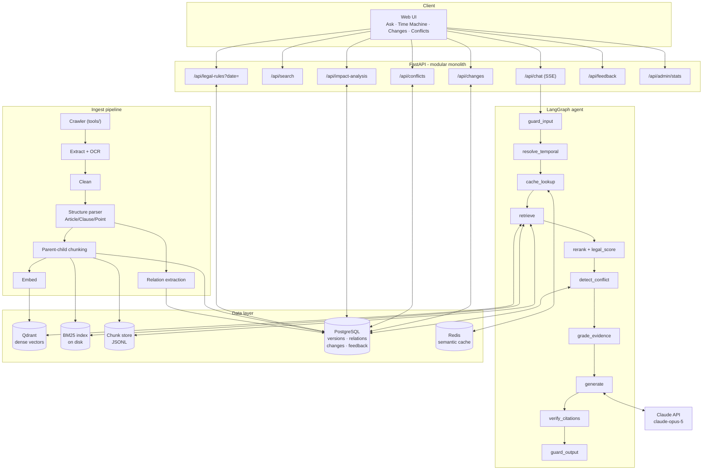
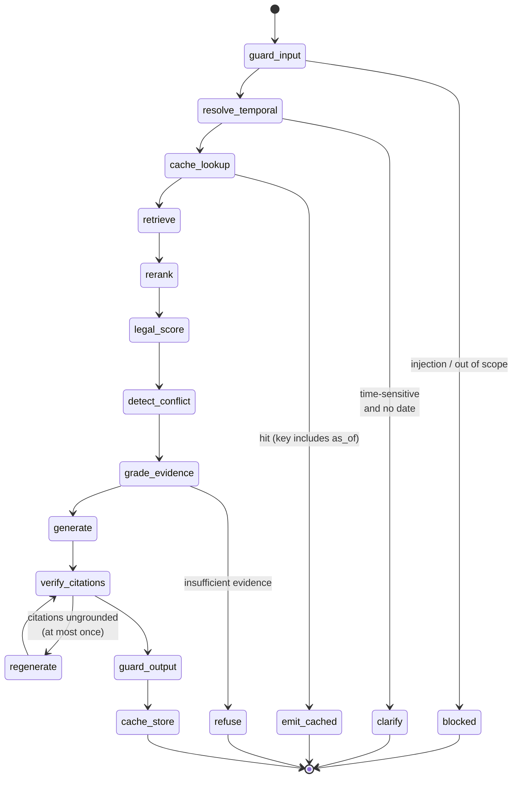

# 04 — System Architecture

> This document describes what the system consists of, how the parts fit
> together, and why each choice was made.

---

## 1. Three value layers

```text
┌────────────────────────────────────────────────────────────────┐
│                          USER LAYER                            │
│  💬 Ask   📅 Time Machine   🔄 Change Monitor   ⚖️ Conflict     │
│  + Admin dashboard   + Eval dashboard   + Feedback             │
└──────────────────────────────┬─────────────────────────────────┘
                               ↓
┌────────────────────────────────────────────────────────────────┐
│                            AI LAYER                            │
│  Intent detection · Temporal reasoning · Hybrid retrieval      │
│  Legal knowledge graph · Conflict detection · Citation check   │
│  Guardrails (in/out) · Semantic cache · Streaming              │
└──────────────────────────────┬─────────────────────────────────┘
                               ↓
┌────────────────────────────────────────────────────────────────┐
│                          DATA LAYER                            │
│  Official sources · Crawler · Document processing              │
│  Immutable versioning · PostgreSQL · Qdrant · Redis            │
└────────────────────────────────────────────────────────────────┘
```

---

## 2. Component diagram



---

## 3. The flow of a single question (LangGraph)



### 3.1 Node responsibilities

| Node | What it does | Which failure it blocks |
|------|--------------|-------------------------|
| `guard_input` | Detect prompt injection, jailbreak, out-of-scope questions, PII | Abuse, leakage |
| `resolve_temporal` | Extract the event date; decide whether to ask back | **Temporal misgrounding** |
| `cache_lookup` | Query Redis: exact match, then semantic match | Cost, latency |
| `retrieve` | BM25 + dense + RRF, validity filtered **during traversal** | Wrong retrieval, shrinking top-k |
| `rerank` | Cross-encoder over the fused top-k | Wrong ordering |
| `legal_score` | Composite score with legal hierarchy | **Official Letter beating a Law** |
| `detect_conflict` | 7 conflict types, adjudicated by rule | Wrong provision chosen |
| `grade_evidence` | Is there enough evidence to answer? | Answering when it should not |
| `generate` | Call Claude, streaming, with prompt caching | — |
| `verify_citations` | Mechanical + semantic check of every `[Sn]` | **Fabricated citations** |
| `guard_output` | Citation coverage, version-mixing detection, disclaimer | Hallucination, version mixing |
| `cache_store` | Write cache keyed by `(question, as_of, config)` | — |

### 3.2 Why a state machine rather than a function chain

Three nodes have **early exits** (`blocked`, `clarify`, `refuse`) and one has a
**bounded loop** (`regenerate`). Written as nested if/else, the branches cannot
be tested independently. LangGraph makes each node a pure function over state,
individually testable, and renders exactly the diagram above.

---

## 4. The ranking formula

Instead of:

```text
score = semantic_similarity
```

use:

```text
Final Score = α · Semantic Relevance
            + β · Legal Authority
            + γ · Temporal Validity
            + δ · Specificity
            + ε · Citation Quality
```

Default weights (normalised to sum 1):

| Component | Symbol | Default | Meaning |
|-----------|--------|--------:|---------|
| Semantic Relevance | α | 0.55 | Rerank score, min-max normalised within the candidate set |
| Legal Authority | β | 0.15 | `(9 − tier) / 8`, tier 1 = Constitution |
| Temporal Validity | γ | 0.20 | 1.0 if in force with both bounds known; 0.7 if one bound missing; 0.25 if adjacent; 0 if far out |
| Specificity | δ | 0.07 | Tax-domain match between query and provision |
| Citation Quality | ε | 0.03 | 1.0 if citable to the Clause; 0.6 to the Article; 0.2 to a passage only |

**Why γ = 0.20 rather than a single hard filter:** 22.9% of corpus documents
lack an `effective_date` ([document 01 §4.3](01-problem-analysis.md)). An
absolute hard filter would discard them. The design: hard-filter when the date
is known, **down-weight** when it is not, and lower the confidence shown to the
user.

**The legal force ladder:**

| Tier | Document type |
|-----:|---------------|
| 1 | Constitution |
| 2 | Code, Law, National Assembly Resolution |
| 3 | Ordinance, Standing Committee Resolution |
| 4 | Order, Presidential Decision |
| 5 | Decree, Government Resolution |
| 6 | Prime Ministerial Decision |
| 7 | Circular, Joint Circular |
| 8 | Ministerial / local Decision, Directive |
| 9 | **Official Letter, professional guidance — not binding law** |

Tier is derived from the **instrument-number suffix** first (`.../QH15`,
`.../NĐ-CP`, `.../TT-BTC`), because that is the most reliable signal when the
title is noisy.

---

## 5. The bitemporal data model

Every provision carries **two time axes**:

```text
VALID TIME       — when did the provision bind taxpayers in the real world?
                   → effective_from / effective_to

TRANSACTION TIME — when did the system learn about it?
                   → ingested_at / superseded_at
```

Example: a law effective 2025-01-01, crawled by the system on 2025-01-05. The
question *"what did the system know on 2025-01-03?"* becomes answerable — which
is the precondition for auditing a past answer.

### 5.1 PostgreSQL schema

```text
documents
  document_id (PK) · instrument_number · document_type · issuing_authority
  title · promulgation_date · authority_tier · source_url · tax_domains

document_versions
  version_id (UQ) · document_id (FK) · content_hash
  effective_from · effective_to · legal_status          ← valid time
  ingested_at · superseded_at                            ← transaction time
  page_count · ocr_page_count · chunk_count

legal_articles
  version_id · document_id · parent_id · dieu · chuong · heading · content

legal_relations
  source_document_id · relation · target_instrument · target_document_id
  target_dieu · target_khoan · confidence · evidence

change_events
  document_id · from_version_id · to_version_id
  article_key · change_kind · detail · detected_at

feedback
  question · answer · verdict · comment · citations · as_of_date · created_at
```

### 5.2 Immutable versioning

When the crawler re-downloads a document, do **not**:

```text
DELETE old  →  INSERT new     ✗
```

because that destroys existing citations, answer history and embeddings.

Instead:

```text
normalise text → SHA-256 → compare hash
   ├── identical  → skip (ingest is idempotent)
   └── different  → close the previous version (superseded_at = now)
                    → insert the new version
```

Consequence: a citation issued six months ago still resolves to **exactly the
text it was made against**.

### 5.3 Legal status — at Clause level, not document level

```text
ACTIVE · PARTIALLY_AMENDED · PARTIALLY_REPEALED · REPLACED
EXPIRED · SUSPENDED · NOT_YET_EFFECTIVE · SUPERSEDED · UNKNOWN
```

`{"document_status": "amended"}` is not sufficient
([document 01 §5.4](01-problem-analysis.md)).

---

## 6. The conflict rule engine

Applied in order, strongest first:

| # | Rule | Basis | Confidence |
|--:|------|-------|-----------:|
| 1 | **Temporal** — only provisions in force at `as_of` compete | Validity by date | 0.92 |
| 2 | **Lex superior** — higher legal force wins | Legal force | 0.88 |
| 3 | **Amendment** — the amending provision beats the amended text | Amendment relation | 0.85 |
| 4 | **Formal vs guidance** — a binding instrument beats an Official Letter | Nature of the instrument | 0.88 |
| 5 | **Lex specialis** — the special rule beats the general one | Scope of application | 0.60 |
| 6 | **Lex posterior** — between equals, the later text wins | Date of promulgation | 0.45 |
| — | No rule decides → **leave open**, flag for expert review | — | 0.30 |

**Non-negotiable principle:** the LLM **nominates** conflict candidates; the
**rule engine decides**. Every decision carries the rule's name so it can be
justified.

> ⚠️ These rules must be checked against the current **Law on Promulgation of
> Legal Normative Documents** and cite the exact provisions before publication.
> This is outstanding work in [document 02 §9](02-related-work.md).

---

## 7. Guardrails

### 7.1 Input

| Check | Action |
|-------|--------|
| Prompt injection (≥10 pattern groups) | Block above threshold, log |
| Jailbreak / role play | Block |
| Out of scope (not tax) | Decline politely, point elsewhere |
| PII in the question | Redact before logging or caching |

### 7.2 Output

| Check | Threshold | Action on violation |
|-------|-----------|---------------------|
| Citation coverage | ≥ 0.60 | Regenerate once, then lower confidence |
| Groundedness score | ≥ 0.45 | Decline, state insufficient basis |
| Citations exist in context | 100% | Strip fabricated citations, regenerate |
| Version mixing (VMR) | = 0 | Block, keep one version, state it |
| Disclaimer | mandatory | Inserted automatically |

### 7.3 Data channel versus instruction channel

Retrieved document content **never** enters the system prompt. It goes into the
user message, wrapped in a clearly labelled block, with a standing instruction
that text inside the block is **data to read**, not **commands to execute**.
This is the primary defence against indirect prompt injection.

---

## 8. Semantic cache (Redis)

Two tiers:

```text
1. Exact    — SHA-256(normalised question ‖ as_of ‖ config)  → O(1)
2. Semantic — cosine over question embeddings, threshold 0.94 → most of the saving
```

**The decisive detail:** `as_of` **must be part of the cache key**. Without it,
a 2021 question receives the cached answer to a 2026 question — turning the
cache into a source of temporal misgrounding.

TTL 24 h; invalidate a cache entry when a `change_event` touches a
`document_id` appearing in its cached citations.

---

## 9. Answer generation

- **Model:** `claude-opus-5`
- **Thinking:** adaptive (`{"type": "adaptive"}`)
- **Effort:** `medium` for Q&A, `high` for conflict adjudication
- **Streaming:** mandatory — emits the first token early, avoids timeouts
- **Prompt caching:** the fixed system prompt plus the citation-contract block
  carry `cache_control`; volatile parts (context, question) come **after** the
  final breakpoint. Caching is a **prefix match**, so everything stable must
  come first.
- **No assistant prefill** (rejected on the current model line).

### 9.1 The citation format contract

Context handed to the model is numbered `[S1] … [Sn]`, each block labelled with
its citation label, validity interval and legal tier. The model must attach
`[Sn]` to **every normative assertion**. The `verify_citations` node then maps
`[Sn]` back to `chunk_id` and checks it.

---

## 10. API surface

| Endpoint | Description |
|----------|-------------|
| `POST /api/chat` | Q&A, SSE streaming, returns citations + conflicts + confidence |
| `POST /api/search` | Retrieval only, no generation — for inspecting retrieval |
| `GET /api/legal-rules?date=2022-01-01&domain=gtgt` | **Time Machine**: provisions applicable on a date |
| `GET /api/documents/{id}` | Document detail |
| `GET /api/documents/{id}/versions` | Version history (bitemporal) |
| `GET /api/documents/{id}/diff?from=&to=` | **Legal diff** between two versions |
| `GET /api/changes?since=` | **Change Monitor** |
| `GET /api/conflicts` | **Conflict Explorer** |
| `POST /api/impact-analysis` | Which documents a new instrument affects |
| `POST /api/feedback` | 👍 / 👎 / ⚠️ wrong time / ⚠️ wrong legal basis |
| `GET /api/admin/stats` | Operations dashboard |
| `GET /metrics` | Prometheus |
| `GET /healthz` | Liveness |

**The important one:** `GET /api/legal-rules?date=` turns the system from a
chatbot into an **API service** — usable by accounting software, not only by
people.

---

## 11. Legal diff — four tiers

Do not LLM-diff the whole document. Tier from cheap to expensive:

```text
Tier 1  Hash          — normalised SHA-256 → instant "unchanged" detection
Tier 2  Text diff     — SequenceMatcher over each aligned Article
Tier 3  Embedding     — match renumbered / moved Articles
Tier 4  LLM classify  — label ADDED/MODIFIED/REMOVED/MOVED/REPEALED
```

Tiers 1–3 handle the bulk at approximately zero cost; the LLM touches only what
actually changed.

---

## 12. Stack and rationale

| Layer | Choice | Why |
|-------|--------|-----|
| API | FastAPI | Async, clean SSE, automatic OpenAPI |
| Agent | LangGraph | State machine with branches and a loop, node-level testability |
| Vector | **Qdrant** | Payload filtering **during traversal** — a hard requirement for the temporal filter |
| Sparse | In-house BM25 | Needs a Vietnamese tokenizer that preserves `48/2024/QH15`, `10%`, `Điều 9` |
| Embedding | BGE-M3 | Multilingual, strong on Vietnamese, trained for retrieval |
| Reranker | bge-reranker-v2-m3 | Multilingual cross-encoder |
| Relational | PostgreSQL | Bitemporal, constraints, transactions |
| Cache | Redis | TTL plus simple ANN |
| LLM | `claude-opus-5` | Long-horizon reasoning, good Vietnamese, prompt caching, streaming |
| Frontend | Plain HTML/JS | Keeps `docker compose up` to **one** command, no build step |

**Why Qdrant and not pgvector:** the validity filter must run during index
traversal. Filtering after retrieving top-k shrinks the result set — ask for 30
neighbours, receive 30 current-law hits, filter to a 2021 date, keep 2. Qdrant
evaluates the payload condition during traversal so top-k remains top-k.
(pgvector is a reasonable starting choice for a different project; here the time
axis rules it out.)

**Why not Neo4j in v1:** a legal dependency graph at this scale (~13k documents,
sparse edges) runs fine in PostgreSQL. Adding another DBMS is operational cost
buying no capability needed in v1. Recorded as an upgrade path.

---

## 13. Module → source map

| Module | Path | Status |
|--------|------|--------|
| Configuration | `virag/settings.py` | Scaffold |
| Data contracts | `virag/schemas.py` | Scaffold |
| Legal hierarchy | `virag/legal/authority.py` | Scaffold |
| Temporal reasoning | `virag/legal/temporal.py` | Scaffold |
| Dependency graph | `virag/legal/relations.py` | Scaffold |
| Conflict adjudication | `virag/legal/conflict.py` | Scaffold |
| Extraction + OCR | `virag/ingest/extract.py` | Scaffold |
| Normalisation | `virag/ingest/clean.py` | Scaffold |
| Article/Clause/Point parser | `virag/ingest/structure.py` | Scaffold |
| Parent–child chunking | `virag/ingest/chunking.py` | Scaffold |
| Manifest reader | `virag/ingest/manifest.py` | Scaffold |
| Tax-domain tagging | `virag/ingest/taxonomy.py` | Scaffold |
| Bitemporal store | `virag/store/db.py` | Scaffold |
| Embedder | `virag/index/embedder.py` | Scaffold |
| BM25 | `virag/index/bm25.py` | Scaffold |
| Vector store | `virag/index/vector_store.py` | Scaffold |
| Chunk store | `virag/index/chunk_store.py` | Scaffold |
| Hybrid retrieval | `virag/retrieval/hybrid.py` | Scaffold |
| Reranker | `virag/retrieval/rerank.py` | Scaffold |
| Semantic cache | `virag/cache/` | **Not written** |
| Generation + citations | `virag/generation/` | **Not written** |
| Guardrails | `virag/guardrails/` | **Not written** |
| LangGraph agent | `virag/agent/` | **Not written** |
| API | `virag/api/` | **Not written** |
| Evaluation | `virag/eval/` | **Not written** |

"Scaffold" = drafted, **never run, never tested**.

---

## 14. Non-functional requirements

| Property | Target | How it is achieved |
|----------|--------|--------------------|
| Time to first token (P50) | ≤ 1.2 s | Streaming + cache + rerank limited to top-20 |
| Full answer (P95) | ≤ 8 s | Bounded top-k, medium effort |
| Explainability | 100% of conflict decisions carry a rule name | Rule engine |
| Reproducibility | Same input + same corpus hash → same retrieval | Fixed seeds, immutable index |
| Observability | Per-stage measurement | Prometheus `/metrics`, trace in the response |
| Graceful degradation | Missing Qdrant/Redis/models → still runs | Fallbacks at every layer |

---

**Previous:** [03 — VietTaxBench](03-benchmark-viettaxbench.md)
**Next:** [05 — Design decisions](05-design-decisions.md)
